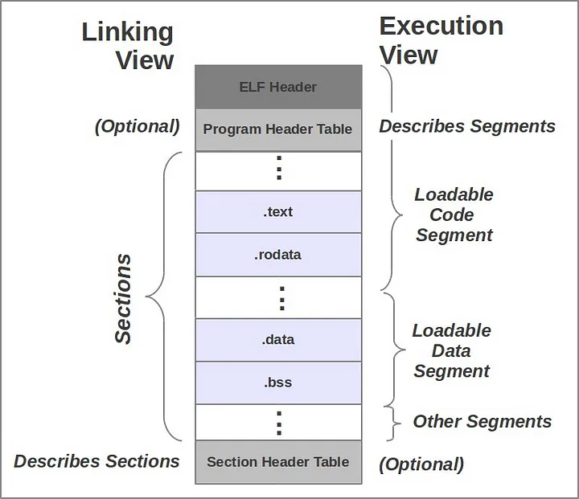
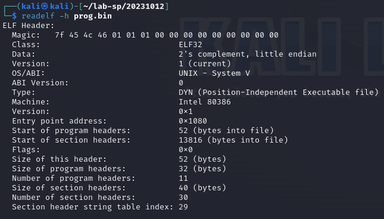
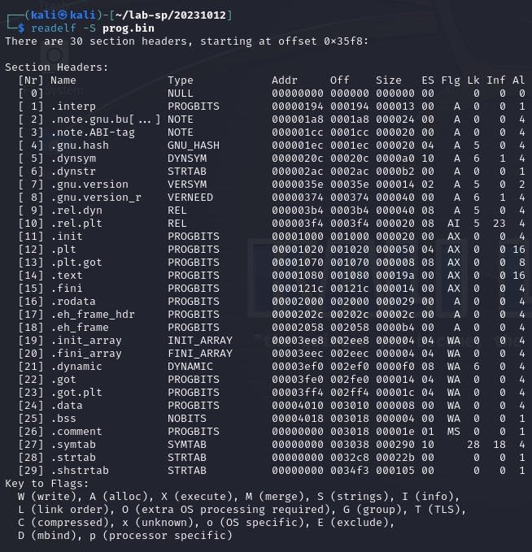
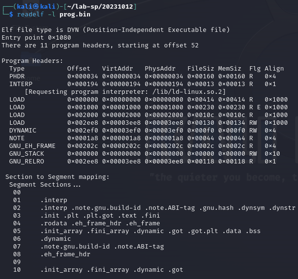
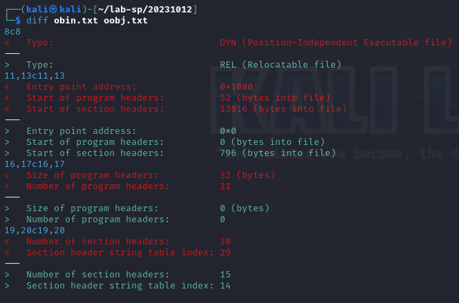
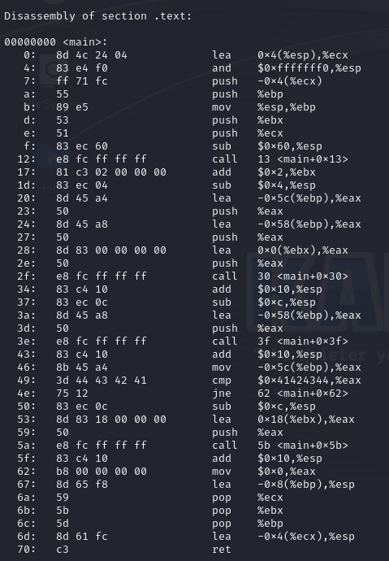

## Materiale
* [VIM](/appunti/assets/docs/unix-vi-editor.pdf)
* [ELF](https://cirosantilli.com/elf-hello-world)
* [Linking & Loading - Real Example](https://brightprogrammer.in/2023/09/24/Linking-Loading-Real-Example/)

# Process Format and Phases 

## Grep
Permette di ricercare stringhe all'interno di un file `grep [options] pattern [FILE]`

[GREP Cheat Sheet](assets/docs/grep_cheatsheet.pdf)

    -c print a count of the number orf lines that match
    -i ignore case
    -v print out the lines that don't match the pattern
    -n print out the line number before printing the matching line
    -w searches for full words only, ignoring your string if it’s a part of another word.
    -r enables recursive search in the current directory

    grep -vi hello *.txt
    searches all txt files in the current dir for lines that do not contain any form of the word hello eg Hello, HELLO or HeLlo

    grep query file1 file2 file3 // multiple files

grep usa espressioni regolari
    
    ? The preceding item is optional and matched at most once.
    * The preceding item will be matched zero or more times.
    + The preceding item will be matched one or more times.
    {n} The preceding item is matched exactly n times.
    {n,} The preceding item is matched n or more times.
    {,m} The preceding item is matched at most m times.
    {n,m} The preceding item is matched at least n times, but not more than m times.
    ^ start of the line
    $ end of the line

    grep ^..[l-z]$ hello.txt

    any line in hello.txt that contains a three characters sequenze that ends with a lowercase letter from l to z. es. [abl] [xyz]

## VIM/VI
(è stato il primo editor di linux)    
`vi / vim filename`

[VIM Cheat Sheet](assets/docs/vim-commands-cheat-sheet-by-pnap.pdf)

    command mode, input mode, visual mode, 
    hjkl move the courser
    ^ move to begin of line 
    $ move to end
    w start of word, b end of prev word
    G end of file

    cut and paste → 5dd delete 5 lines move to position and p to paste
    copy and paste → yank 5yy

    :w save file
    :wq save and exit
    :ZZ
    :q! force exit
    :e filename to edit another file 
    :x write file, then quit.
    u - undo last edit.
    ctrl-r redo.
    / search forward in the file.
    ? search backward in the file.

~~~c
#include <stdio.h>

int main(){
    char buf[80];
    int cookie;
    printf("buf: %08x cookie: %08x\n",&buf,&cookie);
    gets(buf);
    if(cookie == 0x41424344)
        printf("You Win!\n");
}
~~~
### gcc compile without buffer overflow checks
    gcc -m32 -z execstack -fno-stack-protector prog.c -o prog.out

    install GEF for GDB
    https://github.com/hugsy/gef
    bash -c "$(curl -fsSL https://gef.blah.cat/sh)"
    disas main // main is the function is guess
    shell python -c 'print(0x80)'
    run < <(python -c 'print("A"*84+"\x0f\x12\x40\x00")')

vim ha 9 buffer per fare cut/paste

# Esecuzione di un programma

Il file compilato contiene una serie di informazioni che servono all'OS per far eseguire il programma.

Il codice sorgente `.c` viene dato in pasto al compilatore, il compilatore solitamente generava un codice oggetto `.o` che viene dato al linker. Adesso `gcc` compilatore fa entrambe `compile + linking`. L'unico formato eseguibile è quello binario.

Il compilatore fa due passate, nella prima passata, trasforma il programma in assembler (assemblatore è contenuto dentro il compilatore), assembler trasforma in un programma oggetto, l'oggetto entra dentro il linker, il linker recupera le librerie per poi generare il formato eseguibile.

Una volta che il programma è in formato eseguibile esiste un programma dell'OS che si chiama **Loader** che carica il programma. 

Il **loader di UNIX** è `ld`

# Executable and Linkable Format - ELF

Le informazioni di un file eseguibile/oggetto creato dal compilatore è formattato in un formato standard ben definito, nel caso di UNIX è il formato **Executable and Linkable Format ELF**. Nel mondo Windows si chiama **Portable Executable PE**. (ELF è usato anche da PlayStation)

## Componenti di ELF

I componenti di un file ELF sono tre: Header, Section, Segments.

    Program header table
    .text // codice del programma tradotto in codice binario
    .rodata // initialized read only data
    ...
    .data // initialized data
    .bss // uninitialized data
    .plt // PLT (Procedure Linkage Table) IAT equivalent
    .symtab // global symbol table
    ...
    Section header table

### ELF Header
`readelf -h filename` # mostra ELF Header di un file ELF

    // ELF Header
    magic_number: un numero che rappresenta il tipo di file
    e_entry: entry point dell'applicazione l'indirizzo di memoria della prima istruzione eseguibile del programma;
    e_phoff: file offset of the program header table;
    e_shoff: offset of the section header table;
    e_flag: processor-specific flags associated with the file;
    e_ehsize: ELF header size;
    e_phentsize: program  header entry size in program header table;
    e_phnum: number of program header;
    e_shentsize: section header entry size in section header table;
    e_shnum: number of section headers;
    e_shstrndx: index in section header table denoting section dedicated to hold section names.

### Sections
**Le sezioni** hanno tutte le informazioni che servono per costruire l'eseguibile, viene usato nella fase successiva del linking. Il numero di sezioni dipende dalla grandezza del programma, dalle librerie che il programma usa, ecc. Quindi, non sono presenti tutte le sezioni del programma nel file ELF. Le sezioni presenti nel maggior parte dei casi sono `.text`, `.rodata` e `.data`.

Section Header Table è una struttura dati che contiene elenco delle sezioni e loro indirizzi e altre informazioni che servono per costruire segmenti.

`readelf -S <filename>` # per vedere la section table del file

    // Section Header
    sh_name : name of the section
    sh_type : section type categoria della sezione
    sh_flag : 1-bit flags descrive attributi
    sh_addr : indirizzo del primo byte della sezione se la sezione è nella memoria del processo.
    sh_offset : offset dal primo byte del file al primo byte della sezione
    sh_size : section size in bytes
    sh_link : section header table index link
    sh_info : informazioni extra sulla sezione

### Segments
Sezioni servono per costruire l'eseguibile, **i segmenti compongono l'eseguibile**. Vengono chiamati **Program Header**, sono composti dai pezzi di codice e dei dati, preparati per essere caricati nella memoria. 

    // Program Header
    p_type : kind of segment 
    p_offset : offset from the beginning of the file to the first byte of the segment
    p_vaddr : virtual address of first byte of the segment in memory
    p_paddr : physical address
    p_filesz : the number of bytes in the file image of the segment
    p_memsz : the number of bytes in the memory image of the segment 
    p_flags : flags relevant to the segment

    // Type of Segments
    pt_null : seg informativi
    pt_load : sono quelli che vengono caricati in memoria dal loader
    pt_interp : specifica il punto e la grandezza di un path name da invocare come interprete

`readelf -l filename` # per vedere segmenti.

`objdump -S` per leggere ELF header 

`objdump -d` **disassembly** mostra il codice assembler del file ELF.

`objcopy` to copy ELF sections.

Il `type` del Header dice il tipo di file, può `REL` oppure `DYN`.

* `gcc -c` crea un file (file oggetto) di tipo **REL - Relocatable File** (rilocabile) (un file che si può spostare). Nel formato REL il compilatore come prima cosa fa, traduce il programma assumendo che il programma sia l'unico programma all'interno della memoria del calcolatore. Come se partisse dall'indirizzo zero. Assegna al programma degli indirizzi partendo da zero.
  
  Nella fase generazione del codice oggetto vengono aggiunti le funzioni di libreria. A questo il programma non parte più da zero ma da un altro indirizzo. Perché il compilatore aggiunge le funzioni che servono per il programma il alto (es. la funzione printf di C).

  Per questo il codice è disposto in maniera rilocabile, per essere spostato quando le funzioni saranno aggiunte.

    **Vantaggio**: gli si può modificare gli indirizzi.

* `gcc -o` crea un file di tipo eseguibile (ma linkato dinamicamente, con le librerie shared) **DYN - Position-Independent Executable file**.

Object file disassembly `objdump -d filename`:

# Come nasce un processo dal shell

Prima cosa che fa la shell è visualizzare la shell → legge il comando → fa `fork()` (dopo la fork abbiamo due shell) → Il figlio esegue `exec(getcommand(cmdline))` con exec metto il codice del comando → e controlla se `fg` o `bg` (un programma che non è in interazione con utente).

## Loading a Process
L'OS legge argomento dell'`exec` che è un **path** (path a un file binario/eseguibile) → va **cercare quel file** → **carica in memoria** → va **verificare che sia un ELF** → (come fa?) lo verifica dal header leggendo il **magic number** → legge header per acquisire informazioni  → header gli dice indirizzi dei segmenti (dove si trova il codice, i dati, le librerie, ecc.).

**magic number** ogni file ha il suo magic number. Serve per riconoscere il tipo di file.

Se il file inizia con `#!` sh-bang allora shell chiama l'interprete riferimento e gli passa il file.

## Differenza tra un file dinamicamente linkato / staticamente linkato

File **dinamicamente linkato** : linka a runtime le cose che sono condivise. Risparmio spazio, es. perché se uso la stessa libraria in diversi processi mi basta tenere in memoria solo copia della libreria. Ma è lento perché devo andare a cercare la parte che mi serve nella memoria centrale. inoltre, serve un programmino che intercetta le richieste.

File **staticamente linkato** : è autonomo, contiene tutto quello che serve per essere eseguito, è auto consistente.

`readelf -a nameOfExec` # per capire l'interprete.

## Linux Process 
un processo è costituito: da una parte di testo binario, librerie, heap, stack, eventuale zone di memoria che programma usa, kernel code.

A questo punto il processo è generato. (quello che fa exec da shell).