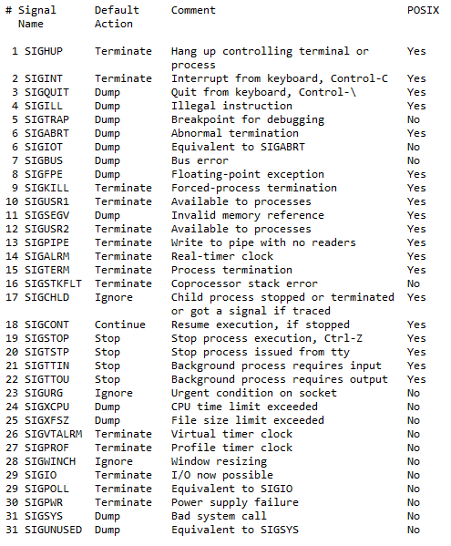
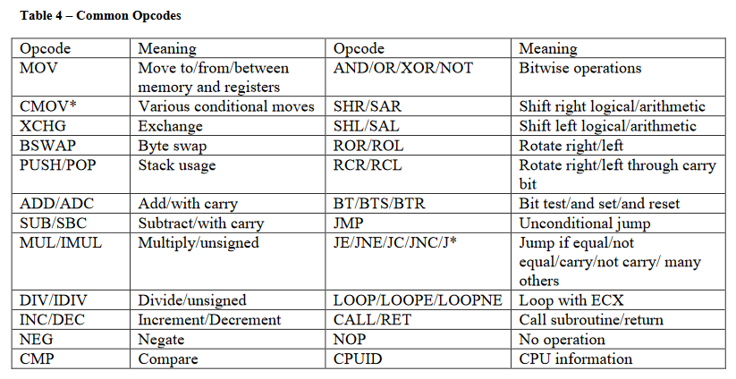
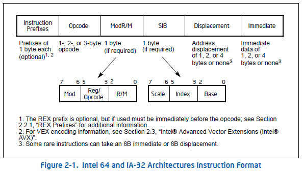
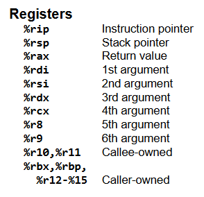
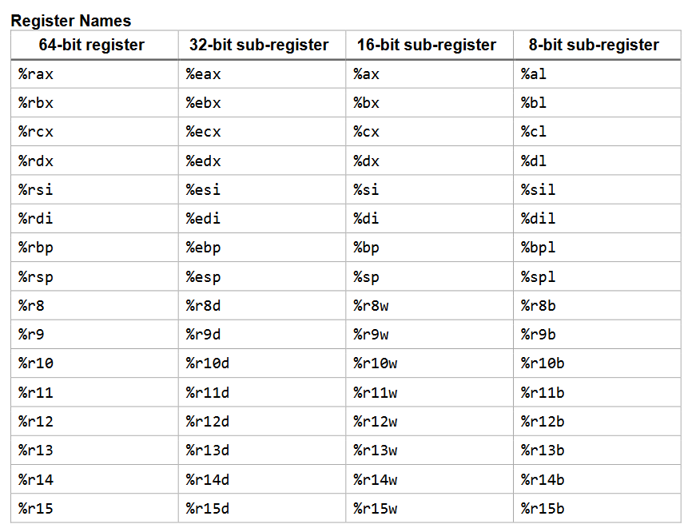

<style>
    strong{
        background-color:#faf43e;
        color: black;
        padding:0.1rem 0.2rem;
        border-radius:5px;
    }
</style>

## Materiale
* [SETUID](https://www.cbtnuggets.com/blog/technology/system-admin/linux-file-permissions-understanding-setuid-setgid-and-the-sticky-bit)

# Process Execution

Quando eseguiamo un eseguibile, non va immediatamente in esecuzione il programma che abbiamo scritto, **vanno prima in esecuzione una serie di routine di sistema** (funzioni di sistema) che **inizializzano una serie di variabili** dell'OS e dell'ambiente che vengono agganciate al nostro programma, dopo di che ad un certo punto viene chiamato la funzione `_libc_start_main()` che contiene all'interno la chiamata alla `main()` del nostro programma.

Questo può essere visto analizzando EFL file del programma (ce una serie di funzioni prima del `main()`).

Un processo va in esecuzione con una serie di argomenti. Un **main di C ha 3 argomenti**:
* `argc` il numero di argomenti, 
* `char *argv[]` puntatore a una sequenza di caratteri che contiene **argomenti per il programma**, 
* `char *envp[]` contiene un puntatore alle **variabili d'ambiente**, sono una serie di variabili del sistema a cui il nostro programma può accedere che vengono solitamente inizializzate in fase di definizione della shell.

~~~c
#include <stdio.h>

int main (int argc, char * argv[], char * envp[]){
    int i;
    // echo all enviroment args
    for(int i=0;envp[i],i++){
        printf ( "envp[8d]: 8s\n", i, envp[i] );
    }
}
~~~
## System call
Quando un processo ha bisogno di accedere a zone riservate all'OS, deve usare le system call. Attraverso una system call avviene un meccanismo di "mezzo" content switch con cui il quale **il sistema entra in modalità kernel e manda in esecuzione la system call**.

Il commando `strace <processo>` permette di vedere syscalls che vengono effettuate durante l'esecuzione di un processo. 

Es. `strace ls -l` per vedere syscall che viene fatto da `ls`.

## Signals
L'OS comunica con il processo via **SIGNAL**, è il meccanismo che viene usato per **comunicazioni tra kernel/OS e processo utente** (praticamente sono dei messaggi che vengono mandati al processo).

Sono delle _syscall speciali_ che **mettono in pausa l'esecuzione del processo e invoca il suo handler**.



### Esempi
`sigkill 9` (sig number) if a process gets this signal it must quit immediately and will not perform any clean-up ops

`sigquit 3` interrupt signal `ctrl+d`

### Come termina un processo?

Un processo termina in due modi:
1. attraverso l'**`EXIT`**,
2. se non raggiunge l'`exit` allora è successo qualcosa che non va, allora termina con un **SIGNAL** (di solito il signal lo riceve se ce qualcosa che non va). Questo signal **può essere gestito dal processo e terminare da solo oppure interviene l'OS e lo blocca**.

Tutti processi devono essere terminati dal loro genitore, il processo con `exit` dice all'os di aver finito, quindi, OS rimuove tutte le risorse allocate al processo (memoria, file, ecc.).

Resta solo PCB del processo all'interno della READY-QUEUE.

Il PCB viene rimosso dal genitore nel momento in cui fa la `wait()`, è compito del genitore fare `wait()` per il suo processo figlio.

Le funzioni di wait: `wait()` della `libc`, syscall `sys_wait4` o`sys_waitid`.

**Durante l'istante che occorre tra l'`exit` del figlio e `wait` del genitore, il processo è uno stato di zombie** (processo figlio in esecuzione fa exit, a questo punto, il genitore deve andare in esecuzione e fare `wait` sul processo figlio, per il genitore di essere mandato in esecuzione potrebbe chiedere un istante di tempo (magari è l'ultimo della ready-queue)).

Se il genitore si dimentica di fare `wait` sul processo figlio (magari il programmatore si è dimenticato di farlo), quindi, il figlio rischia di essere un processo zombie per tutta la durata del sistema. (possono causare memory leak)

La soluzione per **terminare i processi zombie**: Per evitare che un processo figlio vada in zombie, esiste un processo demone (`process reaper`) del sistema che va in esecuzione periodicamente che va a guardare i processi zombie, gli cambia il pid (ogni figlio ha PID del genitore) e gli **assegna PID 1**, processo 1 è un processo che va in esecuzione periodicamente e **fa `wait` per processi zombie** e li termina.


## Privilege Escalation via Complete Mediation
Il meccanismo **Complete Mediation** si usa tutte le volte che si rende necessario **assegnare ad un oggetto dei diritti di accessi superiori** di quelli che sono stati assegnati inizialmente. 

Viene utilizzato per assegnare ad **un processo temporaneamente i diritti superiori**
e per **garantire che il processo non ne abusi** di diritti superiori, quindi, si assicura che vengano usate in modo corretto.

**Privilege escalation** è quando passiamo da uno stato di diritti inferiore ad uno stato di diritti superiore.

Nei sistemi UNIX il processo passa da uno stato `user` a uno stato `kernel`. Il meccanismo che viene usato per fare questo è _complete mediation_. Quando un processo user chiama una system call per quella **fase di tempo opera in modalità kernel** (kernel mode perché l'os gira in kernel mode).

### SETUID
Il meccanismo che viene usato per fare **complete mediation nell'ambito del file system** è `setuid`. (un bit).

`setuid` **permette ad un utente di accedere/usufruire** i diritti di accesso di quel programma nel momento in cui lo manda in esecuzione.

Nel file `etc/shadow` l'utente normale non può fare nulla, come fa un utente scrivere la password se non ha permessi? Quindi, bisogna dare permessi quando l'utente desidera di cambiare la password.

Per risolvere questo problema si prende il programma `/usr/bin/passwd` che permette di cambiare la password e gli assegna `setuid`.

Se osserviamo i permessi di owner (è root) del file `/usr/bin/passwd` notiamo che ce una `s` al posto della `x`, `s` indica che il file ha il bit `setuid` attivato:

    -rwsr-xr-x /usr/bin/passwd

Quindi, nella fase in cui l'utente esegue `passwd` viene eseguito (l'utente diventa root) con permessi dell'owner (root) del file.

#### Come funziona `setuid` internamente?

Ogni processo ha due uid: `RUID`, `EUID` (che stanno nel PCB)
* `RUID` è userID **UID di chi ha generato il processo** (UID che viene assegnato dal sistema quando creiamo un utente, si trova in `/etc/passwd`);
* `EUID` **identifica i privilegi di un processo**, i privilegi di un processo non sono determinati da `RUID` ma dal `EUID`.
  
Normalmente sono uguali `RUID == EUID`. Quando eseguiamo un programma con `setuid` sono diversi, `EUID` lo prende dall'UID dell'orwner che andiamo ad eseguire, se ha `s` al posto di `x`, ogni volta che il processo viene eseguito `EUID` nel processo diventa `0`. quindi ha diritti di root.

```sh
cp /bin/cat ./mycat # copio cat
sudo chown root mycat # divento owner di mycat
ls -l mycat
-rwxr-xr-x ...
mycat /etc/shadow # eseguo mycat per vedere le password
mycat: /etc/shadow: Permission denied
```
Se non ha `s` e se non abbiamo permessi per eseguirlo ci dice `Permission denied` perché l'abbiamo mandato noi e perché `EUID` è il nostro.

```sh
sudo chmod 4755 mycat
```
Il 4 assegna `setuid`.

Il trucco è il `sudo`, senza `sudo` non funziona, serve sempre un `system admin` per abilitare `setuid`.

#### Come funziona?
Quando un processo viene generato (forka), si duplica il genitore, figlio prende UID del genitore, tipicamente immediatamente dopo il figlio esegue `execve`, a questo punto `execve` passa come paramento il `Path` di un file eseguibile. Se il file che deve essere eseguito ha un `setuid bit` settato a 1 allora viene cambiato `EUID` del programma figlio e viene eseguito come owner di quel file.

Per settarlo si usa `chmod`.

Per vedere se ha setuid `ls -l` oppure `stats`. Quando si tratta di un directory `s`-minuscola indica che è settato a livello user e `S`-MAIUSCOLA è settato a livello gruppo. Per file s'è `S`-MAIUSCOLA significa che non è eseguibile.

```sh
chmod +s file # per assegna setuid
chmod -s file # per rimuovere
chmod u-s file # per rimuovere
chmod 4777 file # (4 per setuid) è inutile perché tutti hanno tutti diritti.
chmod 4764 file file
```

# Shell/Bash Scripting

[Bash cheatsheet](https://devhints.io/bash)

`#!/bin/bash` shebang `#!` specifica il shell che stiamo usando, è **obbligatorio all'inizio del file**.

`#` per commenti.

```sh
$* # * variabile contiene argomenti
$# # è un variabile di sys che contiene il numero di argomenti di *
```
```sh
    shell interpreta comandi per gestione del sistema

    bob='hello world'
    foo = 3 # non lasciare spazi. Cerca comando foo e passa come argomento 3
    foo=3 # assegna 3 al variabile foo

    echo $bob # stampa hello world
    echo "${bob}"

    set # per vedere variabili del ambiente

```

## ENV variables - Variabili d'ambiente

Alcuni variabili importanti:
~~~sh
PS1 # è la riga del prompt
PATH # contiene la lista delle directory dove andare a cercare i file binari dei programmi
./ # significa vai a guardare in questa directory corrente
~~~

~~~sh
#!/bin/bash
# this is a comment
echo "The number of args is $#"
echo "The args are $*"
echo "The first is $1"
echo "My process number is $$"
echo "Enter a number form the keyboard: "
read number
echo "The number you entered was $number"
~~~

* `$#` 	Number of arguments.
* `$*` 	All positional arguments (as a single word).
* `$@` 	All positional arguments (as separate strings).
* `$1` - `$4` Arguments.
* `$_` 	Last argument of the previous command.
* `$?` 	Expands to the exit status of the most recently executed foreground pipeline.
* `$-` 	Expands to the current option flags as specified upon invocation, by the set builtin command, or those set by the shell itself (such as the -i option).
* `$$` Expands to the process ID of the shell. In a () subshell, it expands to the process ID of the invoking shell, not the subshell.
* `$!` Expands to the process ID of the job most recently placed into the background, whether executed as an asynchronous command or using the bg builtin.
* `$0` Expands to the name of the shell or shell script. .

Note: `$@` and `$*` must be quoted in order to perform as described. Otherwise, they do exactly the same thing (arguments as separate strings).

Per eseguire un file script `chmod +x <filename>` oppure `bash <filename>`.

### System wide
* /etc/environment : specifically meant for env vars
* /etc/env.d/* : env vars, split in multiple files 
* /etc/profile : all type of initialization scripts
* /etc/profile.d/* : initialization scripts
* /etc/bashrc, /etc/bash.bashrc : meants for functions and aliases

### User specific
* ~/.bash_profile : initialization for login (bash-)shells
* ~/.bashrc : initialization for all interactive (bash-)shells
* ~/.profile : used for all shells
* ~/.csrc, ~/.zshrc, ~/.tcshrc : similar for non-bash shells

## Script Examples

~~~sh
#!/bin/bash
echo "Hello world!"
echo "$USER, your current dir is $PWD"
echo `ls -la` # Per eseguire comandi inline
exit # clean way to exit a shell script
~~~

~~~sh
#!/bin/bash
echo "what is your name"
read USER_NAME # legge
echo "Hello $USER_NAME"
echo "i will create you a file called ${USER_NAME}_file"
touch "${USER_NAME_file}"
~~~

~~~sh
#!/bin/bash

Year=`date +%Y`
Month=`date +%m`
Day=`date +%d`
Hour=`date +%H`
Minute=`date +%M`
Second=`date +%S`
echo `date`
echo "Current Date is: $Day-$Month-$Year"
echo "Current Time is: $Hour:$Minute:$Second"
~~~

### Exercise #1
Write a script that upon invocation shows the time and date and lists all logged-in users. the script then saves this info to a logfile.

~~~sh
#!/bin/bash
DATE=`date`
echo $DATE

USR=`who`
echo $USR

echo $DATE $USR > log
~~~

### Exercise 2
Write a shell script which individuates all files with permissions 0777 inside a given directory and save them on a file namesd `yyyy-mm-dd` taken from the current date.

~~~sh
#!/bin/bash

find $1 -perm 777 -print > `date +%d-%m-%Y`
# cerca i file dato come arg_1 con permessi 777 e stampa la lista dei file e scrive in un file con nome "gg-mm-aaaa"
~~~

## if - then - else

~~~sh
    if [ test ] # [] è un commando di shell /bin/[ che interpreta condizioni
    then
        commands
    else
        commands
    fi
~~~

### Test conditions

* `[[ -z STRING ]]` 	Empty string
* `[[ -n STRING ]]` 	Not empty string
* `[[ STRING == STRING ]]` 	Equal
* `[[ STRING != STRING ]]` 	Not Equal
* `[[ NUM -eq NUM ]] `	Equal
* `[[ NUM -ne NUM ]]` 	Not equal
* `[[ NUM -lt NUM ]]` 	Less than
* `[[ NUM -le NUM ]]` 	Less than or equal
* `[[ NUM -gt NUM ]]` 	Greater than
* `[[ NUM -ge NUM ]] `	Greater than or equal
* `[[ STRING =~ STRING ]]` 	Regexp
* `(( NUM < NUM ))` 	Numeric conditions
* `[[ -o noclobber ]]` 	If OPTIONNAME is enabled
* `[[ ! EXPR ]]`	Not
* `[[ X && Y ]]` 	And
* `[[ X || Y ]]` 	Or
  
### File conditions

* `[[ -e FILE ]]` 	Exists
* `[[ -r FILE ]]` 	Readable
* `[[ -h FILE ]]` 	Symlink
* `[[ -d FILE ]]` 	Directory
* `[[ -w FILE ]]` 	Writable
* `[[ -s FILE ]]` 	Size is > 0 bytes
* `[[ -f FILE ]]` 	File
* `[[ -x FILE ]]` 	Executable
* `[[ FILE1 -nt FILE2 ]]` 	1 is more recent than 2
* `[[ FILE1 -ot FILE2 ]]` 	2 is more recent than 1
* `[[ FILE1 -ef FILE2 ]]`	Same files

```sh
    if [ -e "$file"] # -e controlla se esiste il file
    if [ -f "$file"] # cosa fa? verifica se è un file (# example 4)
    if [ -d "$file" ]  # controlla se è un dir
```
### Exercise 3
write a script which 
1. determines and write the uid of a given file and determines whether it belongs to ans admin user.
2. print the name of the file owner as well of its primary group.

Normalmente userID dei processi  sono tutti sopra 1000, root è 0, per demoni di sistema vengono dati UID fino 1000.

```sh
#!/bin/bash
# print and verify file owner
# stat command
stat_cmd=$(which stat)
# file to be verified
file=$1
if [ -e "$file" ]; then
    user_id="$(stat_cmd --format="%u" $file)"
    user_name="$($stat_cmd --format="%U" $file)"
    echo "$file owner is $user_name ($user_id)"
fi
# verify UID
if [ "$user_id" -ge "1000" ]; then
    echo "This file belongs to regular user"
else
    echo "This file belongs to system user"
fi
```
### Example 4

```sh
#!/bin/bash
# print file size
# size command
stat_cmd=$(which stat)
# file to be verified
file=$1

if [ -f "$file" ]; then

    size=$($stat_cmd --format="%s" $file) # byte
    units="B"

    if [ "$size" -gt "1024" ]; then
        size=$(expr $size / 1024) # kilobytes
        units="KB"
    fi
    if [ "$size" -gt "1024" ]; then
        size=$(expr $size / 1024) # megabytes
        units="MB"
    fi
    if [ "$size" -gt "1024" ]; then
        size=$(expr $size / 1024) # gigabytes
        units="GB"
    fi
    if [ "$size" -gt "1024" ]; then
        size=$(expr $size / 1024) # terabytes
        units="TB"
    fi

    echo "$file size is $size $units"
else
    echo "File does not exist"
fi
```

## For Loops

```sh
    for var in list
        do
            commands
        done
```

### Example 6    

```sh
#!/bin/bash
# print file last access and modification date
# stat command
stat_cmd=$(which stat)
# file to be verified
LIST=`ls $1`
echo $LIST

for file in $LIST
do
    if ([ -f "$1/$file"] || [ -d "$1/$file" ]); then
        mod_time=$($stat_cmd --format="%y" $1/$file)
        acc_time=$($stat_cmd --format="%x" $1/$file)
        echo "$1/$file last access is $acc_time, modification time is $mod_time"
    else
        echo "File $1/$file does not exist"
    fi
done
```
## While

    while [ test ]
    do
        commands
    done

### Example 7
`sleep x` # mette in wait il processo per `x` millisecondi.

The following script waits until a non-empty file input.txt has been:
```sh
#!/bin/bash
while [ ! -s input.txt ]
do
    echo waiting...
    sleep 5
done
echo input.txt is ready
```
## Switch Case

    case var in
    test1)
        commands
        ;;
    test2|test3|test4) # test2 or test3
        commands
        ;;
    esac

### Example 8

```sh
#!/bin/sh
for f in $*
do
    if [ -f $f -a ! -x $f ]
    then
        case $f in
        core)
            echo "$f: a core dumb file"
            ;;
        *.c)
            echo "$f: a C program"
            ;;
        *.cpp|*.cc|*.cxx)
            echo "$f: a C++ program"
            ;;
        *.txt)
            echo "$f: a text file"
            ;;
        *.pl)
            echo "$f: a PERL script"
            ;;
        *.html|*.htm)
            echo "$f: a web document"
            ;;
        *)
            echo "$f: appears to be "`file -b $f`
            ;;
        esac
    fi
done
```
Core dump file è file che viene generato dal sistema quando si verifica un `fault`.

# Assembly - Human-Readable Machine Language

[Assembly Cheatsheet](assets/docs/x64_cheatsheet.pdf)

[Intel introduction](assets/docs/instruction_format_intel64_ia32.png)

Il modello di macchina su cui lavoriamo è la macchina di _Von Neumann_.


Instruction Set Architecture ISA-specific. 

Assembly è un linguaggio di programmazione inventato negli anni '50, è un linguaggio molto vicino all'architettura che consente di scrivere istruzioni **molto vicino al hardware**. Ha **istruzioni che possono essere convertiti direttamente a linguaggio macchina**. Praticamente è un linguaggio macchina tradotto in human-readable. (di solito sono os che usano codice assembler, sistemi embedded).

Assembler è il programma che converte il programma assembly in un file eseguibile.

Assembly è **importante** nel mondo della sicurezza, in particolare permette di analizzare il codice (es. codice di un virus) (si fa reverse engineering del codice eseguibile). Inoltre:

* permette di trovare errori difficili da trovare senza,
* permette di ottimizzare il codice (è particolarmente snello),
* permette di riparare un codice senza il source code,
* disassemble permette di riparare oppure modificare un eseguibile.

Noi usiamo assembler x64 di Intel/Microsoft (contiene anche 32bit)

* Netwide assembler NASM (usato da open source), 
* Flat assembler FASM,
* Traditional microsoft MASM detto anche intel assembly
instruction.

L'architettura Intel è un'architettura CISC (Complex instruction set computer).

Una riga di istruzione assembly:

    LABEL OPCODE OPERANDS COMMENTS

Per commentare `;` oppure `#`
Opcode rappresenta il tipo di istruzione CPU




Un istruzione assembly di intel può essere lungo da 1 byte a 64 bytes.

Dati possono essere in registri del cpu `reg` oppure in memoria `mem` oppure un valore immediato `imm`

* word 16 bits
* double word 32 bits
* quadword 64 bits
* double quadword 128 bits

Intel usa la rappresentazione **Little Endian** (in memoria non in registri)

    0x1F A5 DC 77
    0x77 DC A5 1F ogni byte viene capovolto

Si può sommare solo dati in registri `reg` e numeri immediati `imm`.

>little endian veniva utilizzato in un protocollo di trasmissione, i dati venivano inviati al contrario, quindi, sono stati sviluppati calcolatori che raccoglievano questi dati e li capovolgevano.

>Intel deve garantire la retro-compatibility, questo perché ha un accordo on Microsoft.

## Registri
Registri sono delle posizioni di memoria che sono direttamente accessibile dal processore. 

Esistono nell'architettura x64, 16 registri che vanno dal R0 al R15.




Il processore può manipolare solo dati presenti nei registri. Quindi, bisogna usare istruzioni `load` e `store` da memoria.