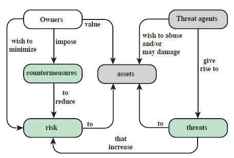

## Materiale di approfondimento
Capitolo 1 del libro di testo

# Storia degli attacchi hacker principali

-   1986, Lawrence Berkeley Lab -- **LBL**: è un attacco eseguito dai
    tedeschi per conto dei russi (KGB). Hacker: Markus Hess.

    -   Libro: Cuckoo's egg, Stalking the Wily hacker

-   1988, The internet **worm**: Robert Morris, uno studente di Cornell
    University. È il primo attacco che usa la tecnica del **buffer
    overflow**, riuscì a spegnere 6000 (10% della rete spento) computer
    entro poche ore. (primo a mettere in pratica buffer overflow e
    diffuse il codice sorgente).

-   1994, Kevin **Mitnick**: primo attacco ai protocolli di rete,
    attacca a un supercomputer center di San Diego attraverso la tecnica
    di **TCP Spoofing** exploitando trust tra i host.

-   1995, Citibank: (una delle prime banche che mise a disposizione dei
    clienti il home banking) attaccarono i router di Cisco intercettando
    il traffico di rete (traffico era in chiaro (login e password
    viaggiavano in chiaro nella rete)).

-   2010, **Stuxnet**: è un virus sviluppato da NSA e Mossad contro il
    programma nucleare di Iran per ritardarlo. È stato progettato per
    attaccare i PLC (Siemens Step7).

-   2017, **Ransomware** Wannacry: è stato progettato per attaccare i
    sistemi Microsoft Windows che cifra tutti i dati e chiede un
    riscatto per decifrarlo. Per realizzarlo è stato utilizzato un bug
    chiamato EternalBlue che stato trovato da NSA. È stato rubato da NSA
    dal gruppo The Shadow Brokers.

-   2020, **Solarwinds**: gli hacker hanno modificato le patch che
    dovevano essere distribuite ai clienti che utilizzavano il sistema
    "Orion". Non è stato rilevato per 6 mesi.

## Human Hacking

Consiste nel modificare/deviare il pensiero umano attraverso pubblicità,
notizie mirate. Si procede **analizzando i profili psicologici**
(digital footprint) di un campione di persone attraverso utilizzo i
**dati dei social media** come like, commenti, orientamento politico
ecc. dopo la profilazione si fanno degli **interventi mirati per deviare
oppure per ottenere il consenso**.

È il caso del **Cambridge Analytica**, utilizzato per elezioni USA e per
Brexit. Hanno usato un bug di Facebook (app "This is your digital life"
sviluppato da università di Cambridge) per ottenere i dati (in modo
ricorsivo amici di amici di amici) di persone senza consenso. Sono
partiti da 270K utenti fino a raggiungere 87M di utenti.

# Terminologia

## Hacker

{width="2.4375in"
height="2.5520833333333335in"}Inizialmente, Hacker è una persona che
voleva capire le cose fino in fondo come funzionavano (un termine
positivo). Ma adesso gli hacker in realtà sono Cracker: una persona che
cerca recuperare informazioni sensibili col fine di usarli per il
proprio vantaggio.

## Computer Security

Il termine computer security secondo il **NIST** ha il seguente
significato: **Misure** e **controlli** che **garantiscono** la
**confidenzialità**, **integrità** e **disponibilità** dei sistemi
informatici che comprende *hardware, software, firmware e informazione
che viene processata, memorizzata e comunicata*.

## Un sistema sicuro

Un sistema che in grado di garantire **confidenzialità**, **integrità**
e **disponibilità** di un calcolatore.

## Confidenzialità 

Si intende la capacità del sistema di **preservare la riservatezza
dell'informazione**, cioè solo le persone autorizzate possono accedere a
determinate informazioni. (alcuni lo definiscono anche come la privacy).
(permesso di **accesso in lettura**).

## Integrità 

Un sistema è in grado di garantire la proprietà di integrità: s'è in
grado garantire che la modifica o la cancellazione di dell'informazione
viene solo esclusivamente dalle persone autorizzate. (I permessi di
**accesso in scrittura**). Cioè, preservare l'informazione da modifiche
non autorizzate.

Le proprietà confidenzialità e integrità riguardano l'informazione.

## Disponibilità

Un sistema garantisce disponibilità se in grado garantire un accesso
tempestivo e affidabile all'informazione. (es. server web disponibile e
accessibile quando noi lo vogliamo)

Disponibilità oltre all'informazione riguarda anche i servizi.

## Accountability

Il sistema deve essere in grado di **memorizzare**, di **associare** o
di far risalire **ogni azione** che viene svolta **in maniera in
equivocabile** nel sistema **all'utente, al processo** o alla persona
che la effettuata. (es. antifurto: telecamera, i file di log).

## Authenticity

Sistema deve garantire che **il contenuto ricevuto dalla rete sia
affidabile**. Legata alla genuinità dell'informazione.

## Livelli di impatto

Vengono usati per fare una prima stima su rischi.

-   **Basso** *Low*: se le perdite dopo un attacco sono limitate,
    effetti minimi sull'organizzazione e sugli individui;

-   **Medio** *Moderate*: se le perdite cominciano ad essere serie e
    intaccano la capacità dell'organizzazione di operare oppure hanno
    impatti significati sulle persone.

-   **Alto** *High:* se le perdite sono catastrofiche che mettono in
    seria difficoltà l'organizzazione di operare.

Quindi, le proprietà (confidenzialità, integrità, disponibilità) vengono
adattate in base al livello di rischio.

## Le sfide di computer security

1.  Computer security: essere in grado **anticipare le mosse** degli
    attaccanti.

2.  Quando si sviluppa un meccanismo/algoritmo di difesa, bisogna sempre
    considerare gli attacchi.

3.  Realizzare delle procedure di sicurezza che richiede di adottare
    delle soluzioni non intuitive.

4.  La scelta architetturale (livello hardware, sistema operativo). La
    persona che decide mettere un meccanismo di sicurezza deve avere un
    paio comprensione dell'insieme.

5.  I meccanismi di sicurezza spesso richiedono modi per la condivisione
    di informazioni segrete (le chiavi).

6.  Gli attaccanti hanno bisogno di solo una debolezza, mentre di chi
    difende deve pensare a tutte le debolezze.

7.  Dato che spesso i meccanismi di sicurezza sono costruiti sopra
    meccanismi già esistenti, quindi le vulnerabilità si propagano.
    Cioè, prima si fa il progetto e poi si aggiunge i meccanismi di
    sicurezza su quello. Invece si dovrebbe incorporare nel processo di
    design.

8.  La sicurezza richiede un monitoraggio regolare e costante. Il
    sistema deve essere tenuto costantemente sotto controllo.

9.  Ce una tendenza naturale da parte degli utenti e system manager di
    percepire una mancanza di benefici finché non vengono attaccati. Se
    si investe in sicurezza non succede niente e se non si investe non
    succede niente. Se non viene mai attaccata ci guadagna ma se viene
    attaccata perde. (non è chiaro il ritorno degli investimenti).

10. Molte persone percepiscono la sicurezza come qualcosa di noioso (di
    dover inserire diversi password oppure cambiare la password
    periodicamente), quindi, la sicurezza deve essere anche user
    friendly.

# Definizioni in sicurezza informatica - RFC 2828

-   **Adversary** (threat agent) *avversario*: Individui che hanno
    intento di fare attività di attacco.

-   **Attack**: È una qualunque attività che colleziona, distrugge,
    degradare informazioni o risorse di un sistema. Un attacco è un
    **tentativo** e se va a buon fine è un **incidente**. È lo
    **sfruttamento di una vulnerabilità.**

-   **Countermeasure** *contromisure*: è un dispositivo o una tecnica
    che ha il compito di ridurre l'impatto di un'attività di un
    avversario. Possono essere preventive oppure a fronte di un attacco
    cercano di ridurre i danni.

-   **Risk** *rischio*: è una stima che ci dice quanto una certa entità
    è sotto minaccia da un potenziale attacco. (è il prodotto tra valore
    e la probabilità di attacco).

-   **Security Policy** *politica di sicurezza*: un insieme di criteri
    per erogazione di servizi di sicurezza. (un documento di
    progettazione).

-   **System Resource** (**Asset**): l'oggetto che dobbiamo proteggere
    (file, db, server, le persone, stabili).

-   **Threat** *minaccia*: ogni circostanza o evento che potenzialmente
    può impattare in modo negativa sulla operatività di una
    organizzazione. Qualcosa che può provocare un danno agli asset.

-   **Vulnerability** *vulnerabilità*: la debolezza presente in sistema
    di sicurezza, di una procedura, di un controllo o di
    un'implementazione che può essere utilizzato per attaccare.

-   **Exploit**: pezzo di codice che utilizza la vulnerabilità.

Proprietari (owners) assegnano un valore
all'asset e impone delle contromisure per ridurre il rischio.

Threat agent (avversari) generano dei threat che provano attaccare
l'asset.

## Vulnerabilità

Possono essere categorizzate come segue: Corrotta (**Corrupted**):
perdita di integrità, **Leaky**: perdita di confidenzialità,
**Unavailable** or Very Slow: perdita di disponibilità.

## Minacce Threats

-   Capacità di utilizzare (exploitare) le vulnerabilità.

-   Rappresentare un potenziale danno alla sicurezza degli asset.

## Attacchi 

-   **passivi**: **non modifica le risorse** del sistema
    (intercettazione) sono **difficili** da **prevedere** e rilevare.

-   **attivi**: prevede una modifica del sistema (Daniel of Service).

-   **insider**: un attacco inizializzato da un componente interno.

-   **outsider**: inizializzato dall'esterno.

### Conseguenze degli attacchi - cosa può fare un attaccante

-   **Divulgazione** non autorizzata *Unauthorized* *Disclosure*:

    -   **Esposizione** dei dati sensibili,

    -   **Intercettazione**,

    -   **Inferenza**: ottiene i dati indirettamente.

    -   **Intrusione**: ottiene accesso raggirando il sistema di
        protezione.

-   **Inganno** *Deception*:

    -   **Mascheramento**,

    -   **Falsificazione**,

    -   **Ripudiando**: nega la responsabilità di un attacco.

-   **Interruzione** *Disruption*:

    -   **Incapacità**: prevenire o interrompere un
        operazione/componente del sistema.

    -   **Corruzione**: altera il sistema negativamente.

    -   **Ostruzione**: ostacola operazioni del sistema bloccando le
        comunicazioni tra servizi di sistema.

-   **Appropriazione** *Usurpation*:

    -   **Appropriazione indebita** *Misappropriation*: assume il
        controllo delle risorse del sistema.

    -   **Abuso** *Misuse:* far eseguire una funzione dannosa al sistema
        di protezione.

## Principali tipi di attacchi

Categoria di Asset| Disponibilità| Confidenzialità| Integrità
-----------------|-----------------|-----------------|-----------------
Hardware | Rubato, disabilitato Denying of Service|rubati es. USB Stick | Modifiche al firmware |
Software |Programmi cancellati, modificati. Denying of Service|Copia del software|Modifiche al programma per eseguire task indesiderati (Buffer Overflow)|
Data|Cancellare i file, bloccare accesso ai file |Lettura, analisi dei dati per recuperare il contenuto.|Modifiche ai file o costruire file nuovi.|
Network (Linee di comunicazione)|	Cancellare, distruggere i dati che viaggiano nella linea.|	Lettura dei messaggi, analisi del traffico|	Modificare, ritardare, riordinare oppure duplicare i messaggi. Creare messaggi falsi.

## Contromisure
L'obiettivo principale è quello ridurre il livello di rischio di un
attacco agli asset per il quale si lavora su tre tipi di contromisure:

-   **prevenire** *prevention* (cifrare il traffico),

-   **rilevare** *detection* (quando non si può prevenire si cerca di
    rilevare es. antivirus),

-   **ripristinare** *recovery* (se ultimi due non funzionano si cerca
    di ripristinare dopo l'attacco).

Contromisure possono **introdurre nuove vulnerabilità** al sistema (es.
installazione di patch di sicurezza con altri falli di sicurezza).

-   **Access control**: limitare accesso alle informazioni di
    utenti/dispositivi tramite autorizzazioni. Es. accesso alla lettura.

-   **Awareness and training** *Insegnare agli utenti l'uso corretto*.

-   **Audit and Accountability** *Ascolto e responsabilità*: creare,
    proteggere, mantenere i log di sistema per permettere monitoraggio,
    analisi, investigazione e segnalazioni delle azioni non autorizzate.

-   **Certification, accreditation and security assessments**: consiste
    nel testare periodicamente l'architettura del sistema di sicurezza.
    Es. Certificato ISO 27001.

-   **Configuration management**: sono dei tool di supporto per fare
    configurazione dei sistemi. Praticamente, si stabiliscono delle
    politiche generali di sicurezza e verificano se le vengono
    rispettate da tutte le macchine collegate.

-   **Contingency planning**: (un evento che non è più in grado gestire,
    richiede un intervento esterno per esempio) è un'attività di tipo
    manageriale che riguarda la progettazione delle situazioni
    emergenza. (cosa fare nel momento di un attacco)

-   **Identification and authentication**: tecnologie che sono mirate
    per garantire l'identità di un soggetto. (Es. password)

-   **Incident response**: (un evento che si può essere gestito
    internamento, per esempio fare un ripristino e recuperare) le
    tecnologie mirate alla gestione degli incidenti. (dice le procedure
    da fare durante un incidente. Es. per contenere i danni se diventa
    un incidente che non può essere gestito da questo fa riferimento al
    contingency planning).

-   **Maintenance**: manutenzione periodica utilizzando vari tools,
    tecniche. Tipicamente patch management.

-   **Media protection**: le tecnologie che vengono utilizzate per
    proteggere i sistemi che contengono le informazioni che servono ad
    evitare accesso alle informazioni e le tecnologie che servono per
    distruggere le informazioni (cancellare HDD).

-   **Physical and environmental protection**: sicurezza fisica.
    (lucchetti, controllo accesso alle istanze, antincendio).

-   **Risk assessment**: valutazione periodica del rischio.

-   **Systems and services acquisition**: le politiche da eseguire per
    acquisire prodotti hardware, software e servizi.

-   **System and communications protection**: tutte le misure per il
    controllo dei sistemi e delle reti di comunicazione. (più legato
    agli aspetti di rete)

-   **System and information integrity**: tutte le misure per il
    controllo dei sistemi e informazioni. (più legato agli aspetti di
    host)

# Fundamental Security Design Principles

Nell'ambito della cyber security, uno dei problemi riguardano i
software, è uno dei punti più deboli dell'intera infrastruttura. Quindi,
sono stati sviluppati una serie di principi fondamentali da seguire
nello sviluppo di un software sicuro.

-   **Fail-safe defaults**: significa che quando si progetta un sistema
    i valori di default devono essere la opzione più sicura.

-   **Complete mediation**: nel momento in cui ce bisogno di un
    privilege escalation lo stesso sia **mediato attraverso una proxy**
    che garantisca che la mediazione avvenga correttamente. (es. quello
    che viene fatta una system call (quando un programma chiama un
    servizio di OS es. read file) deve garantire che il sistema faccia
    quello che stato richiesto e non qualcosa altro. Quindi, chiedo
    all'OS di farmi da mediatore per eseguire il system call perché io
    non sono in grado di farlo perché è una operazione riservata all'OS,
    quindi si fa un privilege escalation passo il controllo al sistema e
    poi dopo OS mi restituisce il controllo).

-   **Open design**: tutti meccanismi di sicurezza devono essere **open
    source**. (opposto è *security through obscurity*).

-   **Separation of privilege**: non devono essere accorpati dentro
    un\'unica persona oppure un unico ente più funzionalità. Persona che
    svolge certe azioni non deve essere la stessa che autorizza quelle
    azioni. (es. se sono autorizzato a prelevare una certa somma dalla
    banca non devo essere io quella persona che autorizza quella
    azione). I privilegi vanno suddivisi tra più persone.

-   **Least privilege**: ad ogni utente di un sistema devono essere
    assegnati i **diritti minimi** necessari a svolgere le operazioni
    che deve svolgere. (es. se devo leggere un file non devo avere anche
    i permessi per scrivere ed eseguire il file). Ogni utente deve avere
    esattamente solo i privilegi di cui può disporre.

-   **Encapsulation, Modularity, Layering**: principi di OOP.

# La superficie di attacco

È **l'insieme di vulnerabilità** presenti nel sistema. Più vasta è la
superficie più maggiore è la probabilità di un attacco. Es. il numero di
porte aperte all'esterno, utenti che hanno accesso alle informazioni
sensibili, più codice, interfacce, il web ha il sistema più è grande la
superficie di attacco.

-   **Network attack surface**: vulnerabilità presenti sulla rete che
    include anche vulnerabilità dei protocolli di rete.

-   **Software attack surface**: più software si ha maggiore è la
    probabilità di avere delle vulnerabilità. (es. secondo una
    statistica, nei software che hanno 100K righe di codice ad ogni 1000
    righe di codice scritto da un programmatore viene inserito dai 8 a
    15 errori (nel prodotto consegnato dopo i test)). Windows 10 ha 70M
    righe di codice, Ubuntu 24M. Office 50M codice. (office è scritto in
    C secondo MS per passare a C# ci vogliono circa 15 anni)

-   **Human attack surface**: vulnerabilità create dalle persone. Errore
    umano, social engineering.

# Computer security strategy

Per predisporre un disegno di sicurezza:

-   il primo passo è quello di definire **Security Policy**: un
    **documento formale** delle regole e pratiche che **specifica** o
    regola come **vengono protetti le risorse** sensibili e critici.

-   **Implemento le misure di sicurezza (Security Implementation)**
    individuando prevention, detection, response e recovery partendo dal
    documento di prima.

-   **Assurance:** certificare/**assicurare** da un ente esterno che le
    **misure** che avete adottato siano **compatibili** con le
    **politiche** vi sono state date.

-   **Evaluation:** controllare che i componenti rispettino certi
    criteri, quindi, significa **eseguire dei test, fare analisi formali
    o matematici**.

Gli standard sono vengono sviluppati da enti come NIST, ISOC, ITU, ISO

