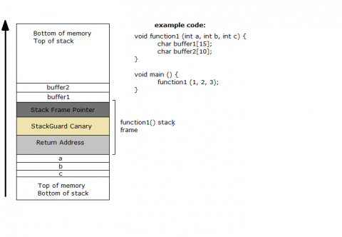
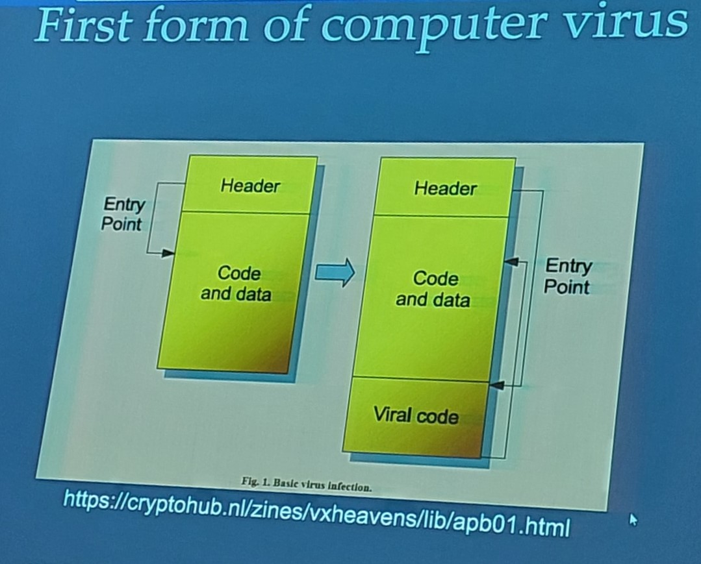
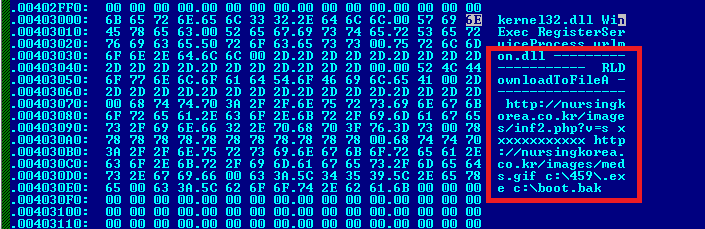

<style>
    strong{
        background-color:#faf43e;
        color: black;
        padding:0.1rem 0.2rem;
        border-radius:5px;
    }
</style>

# Memory Error - Countermeasures

Tipi di attacchi che si basano su Memory Error. Consiste nell'iniettare del codice in memoria da far eseguire, obbiettivo principale di questi tipi di attacchi è quello di riuscire a modificare puntatore a funzione:
* Smashing the Stack
* Heap Overflow
* Format String Bug [Example](https://owasp.org/www-community/attacks/Format_string_attack)

Le zone di memoria che vengono usati sono: Stack, Heap e Librerie di sistema come `libc` nella memory-mapped region.

## Contromisure 
Le contromisure sono sviluppati a 4 livelli del sistema:

### A livello developer 
Insegnare ai programmatori di non usare funzioni libreria vulnerabili (es. `gets()`, `strcopy()`). Per quasi ogni funzione sono state inventate delle versioni sicure come `strncpy()`, `strncat()` dove `n` significa il numero di caratteri da leggere, cioè non copia più di di quello che è stato dichiarato. 

Il problema di questo metodo è che anche se si può insegnare a nuovi sviluppatori di usare queste funzioni sicure, non si può cambiare i programmi già esistenti che utilizzano le vecchie funzioni vulnerabili. (es. sostituire il codice C legacy oppure sostituire tutte le funzioni vulnerabili in Windows e ricompilare, è un lavoro che nessuno vuole fare).

Quindi, per ovviare a questi problemi ci viene incontro l'OS e hardware.
### Address Space Layout Randomization - ASLR 
è una protezione a livello di sistema operativo: è la prima protezione che introduce l'os, quindi, è una feature dell'os, che ad ogni esecuzione cambia l'indirizzo di partenza dello stack questo rende estremamente difficile il calcolo del Return Address.

```c
#include <stdio.h>
#include <stdlib.h>

// this program let you check if address space layout is randomized
// if you run this program and addresses change every time it means that kernel has randomization activated

void main(){
    char x[12];
    char *y = malloc(sizeof(char)*12);

    printf("Address of buffer x (on stack) : 0x%x\n",x);
    printf("Address of buffer x (on heap) : 0x%x\n",y);

}
```
commando per abilitare/disabilitare la protezione ASLR: 

* 0 = disabilitato, 
* 1 = abilitato (default), 
* 2 = abilitato (temporary).

    sudo sysctl -w kernel.randomize.va.space=0

Ci sono tecniche per bypassare questa protezione: es. sapendo che l'os cambia solo ultimi 12bit dell'indirizzo si può fare brute force (1024 tentativi da fare). 

### Stack-Guard - Canary
Una protezione a livello di compilazione: inoltre, al prologo ed epilogo, il compilatore introduce una guardia. Una guardia è un valore messo in una locazione dello stack, che viene messo tra variabili e Return Address. Durante un attacco di buffer overflow il valore di guardia viene soprascritto, quindi, il processo controlla prima del `ret` se il valore che stato assegnato è cambiato, se stato cambiato vuol dire che qualcuno ha provato ad alterare lo stack. 



Il valore della guardia è un numero casuale che viene memorizzato in un registro dedicato della cpu chiamato `GS`, però generare un numero casuale e nasconderlo al attaccante è molto costosa. Quindi si usa un informazione pubblica che non può essere scavalcato dall'attaccante.

```s
; at&t syntax

; prologo

; canary start
movl %gs:20,%eax
movl %eax,-12(%ebp) ; 12 byte sotto ebp
xorl %eax, %eax

; do something

; canary check 
movl -12(%ebp), %ex
xorl %gs:20,%eax
je -L2
call _stack_chk_fail ; stampa stack smash detection

; epilogo 

ret
```
Tutto questo viene inserito automaticamente dal compilatore durante la compilazione.

L'opzione `-fno-stack-protector` lo disabilità.

Il codice prima dell'inserimento dello stack guard:
```c
void function1 (const char* str){
    char buffer[16];
    strcpy(buffer, str);
}
```
Il nostro codice con il `stack check guard`:
```c
extern uintptr_t __stack_chk_guard;
noreturn void __stack_chk_fail(void);

void function1(const char* str){
    uintptr_t canary = __stack_chk_guard;
    char buffer[16];
    strcpy(buffer, str);
    if ( (canary = canary ^ __stack_chk_guard) != 0 )
            __stack_chk_fail();
}
```

Questo valore è chiamato `CANARY` ed è stato inventato da "Chris Eagle ??", è chiamato canarino perché è una tecnica usata nelle miniere dove mandava un canarino all'interno per verificare la presenza di gas (metano). Sostanzialmente un indicatore di pericolo.

#### Tipi di valori canary
* Terminator: è un valore costituito da valori terminatori delle stringhe, NULL `0x00`, Cariage Return CR `0x0d`, Line Feed LF `0x0a`, End of File EOF `0xff` (es. `0x000d0aff`).
* Random: un valore random generato al momento di esecuzione (exec time). Utilizza `/dev/urandom` oppure l'hash dell'orario.
* XOR Random: in cui si usa un random canary `xor-scrambled` parziale oppure intero con un dato di `control data` (frame pointer + return address).

Posso bypassare canary test se metto il valore del canarino, ma questo non posso mettere dentro input con shellcode perché `0x00` è un terminatore di stringa per `gets()` e `0x0a` per `scanf()` quindi non posso inserire tutto il codice di shellcode.

### A livello hardware - Non-Executable Stack
è un opzione utilizza un componente a livello hardware e un componente a livello software. Consiste nel rendere lo stack una zona di memoria non eseguibile.

Componente a livello hardware se il processore riceve istruzioni da un indirizzo di stack fa segmentation fault cioè non manda in esecuzione l'istruzione. Questo lo fa leggendo il bit protezione nella tabella delle pagine No-eXecute bit (NX bit).

Questo può essere raggirato usando l'attacco`Return-to-libc`.

#### Data Execution Prevention - DEP (Microsft)
Componente a livello software, è una protezione di memoria a livello di sistema presente nei sistemi Windows a partire dalla versione Windows XP e Windows Server 2003. consiste nel settare le pagine di memoria come non-executable, questo rendere molto difficile eseguire attacchi di tipo buffer overflow su stack, heap e memory pools. Se un codice viene eseguito da una ragione non eseguibile il processo viene terminato.

# Malicious Software - Malware
Questo approccio consiste nel costruire un programma che attacca il sistema e convincere l'utente in qualche modo a mandarlo in esecuzione. Adesso il problema non è quello di cercare bug di sistema come nel caso di buffer overflow ma di convincere la vittima ad eseguirlo. Se riesco farlo, allora, non devo studiare il sistema operativo ma mi basta sapere un linguaggio di programmazione.

Malware è un programma che viene caricato in sistema in modo nascosto con obbiettivo di compromettere confidenzialità, integrità o disponibilità dei dati, delle applicazioni del sistema operativo.

>NIST 800-83 defines malware as : "a program that is inserted into a system, usually covertly, with the intent of compromising the confidentiality integrity, or availability of the victim's data, applications, or operating system or otherwise annoying or disrupting te victim."

Un malware è costituito da due parti principali, una parte che si occupa di propagazione/diffusione e una parte che si occupa degli effetti che causa.

All'inizio dato che le macchine Windows non erano collegate alla rete internet i virus propagavano con i floppy.

## Tabella terminologia pag. 185

## Classificazione dei malware
### Possono essere classificati in due categorie principali:
* In base al modo in cui si diffonde oppure come propaga fino alla vittima,
* Secondo le azioni o payload fa una volta raggiunto la vittima.

### Possono essere classificati anche in seguente modi:
* in base se ha bisogno di un agente esterno per diffondersi (codice parassita come virus),
* virus autonomi come worms, trojans, and bot,
* malware che non si replica es. spam e-mail, trojans
* malware che si replica es. virus, worms

## Metodi di propagazione
Per propagarsi il malware può:
* **infettare del codice** delle applicazioni del sistema,
* **sfruttare degli exploits** di software, quindi, trova una vulnerabilità e inietta del shellcode e diventa virale,
* **convincere la vittima** ad eseguire il programma, quindi, bypassando tutti meccanismi di controllo.

## Azioni del payload (effetti del malware)
* Può compromettere il funzionamento del sistema oppure modificare il contenuto di un file,
* Rubare servizi es. botnet,
* Rubare informazioni es. keylogger,
* Nascondersi in un sistema.

Queste azioni possono essere fatti anche da un exploit cambia solo la modalità con cui si arriva al sistema.

Inizialmente la creazione di malware richiedeva delle competenze estremamente alte di programmazione, i primi malware era scritti in assembly. Toolkits usati per crearli vengono chiamati `crimeware`.

Esempi di malware famosi:
* Zeus: un malware sofisticato creato per rubare dati bancari,
* Angler.

## Advanced Persistent Threats APT
è una tipologia di malware che ha due caratteristiche principali: 
* **avanzato**: usufruisce di una vasta gamma **tecniche e tecnologie sofisticate di intrusione e malware**;
* **persistente**: che è la caratteristica fondamentale perché adotta particolari tecniche per **restare nascosto più a lungo possibile** con obbiettivo di raccogliere dati sensibili, è la **differenza principale** rispetto gli altri malware;
* **threats** (minacce): minaccia di compromettere obiettivi mirati normalmente sono obiettivi politici od organizzazioni importanti.

Normalmente è un attacco mirato e sponsorizzato dai governi.

Profili di alto livello: Aurora, RSA, APT1 e Stuxnet.

## Viruses
Un **virus è un programma parassita** che è in grado infettare un altro programma che per compromettere utilizza i **dettagli implementativi e vulnerabilità** dell'os e dell'hardware:
* è in grado di inserire una propria copia del virus nel programma,
* è in grado replicare e infettare altri contenuti,
* è in grado di diffondersi facilmente nella rete.

Sono stati inventati a partire dagli anni '80.

### Come fa ad infettare? 
Aggiunge un pezzo di codice dentro l'eseguibile spostando l'entry point del programma al suo codice.



### Azioni di un virus
Quando è attaccato ad un programma è in grado fare tutto quello che il programma compromesso è in grado di fare (es. nell'ambiente unix un eseguibile va in esecuzione in modalità user quindi può fare tutto quello che può fare l'utente invece se infetta un eseguibile con permessi root allora può fare tutto. il problema di Windows vecchi era che gli utenti erano tutti amministratori del sistema praticamente root).

### Componenti del virus
* **Meccanismo di infezione**: quindi il **modo con cui si diffonde** chiamato anche `infection vector`.
* **Trigger**: è **evento o condizione** che determina quando attivare il payload detto anche `logic bomb`. Non tutti i virus si attivano appena stati infettati quindi è un componente **opzionale** (es. il virus Michelangelo si attivava solo al compleanno di Michelangelo).
* **Payload**: è quello che il virus deve fare.

### Fasi del virus
* Fase **dormiente**: **aspetta il trigger**,
* Fase **triggering**: in cui si **attiva**, 
* Fase **propagation**: **garantire la sopravvivenza**, quindi si infetta/replica/diffonde, 
* Fase **execution**: esegue il programma "maligno".

Quindi, la prima cosa che fa un virus è infettare.

### Macro e scripting virus

I **macro virus** sono in **grado di attaccarsi ad un file** come word, pdf, mp4, jpeg, ecc. Questi file hanno al loro interno del **codice eseguibile scritto in un linguaggio di programmazione più avanzati come VB/Js** che viene eseguito dal programma reader. 

Per esempio un file word/excel non è fatto solo di testo ma ha anche del codice eseguibile (Visual Basic) che può venire usato per formattare il testo, nel caso di pdf ci può essere anche del Javascript.

>NIST 7298 define a macro virus as: "a virus that attached itself to documents and uses the macro programming capabilities of the document's application to execute and propagate."

I macro virus sono:
* sono indipendenti dall'os,
* infetta i documenti, non codice eseguibile del programma,
* sono diffondersi molto facilmente,
* sono più semplice da scrivere rispetto virus tradizionali.

```
macro Document_Open
    disable Macro menu and some macro security features
    if called from a user document
        copy macro code into Normal template file
    else
        copy macro code into user document being opened
    end if
    if registry key "Melissa" not present
        if Outlook is email client
            for first 50 addresses in address book
                send email to that address
                with currently infected document attached
            end for
        end if
        create registry key "Melissa"
    end if
    if minute in hour equals day of month
        insert text into document being opened
    end if
end macro
```
il trigger di `melissa` è `if minute in hour equals day of month`

**I virus tipicamente si mettono nel `boot sector`** (è il settore che viene letto per secondo quando si avvia un computer, prima carica il firmware dal rom) che carica il kernel, vuol dire che il virus viene caricato prima di tutto quindi ha controllo completo della macchina. Oppure viene messo negli **eseguibili** oppure nei **documenti** come word.

* Boot sector infection (master boot record or boot records),
* File infection (executable file),
* Macro virus (documents like word, pdf, which uses macro or scripting languages and interpreted by an application),
* Multipartite virus (infects files in multiple ways)

### Concealment strategy - Come fa un virus a nascondersi?
Un virus tipicamente fino agli anni 2010 veniva individuato attraverso il suo **signature**, è **una stringa binaria che contraddistingue un virus**, quindi i ricercatori cercano delle stringhe univoche che caratterizzava i virus, quindi messi in un database. Ogni volta che l'os mandava in esecuzione un programma passava l'eseguibile all'antivirus quindi antivirus controllava l'eseguibile per una stringa presente nel database.



* Encrypted virus
* Stealth virus
* Polymorphic virus
* Metamorphic virus

Come contro mossa i creatori di virus hanno pensato di cifrare il codice del virus **Encrypted Virus**. Il corpo del virus è **suddiviso in due parti**, una parte **payload** una parte che contiene il **routine di decifratura**. Quando il virus va infettare un sistema fa partire la funzione di encryption e decryption che genera una chiave casuale cifra il payload e infetta il sistema, in questo modo si ha copie diverse di virus, praticamente cambiando la chiave di cifratura cambia l'aspetto tutte le volte pur rimanendo lo stesso.

Es. Cascade virus in 1988

L'antivirus si concentra sul routine di deciframento perché l'unica parte non cifrata, quindi si cerca il signature su quello.

A questo punto i creatori di virus hanno fatto in modo che il **decryption routine** pur rimanendo in chiaro **cambiasse in volta in volta**. Quindi **inserivano delle istruzioni inutili**. Questi virus sono una evoluzione di virus cifrati chiamati virus polimorfi **Polymorphic Virus**. Quindi, ogni generazione di virus ha un signature diverso.

Es. Chameleon virus or V2P del 1990, Whale virus


A questo il meccanismo di signature non è più sufficiente per individuare un virus. La soluzione fu inventato da **Eugene Kaspersky**, l'intuizione è stata che una volta che virus è decrittata e caricata in memoria, è sempre lo stesso, questo perché il processore non è in grado di eseguire istruzioni cifrate. Quindi **carico il virus in un virtual machine** e lo faccio partire quindi il virus si decifra e **controllo il signature**.

Per evitare il metodo di Kaspersky i costruttori dei virus hanno inventato i virus metamorfi **Metamorphic Virus** che si modificano completamente da una generazione all'altra, quindi la tecnica si **aggiungere istruzioni casuali** che è stata applicata al routine di decryption nei virus polimorfi viene esteso **a tutto corpo del virus** (`scrambling`). **Quando infetta un nuovo file/sistema si modifica automaticamente** quindi, ogni copia di virus è completamente diverso.

Come si becca? Nei primi casi è stato fatto un'analisi statica. Nel caso dei virus metamorfi si manda in esecuzione il virus e si vede cosa fa, quindi si fa un analisi dinamica. 


#### Analisi statica
* controlla il codice senza eseguirlo
* scansiona in una white list
* scansiona con antivirus differenti
* weeding: rimuove parti del file non infetti per identificare il virus
* analisi del codice, controlla il codice binario per capire se è eseguibile ELF, PE
* disassembling, controlla il byte code se presenta qualcosa di anomalo

#### Analisi dinamica
* controllo esecuzione del codice dentro un sandbox
* monitora cambiamenti al:
  * file system, 
  * registri, 
  * processi, 
  * threads,
  * porte di rete 

## Worm
Un virus ha bisogno di un corpo trasportatore, hanno pensato di creare un malware che non ha bisogno di un trasportatore, quindi un virus che è **autoconsistente**, nasce quindi l'idea del worm.

**Worm è una forma di malware che è in grado di gestirsi da solo**, quindi non ha bisogno di file di varia natura. Un **worm sfrutta le vulnerabilità di un codice già in esecuzione per eseguire autonomament**e come un servizio di rete è il programma che gestisce la porte. Quindi, utilizza exploit come buffer overflow.

Il primo worm documentato è quello del 1980 di Xerox Labs

(Una porta è un programma che ascolta il traffico TCP e UDP che arriva dalla rete (ci sono 65000 porte per TCP e per UDP, ci sono 13000 porte), es. porta 80 è dedicato per web browser.

Quindi lo shellcode del nostro exploit è il worm.

Quindi, il worm usa un bug di un servizio di rete, la prima cosa che fa il worm è quello di replicarsi non come un virus ma va cercare altri servizi rete su altre macchine. Quindi, il worm si muove in maniera random. 

I worm possono replicarsi attraverso:
* E-mail o instant messenger: aworm invia una sua copia agli altri sistemi attraverso posta elettronica,
* File sharing: si copia oppure infetta come un virus un file di un usb/cd etc.
* Remote execution: worm  esegue una sua copia su un altro sistema,
* Remote file access or transfer: worm usa un remote file access or servizi trasferimento per copiarsi da un sistema all'altro,
* Remote login: worm logga dentro un sistema remoto come un utente e usa comandi dell'utente per copiarsi.

In questo il virus Melissa è un worm che va replicarsi usando indirizzi email ma era un macro virus che aveva bisogno di un documento per appoggiarsi quindi non è autonomo.

### Target discovery

Quindi, worm attacca una macchina e questa macchina ha un certo ip, da cui può usare un generatore di numeri causali, una lista di indirizzi ip per attaccare altri sistemi. I worm si diffondo in maniera estremamente rapida.

* Scanning (or fingerprinting): cerca altri sistemi da infettare,
* Random: utilizza un generatore di numeri casuali,
* Hit-list: utilizza una lista di ip
* Topological: utilizza informazioni della macchina infettata per trovare altri host,
* Local subnet: utilizza il subnet mask per generare ip.

Il worm può attaccare una macchina che stata già attaccata, è l'errore di Morris che non controllava se la macchina fosse già stata infettata, quindi le macchine crashavano per troppe copie di worm.

Un virus in qualche modo ha bisogno dell'intervento umano mentre un worm non ne ha bisogno.

Morris usava remote login per entrare oppure usava buffer overflow sul comando `finger`.

Worm famosi:
* Melissa - 1998 - email worm
* Code red - 2001 - Exploited Microsoft IIS bug
* Nimba - 2001 - worm/virus spread through email windows share
* Stuxnet - 2010 - targeted industrial control systems

## Ransomeware
Wannacry è un worm, è il primo ransomeware che viene utilizzata da un'organizzazione criminale. Utilizza un insieme di bug tra cui `eternal blue` (rubato da NSA), sono degli errori di del protocollo samba di file sharing di Windows.

Per fermare è stato utilizzato un suo meccanismo che controllava se un certo sito era attivo oppure no, se non rispondeva si attivava. è stato trovato analizzando il codice tramite reverse engineering. Questo meccanismo si chiama **kill switch** è un meccanismo con cui il malware si auto blocca. 

## Mobile malware

>NIST SP 800-23 defines mobile code as: "program that can be shipped unchanged to a heterogeneous collection of platforms and executed with identical semantics".

18:00

clickjacking


social engineering
convince un untente ad eseguire un codice maligno
spam trojan horse mobile phone trojans 

cosa un virus quando arriva in un sistema?
in windows 95 e 98  tutti utenti erano amministratori del sistema
primo ranasomware nel 1989 il problam chiedere soldi , perché nn esisteva un metodo per prendere soldi essere beccato.

pegauss usava bug di adobe reader
installava una prima parte e poi scaricava il resto