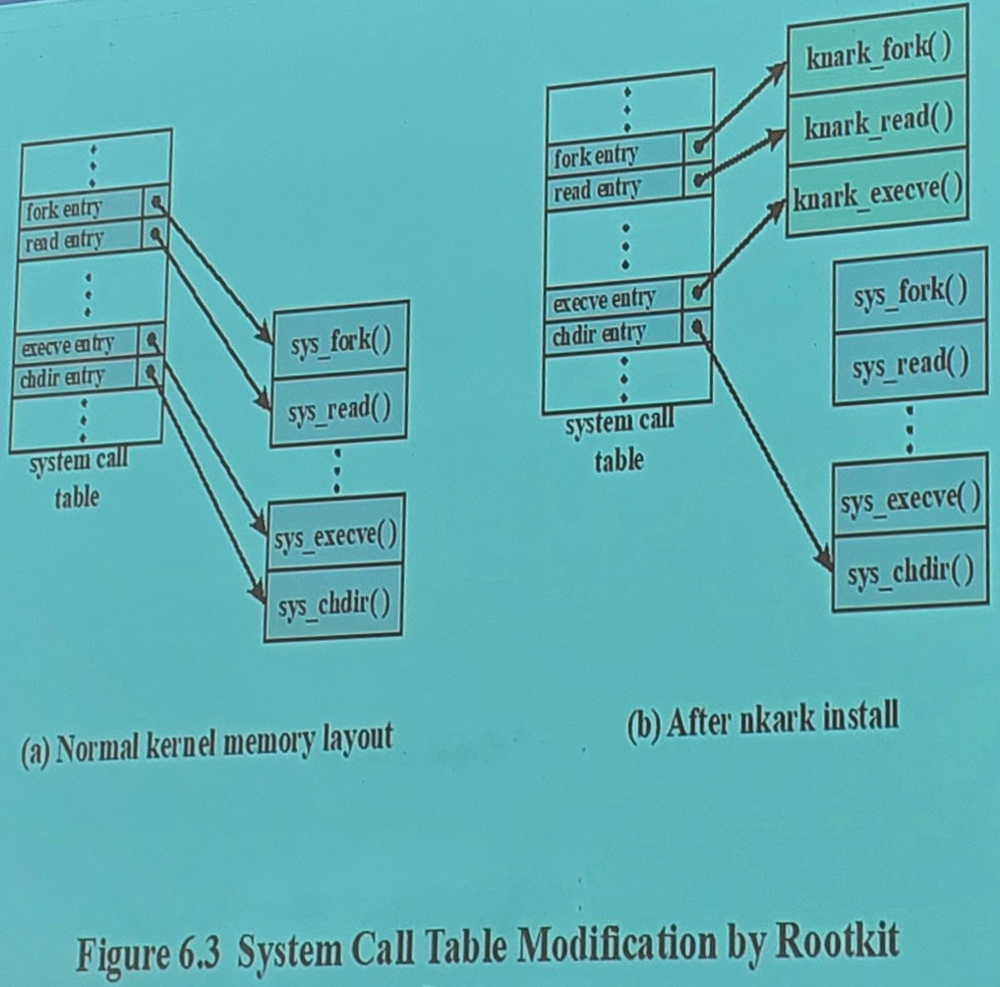

<style>
    strong{
        background-color:#faf43e;
        color: black;
        padding:0.1rem 0.2rem;
        border-radius:5px;
    }
</style>

### Materiale didattico
cap 6 del libro di testo


# Malware - part 2

## Backdoor
In questo caso l'attaccante vuole prendere il controllo della macchina ma alla arrivo sulla macchina non sa ancora cosa farne, quindi, installa un Backdoor anche detto trapdoor è **un meccanismo che consente di entrare bypassando il meccanismo di autenticazione**. Tipicamente usato dai programmatori in fase di debugging e testing chiamato `Maintenance hook`.

Quando viene installato un malware, si individua e compromette dei servizi rete con un suo servizio di rete che ha le stesse caratteristiche con un backdoor (es. si sostituisce il servizio telnet con cui se si digita "admin" riesce a loggare).

## Rootkit
Sono una serie di programmi e applicazioni che vengono installati per nascondere il malware/l'attacco. Va a sostituire/modificare comandi di sistema che vengono usati per monitorare il sistema. L'idea è far in modo che l'utente non veda l'attivita del malware (es. sostituisce il command `ls` con un `ls` modificato in cui non fa vedere i file del malware).

Tipi di rootkit:
* persistente, ogni volte che si fa il boot vengono portati in memoria;
* memory based, viene attivato solo nel momento in cui il malware parte, quindi quando di spegne la macchina rootkit sparisce;
* user mode;
* kernel mode;
* virtual machine based, il rootkit fa partire un vm su cui si fa girare l'os sottocontrollo dell'attaccante, quindi l'os non gira sulla macchina fisica ma sul vm che ha fatto partire il malware;
* external mode; 

Come funziona? vanno a modificare il puntatore di syscall nel kernel. Banalmente, installalo delle nuove syscall e vanno modificare il puntatore della tabella del kernel (es. quando si fa la fork() viene chiamato un'altra k_fork() modificato).



# Malware - Countermeasures Approches
La strategia base di difesa:
* prevention: es. stack-guard come nel caso di buffer overflow ma non è sempre possibile prevenire, quindi si cerca di fare detection; 
* detection: predispongo dei meccanismi che si accorgono delle anomalie (attacco) nel sistema
* response.

## Principali elementi di prevenzione
* politiche: dei modi di comportamento a chi usa i sistemi quindi limitare accesso alle informazioni, solo certe persone possono fare certe azioni;
* awareness: devo rendere consapevole dei rischi legati  all'uso delle tecnologie (corsi agli utenti finali) (es. contro phishing).
* vulnerability mitigation: cercare di ridurre la superficie di attacco, quindi ridurre le vulnerabilità;
* threat mitigation: ridurre la probabilità delle minacce sul sistema

## Detection e Response
Se prevention fallisce si fa detection and response.

La misura di detection più utilizzata è software antivirus.

1. First generation: **simple scanners**, va cercare un **pattern** particolare dentro un eseguibile per identificare un virus già conosciuta;
2. Secondo generation: **heuritstic scanners**, aggiunge un ulteriori controlli che usano politiche euristiche e controllo di integrità (controllava l'integrità dei software già installati e erano cambiati lo veniva bloccato, non funziona per software nuovi); 
3. Third generation: **activity traps**, utilizzato per malware polimorfi, in cui si osserva/monitora le azioni del programma in esecuzione (in memoria);
4. Forth generation: **full-featured protection**, introduce meccanismi che cercano di simulare il malware attraverso simulazioni e meccanismi di machine learning.

Il rilevamento del malware avviene tramite:
* **signature based**, funzionava fino l'avvento dei virus polimorfi, ma è ancora usato perché i vecchi virus sono ancora in circolazione;
* **behavior based**, analisi comportamentale, il problema di questo metodo è che potrebbe causare danni al sistema prima che venga identificato e bloccato dato che richiede esecuzione per rilevare il malware; 
  * **Specification based**

Tipo di analisi può essere:
* **Statico**: in cui prendo l'eseguibile e lo analizzo e cerco capire se contiene delle sequenze di istruzioni pericolose;
* **Dinamico**: mando in esecuzione il malware ed osservo il suo comportamento intercettando le syscall perché le operazioni pericolose vengono fatte con syscalls (in linux comando `strace`, es. syscall pericolose come quelli che aprono servizi di rete oppure quelli che aprono/creano/cancellano file del file system);
* **Hybrid**: una via di mezzo tra statico e dinamico.

Le signature caratterizzano un virus da un altro, quindi, tipicamente il database delle signature è segreto industriale. Loro le raccolgono attraverso sensori sparsi sui router che instradano il traffico della rete oppure dai sensori delle macchine degli utenti.

### Common Malware Enumeration - CME
Esiste un organizzazione no-profit statunitense **MITRE** che raccoglie e li fornisce un identificazione unica alle signature vecchie di paio di ore e le rende pubbliche.

Antivirus gratuito come `Virustotal` offerto da google utilizza vari antivirus contemporaneamente per analizzare un file.

### Endpoint Detection and Recovery - EDR
è un prodotto che è in grado fornire "real-time" detection, prevention e response. Raccoglie dei dati e li manda al cloud per analisi oppure dati vengono mandati agli algoritmi di machine learning. è **reattivo**, quindi, in grado di rispondere autonomamente (es. se il virus apre una porta lui lo chiude oppure se vengono creati dei file lui li cancella immediatamente). Il problema è sui falsi positivi.

* Performing automated analysis at endpoint,
* Machine learning supervised and unsupervied,
* Integrating threat intelligence, feed, and IOCs (Indicator of compromise): cerca di fornire delle informazioni addizionali per capire se quello che succede sul sistema è opera di un malware, Indicator of compromise, sono dei pattern che indica il comportamento di alcuni malware (es. quel malware crea un file sotto questo directory).
* Supporting real-time endpoint queries
* NG AV (Next Generation Antivirus) functionality + reporting.

# Abraworm
Implementazione di AbracadabraWorm (Purdue University, USA)

https://engineering.purdue.edu/kak/compsec/NewLectures/Lecture22.pdf

[PDF - Lecture22 notes](assets/docs/AbraWorm_Lecture22.pdf)

[Repository - Laser Lab](https://git.laser.di.unimi.it/teozoia/abraworm)

Trova una vulnerabilità, si replica su altre macchine cercando di utilizzare la stessa vulnerabilità, in fine cerca di esportare dei file (i file che hanno la stringa "abracadabra").

Il servizio di rete più attaccata è `ssh`, quindi, il nostro worm fa un brute force su `ssh`.

è interessato al contenuto della home, una volta loggato fa un `ls | grep` e esfiltra i file su un altro host tramite `scp`. E tenta di infettare altre macchine.

la porta della nostra macchina 22:2222 la porta del docker.


```sh
docker compose up # per eseguire
docker-compose up --force-recreate
docker ps # per visualizzare i processi docker
```

Il worm utilizza delle liste di utente e password per fare il bruteforce, 

[User List](https://raw.githubusercontent.com/jeanphorn/wordlist/master/usernames.txt) |
[Password List](https://raw.githubusercontent.com/danielmiessler/SecLists/master/Passwords/Leaked-Databases/rockyou-75.txt)

La libreria python `paramiko` fornisce un api per ssh.


