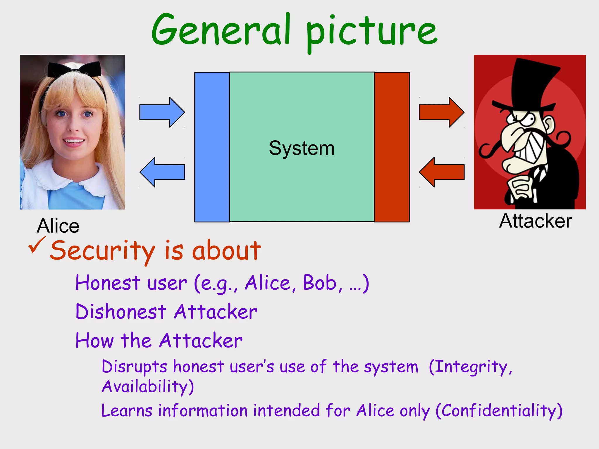

# Network Security

In **Network security** l'attaccante **sfrutta debolezze dei protocolli di rete** rispetto **system security** che sfrutta le debolezze dell'os oppure delle applicazione del sistema. All'interno del network security c'è una parte particolarmente importante che è **Web security**, è una sottospecie legato all'HTTP ed alle applicazioni web che girano all'interno del web.

Esiste anche una branca che di sicurezza che si chiama Hardware security che riguarda side-channel attacks.

confidenzialità: l'attaccante non deve essere in grado di sapere i segreti di Alice,
integrità: l'attaccante non deve essere in grado di corrompere i funzioni di sistema,
disponibilità: l'attaccante non deve essere di grado di sottrarre il funzionamento del sistema.

## Che cose è una rete?
Una rete è un insieme di calcolatori connessi tra di loro. La forma più elementare di una rete è due endpoint collegati tra di loro tramite un cavo che lo utilizza per scambiarsi informazioni. L'obbiettivo della rete è quello di facilitare lo scambio di informazioni.

**Endpoint** sono gli hosts, dispositivi che generano traffico di informazioni (es. pc, smartphone).

**Apparati attivi**: sono dispositivi intermedi che vengono utilizzati per creare collegamenti e per inviare le informazioni tra canali, generalmente non generano traffico (es. router, switch).

The plumbing is called a **link/channel**: we don't care what the physical technology is: ethernet, wireless.

componenti principali di una rete sono: hosts, apparati attivi e canale.

### Local area network - LAN
è una rete che collega i calcolatori in una area di dimensione limitata tipicamente entro un 1km. Tutti gli host sono connessi tramite switches e hubs.

### WIde area network - WAN
wan (internet è una wan), la rete di nato, wan è un insieme di lan.

### Network interface card - NIC
Un host a collegarsi alla rete necessità di una scheda di rete (ethernet, wifi). Un host può avere più interfacce di rete. (è possibile configurare l'interfaccia di rete in modalità promiscua)

Sulla rete internet, ogni host ha due indirizzi, 
* **MAC address** serve per LAN (network card), usa un numero esadecimale formato da 48bit che viene installato dal fabbricante, cisco 00-1a-a1,...
* **IP address** per WAN, layer 3 ip, IPv4 usa 32bit invece IPv6 usa 128bit.

#### Media Access Control - MAC Address
Per visualizzare il MAC/IP address su Linux `ifconfig` e Windows `ipconfig /all`
Cambia il MAC address in Linux: 
* stop networking service: `/etc/init.d/network stop`
* change networking service: `ifconfig eth0 hw ether <MAC-address>`
* start networking service: `/etc/init.d/network start`
  
## Protocolli
Per comunicare gli host utilizzano dei protocolli, sono dei programmi implementati a livello OS, nell'ambito dell'OS ce un componente di rete, un modulo che si occupa della gestione di rete interfacciando con la scheda di rete che poi implementa i protocolli di rete. **Protocolli sono dei programmi in cui è stato stabilito come due host devono comunicare** es. come chiedere un servizio, come fa un host a mandare un email ad un altro.

I protocolli possono essere classificati a grandi linee con due modi:
* **Connectionless** protocol: i dati vengono inviati appena viene raggiunto il numero minimo di dati richiesto per pacchetto (UDP).
* **Connection-oriented** protocol: offre una connessione affidabile tra due nodi creando un circuit-switch virtuale, normalmente viene usato da TCP. (anche se la rete è packet switching i pacchetti vengono tenuti in un buffer, vengono ri-ordinari prima di essere inviati). Sfrutta meglio la rete, l'affidabilità viene gestito a livello software.

Per fare instradamento si usano due modalità:
* **Circuit Switching**: stabilisco prima della comunicazione un canale fisico tra due host, cioè faccio lavorare apparati attivi per creare il percorso, quindi tutte le comunicazioni tra i due seguiranno lo stesso percorso. (es. legacy phone network)
* **Packet switching**: suddivido l'informazione in pacchetti e li instrado nella rete, quindi seguiranno dei percorsi diversi, il destinatario riceve i pacchetti in ordine sparso, quindi li ordina e manda al livello utente. In questo modo si utilizza al meglio la rete (Best effort), se un nodo si rompe utilizzo un altro. (Generalmente un pacchetto ha 1500 bytes)

## Encapsulation
Per comunicare su internet, si sovrappongono più protocolli, ogni protocollo ha un formato di pacchetto diverso per raggruppare tutte queste informazioni utilizzo il meccanismo di **encapsulation**. Ad ogni livello aggiungo un header e un footer opzionale al payload del livello precedente. Infine, ricezione ogni livello toglie encapsulation del suo livello.

Per comunicare all'interno della LAN devo conoscere MAC address e per anche per uscire dalla LAN devo conoscere MAC address del router.

Per trovare il MAC address di un host, si utilizza il protocollo Address Resolution Protocol ARP (a livello NETWORK). APR recupera a partire da un indirizzo ip il suo indirizzo mac, manda in broadcast una ARP Request chiedendo a tutti chi possiede questo ip address, quindi host che ha quell'indirizzo risponde. Se nessuno risponde allora quel LAN non ha quell'ip quindi il pacchetto viene instradato fuori attraverso router.

## Network security
Dal punto di vista della cyber security la rete introduce degli aspetti critici. Dal momento in cui due calcolatori sono sulla rete, le informazioni che prima si ricavava dal host adesso le si può trovare anche sulla rete. 

Quindi il **canale di comunicazione** può essere un nuovo elemento di debolezza su cui attaccare. Dopo di che, con la rete vengono introdotti dei **nuovi device** (apparati attivi) che a loro volta avranno delle debolezze (es. hardware dedicati allo smistamento del traffico internet come router), una compromissione su una di queste macchine compromette tutto il traffico che gira.

Dal punto di visto dell'os, il sistema diventa più vulnerabile perché i componenti di rete aggiungono **nuovi software** e **applicazioni di rete** che a loro volta introducono nuovi elementi di vulnerabilità es. attacchi a protocolli, ssh, sftp, http, smtp e web applications come browser, email client ecc. 

Inoltre, la rete può essere utilizzato per inviare malware.

* Attacchi di tipo **passivo**: attacchi che non modificano in alcuno modo i sistemi su cui vengono effettuati e quindi sono difficilmente rilevabili. Sono principalmente legati ad **intercettazione del traffico**. Es. Analisi del traffico, leggere il contenuto del messaggio.

* Attacchi di tipo **attivo**: prevedono in qualche modo una modifica ai protocolli oppure di pacchetti, quindi, possiamo creare,modificare i messaggi, modificare identità del mittente e destinatario e sopratutto attacchi di tipo Denial of service. Es. Man in the Middle MITM, TCP hijacking, dos/ddos. Maggior parte degli attacchi si basano su errori di progettazione di protocolli TCP.

TCP sono stati pensati per facilitare lo scambio di messaggi, non è pensato per attacchi, quindi non erano pensati contro "mal viventi". Principalmente è stato ideato per sopravvivere ad un attacco nucleare.

## Attacco spoofing - "impersonificazione"
Consiste nel modificare il source/destination address del protocollo IP.

Questo è possibile perché il protocollo IP non provvede un meccanismo di autenticazione, cioè non controlla i dati che vengono inviati.

L'IPv6 introduce dei meccanismi di controllo contro spoofing.

Ne esistono diversi tipi di spoofing tra cui IP spoofing.

Come funziona? l'attaccante fa uscire un pacchetto IP contenente un indirizzo di un'altra macchina. Generalmente, è usato per nascondere IP dell'attaccante.

## Attacchi sul canale di comunicazione - Sniffing, Wiretap, Eavesdropping
Canale di comunicazione, etere, doppino telefonico, fibra ottica, in tutti i casi è possibile intercettare.

Sulle LAN, si può configurare (con hub) la scheda di rete in **modalità promiscua**. **Hub** quando riceve un pacchetto lo manda a tutti gli host (broadcast), se il MAC address non corrisponde il pacchetto viene scartato, ma in modalità promiscua posso leggere il pacchetto. Con switch questo non succede, bisogna compromettere il switch.

Tecniche di intercettazione:
* Packet sniffing su ethernet: leggere i pacchetti che passano sulla rete.
* Radiation: usa le proprietà (radiazioni/corrente/elettromagnetismo) dei cavi in rame per intercettare.
* Fibra ottica: è quello più difficile da intercettare, tipicamente non può essere intercettato senza essere scoperti.
* Microonde: wifi, etere è facilmente intercettabile, basta una antenna.
* Comunicazioni satellitari: facile da intercettare anche in un raggio di 1 km dall'antenna, perché sono segnali molto forti.

|Medium|Strengths|Weaknesses|
|-|-|-|
|Wire| Widely used,   Inexpensive to buy, install, maintain|Susceptible to emanation   Susceptible to physical wiretapping|
|Optical fiber| Immune to emanation   Difficult to wiretap | Potentially exposed at connection points|
Microwave| Strong signal, not seriously affected by weather | Exposed to interception along path of transmission   Requires line of sight location   Signal must be repeated approximately every 30 miles (50km)|
| Wireless (radio,WIFI) | Widely available   Built into many computers | Signal degrades over distance; suitable for short range   Signal interceptable in circular pattern around transmitter|
| Satellite | String, fast signal | Delay due to distance signal travels up and down   Signal exposed over wide area at receiving end| 

### Tool per intercettazione
* Wireshark: è un packet sniffer, fa monitora, analizza, filtra il traffico, leggendo i pacchetti che traversa la rete.

è difficile rilevare se qualcuno sta sniffando, perché, intercettazione è un attacco passivo.

**Soluzione**: la via più rapida è encryption.

### Reconnaissance - fingerprinting
Consiste nel fare l'impronta di un sistema, è la prima fase di un attacco è trovare informazioni sulla macchina che vogliamo attaccare.

**Keychaine**, sono le fasi che caratterizza un attacco informatico, [attack.mitre.org](https://attack.mitre.org).

### Port scanning
Una tecnica di attacco che si basato sul principio di fingerprinting. Un host ha delle porte (65535 per TCP e per 65535 UDP) per comunicare con le applicazioni. Le prime 1024 porte sono riservate per applicazioni del sistema.

Un port scanner è un applicazione mirata a profilare un server in termini di servizi offerti. Es. `Nmap`.

#### Nmap
Con `nmap` si può sapere, quanti host, mac address, ip address della rete, costruttore di host, porte aperte, cosi si può profilare la macchina della vittima (solitamente eseguito da un altro pc compromesso).

Al giorno di oggi i pacchetti di `nmap` vengono filtrato dal firewall.

[Common Nmap commands](https://www.mygreatlearning.com/blog/nmap-commands/)

#### Common Vulnerability Enumeration
[cve.mitre.org](https://cve.mitre.org/) permette di vedere le vulnerabilità "note" di un certo servizio/prodotto di rete.