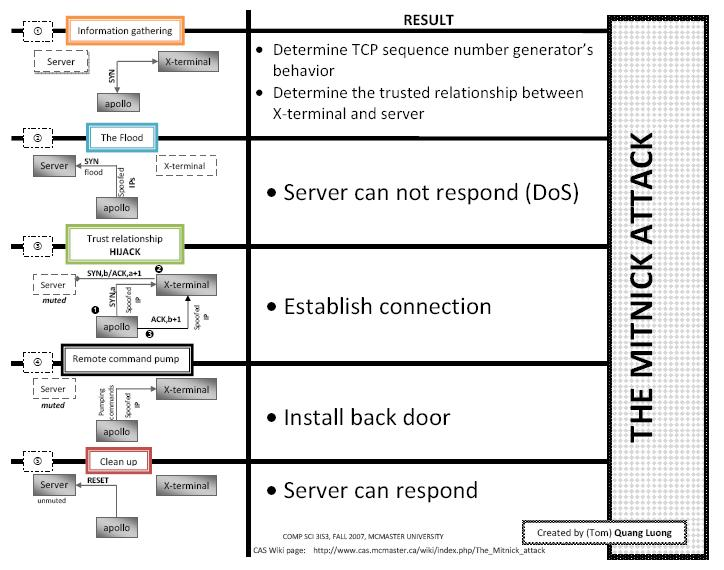

<style>
    strong{
        background-color:#faf43e;
        color: black;
        padding:0.1rem 0.2rem;
        border-radius:5px;
    }
</style>

# Network security - Attacks
Attacchi di rete sfruttano le vulnerabilità dei meccanismi di comunicazione all'interno dei protocolli, che sono stati pensati per un contesto di collaborazione (non antagonista).

## Address Resolution Protocol - ARP - Request/Reply
è un protocollo di livello 2 che viene utilizzato per comunicare all'interno di una LAN, usato per recuperare physical address (MAC) dato logical (IP) address. 

Quando un pacchetto arriva al protocollo di rete di livello 2:
Prima cosa che fa è andare a vedere se l'ip destinatario è dentro questa rete, per questo utilizza una tabella chiamata **ARP-Cache**, è una tabella che contiene degli **entry di tipo IP address -> MAC address**, se trova l'indirizzo del destinatario, prende il suo mac address, costruisce il pacchetto di livello 2 e lo invia, altrimenti, fa **in broadcast un ARP request** sulla rete LAN, 
chiedendo se qualcuno ha quell'ip, se qualcuno ha quell'IP **risponderà con ARP reply con il suo MAC address**. 

Quindi, è un meccanismo che si fida degli host della rete LAN sulla loro "buona fede".

Il protocollo ARP consente di fare un attacco di tipo **Man In The Middle** - MITM è un attacco che prevede che l'attaccante si intrometta tra il mittente e destinatario, quindi, l'attaccante è in grado di **intercettare** e/o **modificare** il flusso di informazioni tra gli endpoint di comunicazione.

L'obbiettivo è quello di sfruttare il protocollo ARP per fare un attacco MITM nell'ambito di una rete LAN.


## ARP (Cache) Poisoning
Consiste nel modificare (avvelenamento) la tabella ARP cache, cioè, mettere dei dati che non sono veritieri, è un **attacco di livello 2 usato per intercettazione**, come la prima fase di MITM, quindi usato a convincere un host a mandare i pacchetti all'attaccante invece che al destinatario vero.

**ARP cache viene aggiornato periodicamente**, le entry (ip -> mac) della tabella hanno una durata di qualche secondo. Per tenere aggiornato tabella senza creare overhead è stato ideato in modo che ogni volta che ricevo un pacchetto, aggiorna la cache.

**ARP è un protocollo stateless**, non ha memoria, cioè non si ricorda delle richieste che ha mandato prima, quindi quando riceve una ARP reply, lui aggiorna la tabella senza controllare che è stato inviato una richieste per quell'ip. Questo perché ARP si basa sull'assunzione che tutti gli host si fidano di altri host della rete LAN.
 
### ARP spoofing
Come si fa ARP Poisoning? Uno dei metodi che si usa è mandare delle reply senza che nessuna abbia fatta una request (detto anche gratuitos).


Quindi, consiste nel convincere un host A a mandare il pacchetto all'host C (attaccante) invece che a B. cioè, l'attaccante dice che l'ip della vittima (B) ha l'indirizzo MAC dell'attaccante.

Questo funziona perché a livello subnet per inviare pacchetti non si usa il MAC address.

Il commando `arp -a` oppure `arp /a` in Windows mostra la tabella di entry.

Dato che le entry scadono periodicamente, questo attacco va fatto in media circa ogni 40s.

Bisogna tenere in conto che se il destinatario comunica col mittente prima dell'attaccante la tabella viene aggiornata, quindi, bisogna mandare ARP reply più frequentemente.

Per fare **MITM bisogna fare un doppio ARP Spoofing**, Attaccante <-> mittente, Attaccante <-> destinatario. L'attaccante dopo aver modificato/letto deve inoltrare i messaggi ai destinatari altrimenti viene rilevato l'attacco.

### MITM Effects
Con MITM fatto tramite ARP Spoofing, l'attaccante può:
* **Sniffing**: intercettare, quindi, leggere il contenuto dei pacchetti,
* **DoS**: assegnando un MAC address inesistente, il mittente manderà i pacchetti a vuoto,
* TCP/IP **session hijacking**: un dirottamento della sessione, modificando i pacchetti.

Al momento **non ci sono soluzioni per ARP cache dinamico** contro questo tipo di attacchi, se non a livello di router, perché richiede di modificare il protocollo ARP. 

L'unica **soluzione** per questo tipo di attacco sono le **entry statiche**, cioè il contenuto della tabella ARP cache caricato da un file di configurazione, questo è possibile solo in particolari contesti (es. una caserma), quindi, non viene considerato come una soluzione per ARP Spoofing.

Le vulnerabilità che sono stati sfruttati:
* ARP è pensato per aggiornare continuamente il contenuto della cache,
* Il contenuto della reply non viene verificato minimamente,
* Gli ARP Announcement un altro tipo di pacchetto ARP che può essere usato per ARP Spoofing

### Tools:
* `hunt`, 
* `ettercap`: creato da ex studenti Alberto Ornaghi e Marco Valleri di UNIMI.

## Denial of Service - DoS | Distributed DoS - DDoS
Denial of service, è un attacco che va minare la proprietà di disponibilità di un sistema. Confidenzialità ed integrità possono essere protette attraverso adottamento di tecniche crittografiche ma ad oggi contro la disponibilità non si conoscono delle soluzioni (per attacchi  pesanti).

Obbiettivo è quello di bloccare un utente legittimo dal usare un servizio oppure sistema all'interno di rete, è basato essenzialmente sul far esaurire una risorsa a un sistema, quindi il sistema non è in grado di erogare il servizio oppure nessun servizio.

Tipi di risorse a cui si riferisce:
* Tempo di CPU,
* Memoria,
* Connettività/Banda,
* File di configurazione,
* Distruzione fisica, come il malware `Brain` che distruggeva la GPU.

Prima di tutto, bisogna chiedersi quale risorsa andare a far esaurire/bloccare.

Un esempio di DoS a livello host:
~~~c
while true{
    fork();
}
~~~
In questo caso si va esaurire la tabella dei processi, è una tabella dell'OS di dimensione finita, dove ogni volta che viene generato un processo viene allocato nella tabella dei processi un PCB, quando non ce più spazio PC crasha.

### Classificazione di attacchi DoS
||Stopping Services|Exhausting resources|
|-|-|-|
|Locally|Process killing <br> Process crashing <br> System reconfiguration| Spawing process to fill the process table <br> Filling up the whole file system <br> Saturate the bandwidth|
|Remotely|Malformed packets to crash buggy services| Packet floods <br> (Smurf, SYN flooding, DDoS, etc.)|

### Smurf Attack
Smurf attack non funzionano più, consiste nel ripetere richieste ping.

Come fa a generare miliardi di ping? un computer multithread non riesce a generare abbastanza richieste ping, quindi, si prende un pacchetto IP, come source address si mette l'indirizzo della vittima, come **destination address si mette broadcast address** (tutti host )di una rete gigante. 

Con ping sull'indirizzo broadcast della rete, tutti gli host ricevono una richiesta di ping e quindi tutti questi host rispondono alla vittima contemporaneamente.

Soluzione: quando trova un destination address di tipo broadcast lo viene scartato.


### SYN flood
SYN flood è un attacco di livello TCP che va saturare la tabella delle connessioni di un host.

Come avviene la connessione TCP? Il three-way handshake: il client che vuole comunicare manda un pacchetto `SYN` (sincronizza), in questo pacchetto allega un numero casuale `x`, il server risponde con un `SYN` con il suo numero casuale `y` con numero casuale del client `x+1` da questo client capisce che il server gli sta rispondendo. A questo punto client deve dimostrare che ha ricevuto `SYN` da parte del server, lo fa con un pacchetto `ACK` (acknowledgement) contenente `y+1`. 


Ogni macchina ha una tabella delle richieste di connessione TCP, quando il server riceve una richiesta di `SYN` lo inserisce nella tabella con l'indirizzo IP del client, dopo di chè quando il server riceve `ACK y+1` dal client, quindi, connessione stabilità tra server-client, il server cancella l'entry dalla tabella. 

Il server riconosce la connessione, perché il server memorizza l'indirizzo ip del client (source ip address) e la porta sulla quale richiede il servizio.

Questo meccanismo viene sfruttato per fare un attacco di tipo DDoS.

Incomincio a generare una serie di `SYN` al server, quindi il server comincia scrivere le richieste pendenti nella sua tabella e mi manda `SYN + ACK` ma io non li mando `SYN + ACK`, cosi si satura la tabella delle connessioni pendenti del server, quindi, non può più accettare nuove connessioni finché non si libera da qualche connessione, cioè la macchine non è più accessible dalla rete.

Per evitare questo di attacchi bisognerebbe modificare protocollo TCP che è "impossibile".

Generalmente per Distributed DoS vengono usate delle botnet.


L'attacco più massiccio è quello fatto ai servizi Amazon con traffico da 2,3Tbps

## TCP Session Hijacking
TCP Hijacking è un attacco storico di livello TCP (4) che si pensa abbia fatto Kavin Mitnick (lui l'ha negato). Sfrutta una serie di criticità dei sistemi negli anni 94-95. 

Alla base di questo attacco ce il 3-way handshake e che il server riconosce il client sulla base di seguenti dati: IP, PORT, Y+1 (syn ack inviato dal client). Noi sappiamo che IP e PORT non dati che garantiscono l'autenticità di un oggetto, nel senso che possono essere modificati. L'unica cosa difficile da indovinare è `Y+1` perché è un numero random generato dal server.

L'idea di questo attacco è ho due host A e B, che hanno stabilito una connessione TCP, ad un certo punto voglio che A invece di parlare con B parli con C (attaccante), dirotta i dati da A verso C e da C verso B. Il problema è che B riconosce A attraverso il numero `ACK Y+1`. Il numero `Y+1` viene incrementato per ogni pacchetto che si trasmette, si aggiunge il numero di byte trasmessi sommato al `Y` iniziale, quindi il server tiene traccia del numero `Y` e client del `X` (finestre TCP).

Se io mi intrometto in una connessione TCP tra due host, e voglio che l'host B riconosca il traffico mandato da me (C), devo conoscere i valori `X` e `Y`. Perché se il pacchetto non ha il sequenze number giusto viene scartato automaticamente.

Es. per far credere a B che il pacchetto arriva da A, il pacchetto deve avere, ipA, portA, x+n, quindi, devo conoscere `x`. 

Un **pacchetto TCP è valido**, solo quando IP address, port, seq num sono validi.

Come si a trovare il sequenza number? Si sniffa il traffico quindi devo avere accesso alla rete oppure si indovina.



### Remote shell - rsh 
Consentiva di eseguire comandi da remoto.

    # rsh <ip_address> <shell_cmd>
    rsh 192.168.56.102 hostname

    # rsh <ip_address> consente fare remote login attraverso rlogin

Il meccanismo di autenticazione: i file `etc/hosts.equiv` oppure `.rhosts` contiene elenco degli ip autorizzati per remote shell.

Scenario di partenza, `X-terminal` è la macchina personale della vittima, la vittima accedeva dal `Trusted server` al `X-terminal`, per evitare di ripetere il processo di autenticazione, la vittima inserisce l'ip del `Trusted server`. L'obbiettivo dell'attaccante è quello di accedere alla macchina della vittima `X-terminal`.


### Attacco
L'obbiettivo dell'attaccante è quello di impersonare il trusted server. Exploitando il servizio `rsh`.

1. La prima cosa che fa l'attaccante è quello di eseguire il commando `finger`, per sapere se la vittima era a casa. 

>`finger` è un comando che veniva usato per ottenere informazioni su persone attraverso l'email come nome cognome, numero di telefono, inoltre diceva se la persona era collegato al pc, ecc.

2. Esegue il comando `showmount -e <ip_address_vittima>`.

>`showmount` fornisce la lista delle macchine che hanno una relazione di `Trust` con la macchina con il dato ip.

>`rsh` è un servizio che lavora a livello TCP, comunica sulla porta 53.

3. Cercare di capire l'algoritmo con il quale viene generato il sequenze number (numero casuale) della macchina della vittima. Quindi, l'attaccante manda dei pacchetti (circa 20) `SYN` alla vittima e la vittima risponde con `SYN ACK`. Da qui Mitnick capisce l'algoritmo che ogni volta veniva aumentato di 400. Quindi, un algoritmo deterministico.
   
4. A questo punto, Mitnick esegue un attacco `SYN Flood` sulla macchina `Trusted server`, cosi facendo mette fuori uso `Trusted server`.

5. Dopo di che Mitnick manda un `SYN` alla porta `53` senza comando (`rlogin`) alla macchina della vittima. 
 
A questo punto ci sono due attacchi in contemporanea un Spoofing su `X-terminal` e SYN Flood su `Trusted server`. 
   
6. Al pacchetto modificato inviato da Mitnick al `X-terminal`, `X-terminal` risponde con un `SYN ACK` al `Trusted server`. A questo punto Mitnick deve rimandare alla macchina della vittima il `SYN ACK` con `Y+1` (`Y` è il numero casuale generato dalla macchina della vittima) ma Mitnick ha un'idea di come generarlo con i pacchetti SYN mandati al punto 3. Tutto consiste nell'indovinare `Y+1`.

7. Quindi, una volta loggato esegue `echo ++ > rhost`, sovrascrive il `rhosts` con `++`, questo vuol dire che tutto il mondo è trustable.

```sh
finder email_S
showmount -e ip_S
Send 20 SYN packets to S
SYN Flood T
Send SYN to S spoofing as T
Send ACK to S with a guessed number
Send "echo ++ > ~/.rhosts"
```


Soluzione contro questi tipi di attacchi? hanno ottimizzato i generatori di numeri casuali.