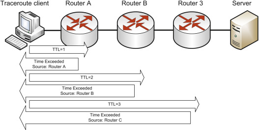
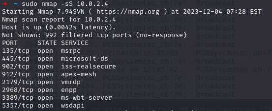
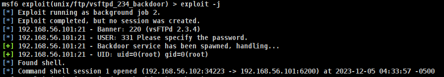

# Network Security Tools and Attacks

### Preparazione delle macchine
Virtual box con #1 Kali e #2 [Metasploitable 2](https://docs.rapid7.com/metasploit/metasploitable-2/)

Creare una NAT network su VB file -> tools -> network manager -> Host-Only Ethernet Adaptor 

Metasploitable è un sistema (vulnerabile) di testing per Metasploit

## Wireshark
Un applicazione che permette di monitorare l'attività "sniffing" di un'interfaccia di rete.

Right click -> follow tcp stream per tracciare una connessione.

settare dns server su Linux `/etc/resolve.conf`.

### Tracerout
`traceroute -n 8.8.8.8` 

La flag `-n` per non risolvere nomi

Come si fa a farlo? Lo si fa inviando un pacchetto e incrementando man mano il Time To Live (TTL) es. `1,2,3` quindi abbiamo 3 livelli di tracciamento. Un router in mezzo al path quando il TTL diventa 0 risponde al mittente con un messaggio che dice `TTL exceeded during transit`.

Lo si fa finché non riceve un reply dall'host cercato es. `8.8.8.8 `

`tracerouter -n -I 8.8.8.8` usa ICMP protocol (ping) senza la flag `-I` usa UDP.

## NMAP
Quando si ha un host e si vuole scoprire quali servizi sta servendo, si usa `NMAP`, è un applicazione che scansiona ogni porta di una macchina per scoprire quali porte sono aperte.

Per scoprire se una porta TCP è aperta, inizia aprire una connessione, manda un pacchetto `SYN`, se la porta è aperta la macchina risponde con `SYN ACK` e NMAP chiude subito la connessione.

`nmap -sT <ip_address>`

PROBLEMA: perché rendiamo consapevole la vittima? 
1. inviamo dei dati direttamente dalla nostra macchina 
2. apriamo una connessione con la vittima,
    
Quindi, lasciamo delle traccie sulla macchina della vittima.

`nmap -sS <ip_address>` NMAP parte da una porta effimera e non manda `ACK` dopo la recezione di `SYN + ACK`

**Per lasciare meno traccie**, non rispondo con un `ACK` al `SYN + ACK` della vittima, non completo il TCP handshake.

`nmap -O <ip_address>` oltre alle porte aperte, trova anche informazioni sulla macchina della vittima (non precisa). Es. Linux 2.0 risponde in una maniera diversa da Linux 3.0.

Lo fa analizzando le risposte ricevute dal sistema che stiamo analizzando.

Per essere più irrintracciabile, uso un altro dispositivo, configurato in un certo modo. L'idea è quello di fare un **side-channel attack su TCP**. 

Si fa una `NMAP idle scan`, sfruttando la segmentazione IP per capire tramite un host detto **ZOMBI**, se una determinata porta di host attaccato è aperta o chiusa.

L'host attaccato non riceve nessun pacchetto con IP sorgente dell'attaccante.

"Side-channel attack" perché valutiamo gli effetti che ha la comunicazione attaccato-zombie su alcuni header.

### IP segmentation 
Quando la grandezza del pacchetto IP supera Maximum Transmission Unit MTU, viene frammentato il pacchetto e inviato con un Identification ID di sequenza. In alcune implementazioni è un **Global Counter**. 

### Attacco
 
Se trovo un sistema zombie con global counter, quindi, indipendentemente dal destinatario con cui sta comunicando usa un contatore globale.

La prima cosa che facciamo è leggere ID dello Zombie, inviamo un `SYN+ACK` (mandiamo un pacchetto sbagliato apposta). Zombie ci risponde con `RESET RST` che contiene anche l'ID, controllando in due momenti diversi dall'ID possiamo inferire se tra un invio e l'altro è successo qualcosa e capire se una porta è aperta o chiusa (se il numero discosta di molto significa che quella porta è aperta).

## MITM - ARP poisoning

`Stuxnet`, il virus modificava la comunicazione tra i dispositivi e il centrale di controllo. il virus mandava delle istruzioni modificate che venivano dal centrale di controllo e il MITM modificava le info di ritorno verso il centrale di controllo.

### Ettercap
`Ettercap` è un tool grafico utilizzato per fare ARP Poisoning.

promiscue mode
1. selezionare interfaccia eth0
2. aggiungi ip da attaccare
3. tipo di attacco apr poisoning

### Armitage - vsftpd
Armitage è un applicazione basato sul framework di Metasploit che permette di fare alcuni attacchi, es. nmap scans, exploit di backdoor, ecc.

L'attacco che abbiamo visto su FTP usa `vsftpd` che è stato distribuito una versione con una backdoor.

`sudo msfrpcd -U user -P password` per lanciare `msfrpcd` come root.

In realtà basta fare `sudo armitage`.

Importante settare Host-Only Ethernet Adaptor su VBox altrimenti l'attacco non funziona per qualche motivo. (Provato not NAT network).

Procedimento:
* avviare armitage con privilegi root,
* nmap scan (modalità os detect) sulla vittima (ifconfig su metaspoiltable vm),
* cercare l'attacco nella lista exploit trascinare sull'host.
* nel tab exploit apparirà terminale del host attaccato

