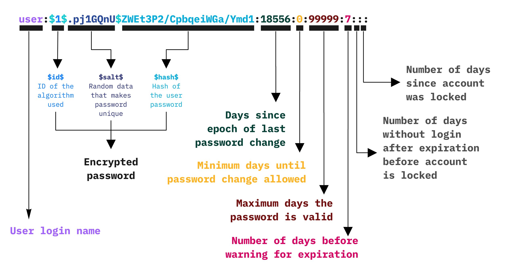

<style>
    strong{
        background-color:#faf43e;
        color: black;
        padding:0.1rem 0.2rem;
        border-radius:5px;
    }
</style>
## Materiale
* Cap 4 libro del testo
* [Dispensa sul controllo degli accessi](/appunti/assets/docs/Access%20Controls_2.pdf)
* [Hw access control](/appunti/assets/docs/Protection_80386.pdf)

# Host protection systems

Un meccanismo di protezione deve prevedere tre momenti:
1. Momento di **autenticazione**,
2. Momento di **autorizzazione**,
3. Momento di **controllo**.

Prima di tutto, **autenticazione**: è necessario sapere chi è la persona che entra "dimmi chi sei?", 

**autorizzazione**: (le politiche di controllo degli accessi) dopo aver qualificato la persona decido quello che può fare "chi può fare cosa". E il processo viene sottoposto ad un **auditing**, dove si va a verificare che le **decisioni intraprese del processo di autorizzazione siano corrette**. Questo, per evitare gli errori della fase di autorizzazione.

**Meccanismi di enforcement**, sono meccanismi che consentono di mettere in pratica le politiche di autorizzazione e controllo degli accessi.

**Accountability**, è la parte di audit in cui io **tengo traccia di tutto quello che è stato fatto**, perché possono verificarsi dei problemi e quindi, successivamente **controllo le azioni che sono state fatte per verificare che sono state correttamente implementate queste le regole**.

Esempio Night club:
* Autenticazione: controllo ID,
* Controllo degli accessi (politica di sicurezza): sopra 18 anni possono entrare, sopra 21 possono bere, ecc.,
* Enforcement: le guardie, buttafuori, le porte, pareti, ecc.,
* Accountability: video sorveglianza.

>B. Lampson: authenticating principal, who said  that? who is getting that info
authorizing access who is trusted to do which operations on this object
auditing...

## Terminologia

* **Subjects** : entità attive, chi effettua le operazioni (detti anche principals), chi fa effettivamente le cose. Es. in un computer sono i processi (non le persone).
* **Objects** : entità passive, quelli subiscono effetti delle entità attivi. Es. file, la memoria, i/o devices. Sono tutte quelle entità all'interno del sistema su cui è possibile operare.
* **Rights**: diritti di accesso. Es. la memory (read, write, execute), non tutti possono fare tutto.

## Reference monitor
Utente arriva, attraverso il processo di identificazione/autenticazione si fa riconoscere, una volta che entrato, quindi, l'utente ha bisogno di accedere a qualche risorsa, quindi, **inoltra una richiesta, la richiesta viene intercettata da reference monitor e verifica le politiche. In base al contenuto della richiesta decide se garantire l'accesso oppure negare**.

**Reference monitor** è un insieme di meccanismi che tramite un insieme di componenti effettua il controllo degli accessi. è in parte dell'os e in generale è distribuita a diversi livelli. 

**Aspetto critico** di questo sistema è che **deve essere incorruttibile**, quindi, bisogna garantire che sia incorruttibile il controllo degli accessi.

Dal punto di visto informatico, deve essere un oggetto contenuto in dimensione (in termini di linee di codice) più è complicato ha più possibilità di contenere bug. 

## Identification and Authentication
La politica di sicurezza, sostanzialmente **definisce chi può accedere a quale oggetto del sistema e in che modalità**. Nel momento in cui decide chi può accedere a una risorsa è necessario avere un meccanismo che individui perfettamente gli utenti che provano ad accedere ad una risorsa, questa fase di riconoscimento dell'utente viene effettuata nella fase di identificazione ed autenticazione.

Il meccanismo per far si che un calcolatore sia in grado di identificare una persona è suddiviso in due fasi:
1. **Fase di identificazione**: inizialmente la persona dice "chi è" fa una attestazione di identità. Es. nome cognome.
2. **Fase di autenticazione** : dopo di che, attraverso una serie di meccanismi, il calcolatore verifica se questa identità sia vera o falsa.

### Fase di identificazione
Tipicamente si usa nome cognome.

### Fase di autenticazione
La prima cosa che il calcolatore fa è quello capire se l'utente stia mentendo, vengono usate 3 strategie durante il processo di autenticazione:
1. **what you know** : è basato sul fatto che il calcolatore condivide un segreto con quella persona, tipicamente la password, parola d'ordine.
2. **what you have** : il calcolatore sa che quella persona ha un oggetto particolare unico, quindi, verifica una cosa che ha solo quella persona. (ID, codice fiscale, carta di credito, sim, ecc.)
3. **what you are** : feature particolare fisica, impronta digitale.

### Password - What you know
Come si fa proteggere la password? quello che **viene memorizzato non è la password ma il digest di una funzione Hash f(x)**. Lo si usa per garantire la segretezza.

Il file delle password (`/etc/shadow`) è accessibile solo al root.

Il calcolatore prende la password in chiaro gli si applica la funzione hash e confronta digest memorizzato sul sistema.

### Password vulnerabilities
Non sono vulnerabilità implicite del meccanismo, in punto di vista ideale è perfetto. Il problema è l'uso che fa l'essere umano.

Principali criticità: 
* lack of awareness by end users, gli utenti non capiscono a cosa serve una password,
* lack password policies that are strictly enforced, **mancanza di politiche rigide** per l'uso e generazione delle password.
* metodi di **cifratura deboli**,
* le password vengono **memorizzate in modo insicuro**.

### Low-tec password obtaining
* primo metodo è il **guessing** attraverso social engineering,
* **shoulder surfing**, semplicemente, guardando lo schermo della vittima
* **phishing** attack, in cui viene invitato a cambiare la password dirigendovi su un sito web che cattura la password.

### High-tec obtaining
* **Brute-force attacks**: genera tutte le possibili sequenze partendo da una serie di caratteri, genera hash usando un algoritmo di cifratura e confronta con la hash del `/etc/shadow`, il problema è il tempo che richiede. 

```py
import hashlib
import itertools
# possible characters in user password
ALPHABET = "abcdefghijklmnopqrstuvqxyzABCDEFGHIJKLMNOPQRSTUVWXYZ1234567890-_.;#@"
LENGTH = 6
def md5hash(char_seq):
    string = ''.join(char_seq)
    hash_obj = hashlib.md5(string.encode())
    return hash_obj.hexdigest()

def bruteforce():
    for word in itertools.product(ALPHABET, repeat=LENGTH):
        generated_hash = md5hash(word)
        if generated_hash in data:
            print('The password of user', data[generated_hash],'is:',word)
```


* **Dictionary attacks**: facendo degli studi si scopre che le persone usano le password secondo una serie di situazioni come il paese, dove lavora, hobby, ecc. detto anche social engineering. Quindi, **si usano una serie di password già noti**. Solitamente con il dizionario giusto si ha una probabilità di 20% di trovare la password.
  
    Tools: 
    * [pwndump3](www.openwall.com/passwords/dl/pwdump), 
    * [John the ripper](www.openwall.com/john)
    * rianbowcrack.

    Siti per dictionary:
    * ftp://ftp.cerias.purdue.edu/pub/dict
    * ftp://ftp.ox.oac.uk/pub/wordlists
    * http://www.packetstormsecurity.nl/Crackers/wordlists
    * http://www.outpost9.com/files/WordLists.html

* **Rainbow attacks**: salta la parte di generazione del hash per velocizzare dictionary attack, **usa un dictionary delle parole hash**. 
  
  Per evitare questo attacco di usa il **"salt" serve per complicare il rainbow attacks**, il sistema genera un numero casuale che viene usato per cifrare.




Un entry di `/etc/shadow`:

`vivek:$1$fnfffc$pGteyHdicpGOfffXX4ow#5:13064:0:99999:7`

`$fnfffc$` è il salt della password su `/etc/shadow`

Se si ha il file `/etc/shadow` si può fare dictionary attack perché il file contiene già il salt.

### Biometric - Tratti biometrici - What you are
>you are your key - Schneier

Permette di **identificare univocamente tramite le caratteristiche fisiche di una persona**, i tratti somatici più diffusi sono l'importa, la retina, la faccia. Inoltre, esistono anche identificazione tramite caratteristiche comportamentali come la voce, il modo di battere la tastiera, ecc.

#### Problemi legati alla biometria

* **_intrusivi_** : es. come nel caso della retina che utilizza un raggio laser per scannerizzare, 
* **_costosi_** : il lettore biometrico più è sofisticato più è costoso, il file delle password è praticamente gratis.
* **_single point of failure_** : si come abbiamo di fronte dei meccanismi che il funzionamento è probabilistico, se il tratto somatico subisce delle variazioni non possiamo più utilizzarlo,
* _sampling error_ : dato che usiamo meccanismi che si basano sulla probabilita ci possono essere degli errori di campionamento,
* **_false reading_** : conseguentemente al punto precedente ci possono essere degli errori di lettura,
* _speed_ : è più lento rispetto la password,
* _forgery_ : può essere copiato/rifatto.

la biometria viene usata per due momenti: 
* **individuare/identificazione** (principale applicazione, usato negli aeroporti),
* **autenticare**.
  
Nel caso delle **password la persona si identifica con il nome utente**, quindi era l'utente che doveva dire chi è, mentre con **il biometrico, avendo le caratteriste il calcolatore può identificare l'utente**.

Nella fase di autenticazione abbiamo: 
* una fase **_enrollment_**: la fase in cui si **acquisiscono i dati biometrici**. Generalmente fatta una volta sola, è **la fase _più critica_** se si sbaglia questa fase potrebbe non riconoscere più, es. nel caso di impronta digitale si fa alla prima volta che si utilizza lo smartphone, 
* una fase di _recognition_ / **verification** : in cui si acquisisce il dato biometrico e confrontato con quello esistente in db.


Il furto di un db di dati biometrici è estremamente critico.
se viene rubato non si può chiedere di cambiare le dita oppure l'iride.

### Errori legati alla biometria
Durante l'acquisizione dei dati biometrici ci possono essere degli errori.
Ci possono essere situazioni come il test è positivo ma la persona non è la persona giusta **FALSO POSITIVO** oppure il test è negativo ma la persona è quella giusta **FALSO NEGATIVO**.

||Is the person claimed| Is not the person claimed|
|-|-|-|
|Test is POSITIVE| True POSITIVE = a | False POSITIVE = b|
| Test is NEGATIVE | False NEGATIVE = c | True NEGATIVE = d |

Vogliamo avere una bassa probabilità di falso positivo e falso negativo e una alta probabilità di vero positivo e vero negativo. Quindi, vogliamo che siano separati.


In realtà è la seguente:


### Spoofing - masquerade attack
Sono attacchi in cui si **falsifica dati biometrici** come faceID, l'impronta.

### Something you have
Il sistema usa qualcosa che ha solo quell'utente, chiamato **token**, può essere sia **attivo** che **passivo**.

#### OTP - One Time Password
Usato tipicamente dalle banche è un dispositivo che inizialmente viene sincronizzato con il server della banca e **genera un numero sincronizzato col il server**. Adesso sono sostituiti dai generatori su smartphone.

l'idea è nata quando si facevano attacchi di password sniffing, perché i dati sulla rete viaggiavano in chiaro.

#### Smart cards
Hanno **un circuito integrato che è in grado di eseguire algoritmi crittografici**. Permette di fare **autenticazione e identificazione** in modo sicuro.

#### Attacchi Skimming
I **token sono vulnerabili agli attacchi di tipo skimming**, in cui si utilizza un dispositivo che legge i dati dopo la fase di autenticazione dal macchinetta di bancomat.

#### Sim Cards
Esempio di utilizzo: la sim registrato precedentemente in banca, viene utilizzato come metodo identificazione. 

La sim al momento dell'acquisto viene registrato al nome della persona che lo acquista e con una serie di dati univoci: ICCID (Integrated circuit card ID) di 18 numeri, IMSI (International mobile subscriber identity) e un numero segreto di 128bit che viene utilizzato per autenticare alla rete mobile.


#### Strong authentication - Multifactor authentication
Multifactor authenticator, permette di superare le debolezze delle passwords, in cui si usa **almeno due fattori, una combinazione di who you are, what you know e what you have**.

Tipicamente di fa login con password e il server manda un OTP al numero di cellulare.

#### Single Sign-On - SSO
In cui si utilizza **un'unica password per più servizi**. Esempio. Google permette di utilizzare una password per più servizi come gmail, youtube, google drive, ecc.


##### Federated Identity Management 
Consente a organizzazioni diverse di stipulare accordi, per cui **usando autenticazione di un organizzazione può accedere ad un'altra**.

Es. [_Eduroam_](https://eduroam.org/where/), permette di usare i credenziali di UNIMI per accedere rete wifi di qualsiasi università del "_mondo_".


#### Open ID
Open ID è un **identity provider**, è uno standard ben definito con dei protocolli. Praticamente, delle entità che sfrutta il servizio di autenticazione di un'altra entità.


