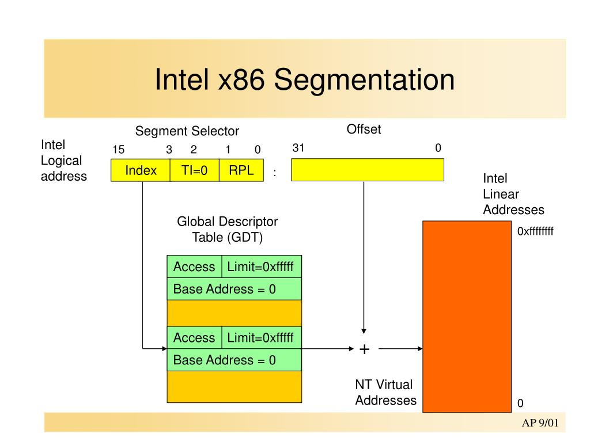
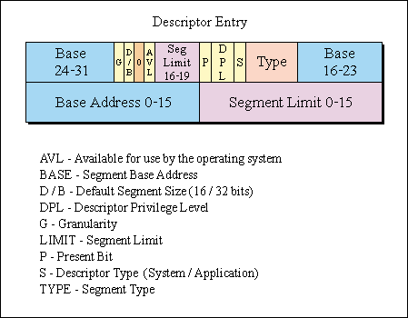
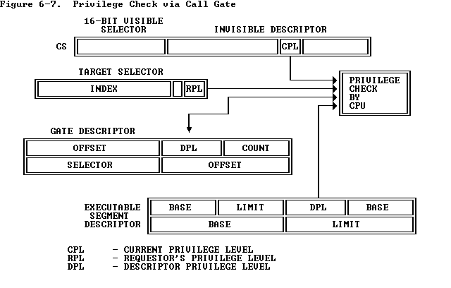
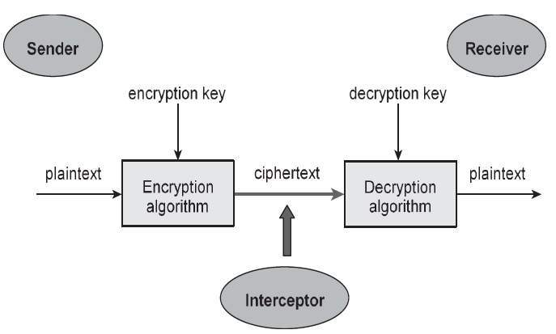
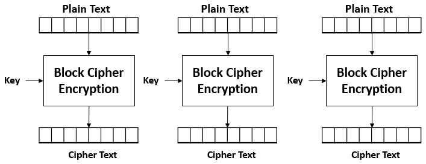

## Materiale
* Cap 2 libro di testo

# Access Control - Parte 2 - Crittografia Intro

Quali sono i meccanismi di protezione che un calcolatore adotta per evitare diverse forme di abuso e di attacchi informatici? 

Al cuore di tutto c'è il meccanismo di **autenticazione, è il meccanismo principale con cui il sistema riconosce l'utente e in base al tipo di utente decide quali sono le politiche di controllo degli accessi da adottare**. Se si riesce scavalcare il meccanismo di autenticazione ovviamente si scavalcano tutti meccanismi di protezione (root). Perché il meccanismo di protezione sono basati sull'identità degli utenti, se riesco far credere al sistema un altro utente rispetto chi sono, godo poi delle proprietà di questo utente.

L'altro meccanismo di protezione che viene messo in atto dal sistema è il **controllo degli accessi** (un meccanismo di prevenzione), quindi, una volta che l'utente si è autenticato vado **verificare ogni volta che compie un'attività se autorizzato a compiere quell'attività**. 

## Access Control `ITU-T X.800` 
>The prevention of unauthorized use of a resource, including the prevention of use of a resource on an unauthorized manner.

Il controllo degli accessi è un **meccanismo di prevenzione**, previene **l'uso non autorizzato di una risorsa** oppure **l'uso di una risorsa in modo non autorizzato**. 

Per fare il controllo degli accessi è necessario avere una **security policy, dice chi può accedere a cosa e in che modo**. Quindi il controllo degli accessi **è significativa solo in presenza delle potiche di sicurezza**.

Il controllo degli accessi è l'elemento fondamentale del sistema, attraverso il quale cerco di **garantire confidenzialità ed integrità di risorse**.

Controllo degli accessi **è sparso** un po da per tutto sul sistema, sia al **livello kernel**, a livello **hardware**, a **livello os** attraverso il file system per quanto riguarda i dati ed a livello servizi (web application).

**Access control matrix è lo strumento che permette di definire formalmente una security policy**. é una matrice dove sulle righe abbiamo gli utenti e sulle colonne le risorse. Quindi, disponendo di una matrice di questo tipo si può costruire un programma di controllo degli accessi. 

Tuttavia è una struttura dati prettamente teorica in quanto le sue dimensioni non consentono di rappresentarla o ne di definirla. Basta pensare ai file di un sistema. Partendo da questo sistema ideale, possiamo **astrarlo e sintetizzarlo come l'access control list di UNIX**, dove riduce il numero di righe a tre (user,group,rest of the world) e le colonne sono risorse, quando viene eliminato la risorsa semplicemente viene tolta la colonna. Ogni risorsa ha il suo access control list.

Chi scrivere questa matrice? può essere compilata da attori diversi:
* Discretionary Access Control **DAC** : dove è il **proprietario** che decide chi può fare cosa, 
* Mandatori Access Control **MAC** : in cui **un'entità superiore** che definisce chi può fare cosa sull'oggetto, quindi la politica di sicurezza è sovraimposta agli utenti. Es. Sysadmin, app developer, hardware.
* Role Base Access Control **RBAC** : è **basato sul ruolo** che l'utente occupa all'interno dell'organizzazione. Es. Studente, Insegnante, Staff, ecc.

## Mandatory Access Control - MAC
Come si fa avere un meccanismo per proteggere il sistema operativo? la politica da implementare è che nessun utente (utente normale) all'interno del sistema deve essere in grado di modificare il sistema operativo sia nella parte del codice che di dati.

Come facciamo proteggere l'os da applicazioni/processi che ci girano su? Bisogna chiamare in causa l'hardware.

Il meccanismo che viene usato per garantire questo policy, è imposto dal progettista dell'hardware.

### 80X86 MAC Policy - 80386
L'access control ha in input un utente e una richiesta, deve decidere se si può soddisfare o meno la richiesta per quell'utente. 

Il problema viene risolto dai progettisti di hardware assegnando delle **Label** (etichette) ai processi, ai dati, all'OS.

Nell'ambito del sistema e nell'ambito di un processore INTEL (runtime) ogni oggetto all'interno della memoria ha un'etichetta (i processi e i dati). **In base all'etichetta si decide se autorizzato oppure no**. Il problema viene semplificato controllando l'etichetta invece di utente o la risorsa.

**Nell'architettura INTEL ci sono 4 label, sono chiamati anelli concentrici**. Si parte da ring 0 che è quello più privilegiato fino livello 3 quello meno privilegiato. Ma in realtà sia Windows che MacOs usano solo 0 e 3 (Altri sono usati sistemi esperimentali).

Ogni componente è considerato segmento, un processo è divisible in 4 segmenti:
* stack,
* heap,
* data,
* code.

La **segmentazione è un meccanismo che serve per fare l'isolamento**, tipicamente un processo può accedere solo alle istruzioni o dati all'interno dei propri segmenti. Implementato per evitare che due processi contigui in memoria non si diano fastidio.

Ogni segmento è descritto da un segment descriptor, raccolti in una tabella nell'OS, ogni segmento ha una etichetta che esprime il suo livello di protezione.

Quando l'os genera vari processi, splitta i processi in segmenti, per ogni segmento ce un descrittore a cui viene assegnato un livello di protezione tramite l'etichetta.

### Descriptor Privilege Level - DPL
**DPL** definisce il livello di protezione del segmento, viene inizializzato dall'os. 

Quando si prende in considerazione il segmento associato al processo in esecuzione definisce il Current Privilege Level **CPL**, il sistema si memorizza il DPL del segmento attualmente in esecuzione.

### Current Privilege Level - CPL
Indica qual'è il livello di protezione del processo attualmente in sistema e questo dato è memorizzato in un registro del processore. 

Quando un **processo va in esecuzione** viene caricato il suo segmento, si va vedere **il suo DPL e lo si mette al CPL** e anche con un **context switch**.

### DPL per dati

Il **codice utente** non deve essere in grado di modificare i dati appartenenti all'os. La policy diventa che un processo che appartiene al **ring C può accedere solo ed esclusivamente ad oggetti di livello D, in cui il livello di appartenenza sia D >= C**.

Es. se si ha un processo utente con livello etichetta 3 non potrà mai accedere ai dati etichettati con 0.

L'os opera a livello 0, quando viene lanciato un processo utente, è l'os che li assegna l'etichetta, sempre nell'ipotesi che l'os non sia compromesso. 

**Ogni volta che ce un accesso a un segmento dati si confronta il DPL del segmento dati con il CPL** (DPL) del processo che gli sta accedendo. Questo controllo viene fatto via hardware. Se non vale la diseguaglianza l'accesso viene negato.

### I rischi

Se un codice non privilegiato `B` di livello 3 ed `A` di livello 0, `B` per accedere ai dati di livello zero chiede ad `A`, quindi, **`B` indirettamente accede ai dati livello 0 tramite `A`**.

### Requested Privilege Level - RPL

Per risolvere questo problema usa **RPL che sta nel segment selector, descrive il livello massimo di protezione associato ad un segmento**. 

**Quando `B` CPL = 3, B chiede ad `A` di accedere ai dati di livello 0, dopo di che va in esecuzione `A` e CPL diventa 0, quindi, la richiesta che il kernel soddisfa è per conto di livello 3, e il dato livello 3 va perso nel frattempo. In questo momento interviene RPL controllando che il massimo fra CPL e RPL sia <= DPL, quindi, in questo caso accesso viene negato**.

Quindi, con questo tipo di controllo un processo di livello alto non può accedere ai dati di un livello minore.

Non fa nessun tipo di controllo sul fatto che un processo sia autorizzato ad accedere a porzioni di dati che sono solo in lettura oppure solo in scrittura.

Per questo tipo di controllo esiste un campo `TYPE` sul segmento che definisce il tipo di operazione che si può fare sul segmento. Usa 4 bit, es. `0000 = read only, 0010 = read/write, 1000 = execute only`.

Il bit 8, A = Accessed, viene usato dall'algoritmo di pagine. Viene usato per decidere quale pagine è stata acceduta.

### DPL per istruzioni
è necessario che il programma utente accedano a porzioni di codice dell'os, perché tutta una serie operazioni possono essere eseguiti solo esclusivamente dall'os. Es. accesso ad una periferica, si può farlo solo tramite l'os. Quindi, il problema è che bisogna consentire alle applicazioni di usare porzioni di codice di os, quindi forzando l'utente ad attivare porzioni di os solo per parte che gli compete. 

Come si fa? Si usano istruzioni apposta per far accedere a porzioni di os.

### Control Transfer

Durante un JUMP cambia la politica, se faccio una JUMP viene controllato che il segmento di arrivo abbia il DPL == CPL. Questo significa che il kernel può saltare ad un applicazione, il problema è ritornare in dietro, cioè kernel entra in una zona non controllata da lui quindi potrebbe essere compromesso in questa situazione.

Ma kernel lavorando a livello 0 ha accesso a tutto, quindi, non ha bisogno di cambiare il livello dove ha meno privilegi.

Basterebbe mettere CPL momentaneamente a zero durante l'esecuzione del processo e possiamo risolvere il problema. Ma così daremo accesso al processo utente di tutto l'os.
Noi abbiamo CPL = 3 e vogliamo che B salti dentro A con DPL = 0. 

#### Controlled Invocation

Come si fa? viene introdotto un meccanismo che si chiama invocazione controllata.

**Controlled invocation è un meccanismo che consente al programma utente di accedere al codice protetto di OS ed è il meccanismo che viene invocato attraverso le system calls**.

Consente di saltare da un ambiente non protetto ad un ambiente protetto in modo controllato. 

Come avviene? avviene attraverso un **`GATE` che è una struttura dati particolare**.

**Con un syscall si può eseguire solo il porzione di codice associato alla system call** e niente di più.

Come avviene? usando istruzioni particolari in linguaggi macchina.

Il meccanismo che viene usato è un meccanismo che **simula in software il meccanismo di eccezioni hardware**.

* Call gate: 
* Software interrupt or Trap: `int 0x80` istruzione che genera un trap su linux.
* `sysenter` / `sysexit`: simili a software interrupt.

Come funziona? **quando il processo deve accedere al sistema operativo deve usare `int 0x80` oppure `sysenter`**. Queste istruzioni attivano una procedura simile a quello delle eccezioni. 

Il **processo in esecuzione viene interrotto, viene salvato il contesto del processo e viene fatto un JUMP ad un indirizzo che è stato preventivamente memorizzato all'interno di una tabella**. 

Nel caso del trap, `Trap Gate` -> `Segment Selector` è l'indirizzo di salto.

#### Interrupt descriptor table

**Quando faccio uno di questi istruzioni il sistema si blocca (il processo utente), CPL viene modificato (da 3 -> 0), il controllo passa all'istruzione in cui l'indirizzo è messo all'interno di una tabella dall'os chiamato interrupt descriptor table (8 byte), quindi entro in kernel mode**.

**Sono sicuro che il processo utente non mi disturba perché è stato interrotto. Ed è in esecuzione solo il porzione di codice che ho deciso io**.

Interrupt descriptor table contiene indirizzi dei routine di sistema per la gestione di questi errori.

Es. page fault -> posizione 14

Un attacco che viene fatto spesso, è quello di modificare interrupt descriptor table,
che va a modificare routine di risposta dell'os. **Sistema funziona finché l'attaccante non riesce ad ottenere permessi root**.

Es. se si modifica routine di gestione della rete, può duplicare i pacchetti senza farsi scoprire.

#### Privileged Instructions

Strutture dati dell'os, Global Description Table GDT, LDT, IDT, che vengono caricate durante la fase di boot e mette indirizzi queste tabelle in appositi registri. Se uno riesce modificare questi registri salterebbe tutto. Quindi, **accesso a questi registri è riservato, hardware consente l'accesso solo quando CPL == 0. In questo caso si parla di istruzioni privilegiati che possono essere eseguite esclusivamente a livello zero**. 

## Log Files
Quando si fa una policy il punto di vista con cui metterci è quello di dimenticare qualcosa sicuramente.

IT audit, è **l'esame e la valutazione della infrastruttura tecnologica di un'organizzazione**. con IT audit si va verificare **l'infrastruttura rispetto alle politiche di sicurezza e garantisce gli standard minimi**.

Obiettivi di un audit:
* **valutare sistemi e processi**,
* **garantire che i processi di gestione dei sistemi siano in accordo con le leggi e politiche**.

IT security auditor, controlla se le policy se sono state rispettate, lo fa andando a verificare i file di log.

Ogni volta che il **reference monitor riceve una richiesta provvede anche a registrarla**. Nei file di log si trova tutte le operazioni significative che sono state svolte da tutti gli utenti e da tutte le applicazioni del sistema.

Ci sono due parti principali:

1. **raccolta e organizzazione** di dati,
2. **analisi delle informazioni**, può essere fatta post mortem (analisi dopo un attacco) oppure in tempo reale (riconoscere l'attacco dalle sue prime forme, analisi in real time).

L'os dal momento di che parte comincia loggare tutto.

su linux quasi tutto sta dentro il directory `/var/log`.

Log importanti su linux:
* `/var/log/syslog` or `/var/log/messages` general system messages (mail,kernel,authentication and cron),
* `/var/log/auth.log` or `/var/log/secure` authentication logs (failed and successful)
* `/var/log/wtmp` or `/var/log/lastlog` history of all user login logout
* `/var/log/kern.log` log messages produced by kernel 
* `/var/log/cron` messages from cron jobs.

`syslog` è il demone di linux che fa log.

Comandi per leggere log files:
* `cat`, `more`, `less`, `tail`, `head` e `grep`
* `/var/log/wtmp` -> command for read `who`
* `/var/log/lastlog` -> command for read `lastlog`
* `/var/log/kern.log` -> command for read `dmesg`

### Il problema 

Il piattaforma di centralizzazione, dato che ogni sistema ha un formato diverso si usa un database sql.

### Log management systems
* Splunk
* XpoLog
* LOGalyze
* Datadog
* EventTracker
* LogDNA
* SolarWind Security Event Manager
* Paessler PRTG Network Monitor
* Papertail
* ManagEngine EventLog Analyzer
* Windows event log manager
 
**SIEM** Security information event manager **sono log analyzer che usano ML e AI**, che permettono di prevenire alcuni attacchi. Molti grandi organizzazioni hanno un centro di calcolo dedicati.

# Crittografia

Crittografia usato in una maniera appropriata consente di risolvere il problema di confidenzialità e integrità dell'informazione. 

**La crittografia è la scienza di cui lo scopo / l'obbiettivo è quello di individuare dei metodi per la trasformazione di documenti di varia natura in modo REVERSIBILE**, cioè il loro contenuto originale possa essere accessibile solo da particolari destinatari.

La teoria complementare è quello di crittoanalisi, è la scienza che si occupa dati dei testi trasformati in maniera reversibile dalla crittografia di risalire al contenuto originale.

Nell'ambito della cybersecurity la crittografia viene impiegato per:
* confidenzialita,
* integrita,
* autenticazione,
* non ripudiabilità

Modello a cui si riferisce (tipicamente nell'ambito network security) è un modello dove abbiamo un mittente, un destinatario e un intruso il cui scopo è quello di capire cosa stanno comunicando.

La crittografia può essere a chiave privata oppure simmetrica (unica chiave per encryption che per decryption) ed a chiave pubblica oppure asimmetrica (abbiamo due chiavi una chiave privata e una chiave pubblica). (Quello più vecchio è quello dove la chiave è privata).

Come funzione di encryption quello che cerchiamo è una funzione biettiva, (ogni elemento dell'insieme dominio ha un solo elemento del codominio).

Se usiamo una funzione suriettiva avremmo che non sapremmo qual'è il messaggio di partenza.

$$Encryption = E : M \times K \rightarrow C$$
$$Decryption = D : C \times K \rightarrow M$$

* La funzione di _encryption_ prende una chiave, un messaggio e restituisce un cipher-text.
* La funzione inversa che è _decryption_ prende la chiave, il cipher-text e restituisce il messaggio originale.

Per cifrare un testo si possono usare due _strategie_:
* **stream cipher** : cifra una carattere alla volta, es. XOR,
* **block cipher** : cifrano a blocchi, es. ECB, CBC, CFB, ecc.

||Stream|Block|
|-|-|-|
|Vantaggi|La velocità di trasformazione   propagazione degli errori bassa| Maggiormente diffuso   Immune all'inserimento dei simboli| 
|Svantaggi| Non molto diffuso   Può essere facilmente compromesso o modificato| Lento   necessità di un padding   propagazione degli errori alta|

## Data Encryption Standard - DES
DES è un sistema nato intorno negli anni 70, è stato progettato da IBM. è un block cipher a 64 bits con una chiave effettivo da 56 bits + 8 bit di controllo = 64 bits. Inoltre, esistono diversi tipi di DES come Double DES, Triple DES.

Nel 1977 DES _Whitfield Diffie_ e _Martin Hellman_, dichiarano che una chiave da 56 bits è vulnerabile ad attacchi brute force, perché 56 bits sono troppo pochi.

Nel 1997, con circa 3500 macchine riuscirono a fare un brute force attack in 4 mesi. Attualmente DES può essere decifrato in poche ore. Invece, Triple DES richiede circa 2000 anni.

## Advanced Encryption Standard - AES
Rijndael oppure AES è il sostituto di DES, sviluppato da due Belgi Joan Daemene e Vincent Rijmen, è un cifrario simmetrico a blocchi di 128 bits con una chiave che può essere 128, 192 oppure 256 bits. (16 caratteri)

## Block ciphers

### Electronic Code Book - ECB
È una modalità di utilizzo dei cifrari a blocchi. Prendo un plain text lo divido a blocchi e li cifro a blocchi. In questo caso usiamo DES, quindi, blocchi da 64 bits.

La problematica di ECB: se prendo due blocchi di plain text uguali cipher text saranno uguali. è stato risolto con CBC.

### Cipher Block Chaining - CBC
Questa tecnica risolve il problema di ECB utilizzando la concatenazione. (DES blocchi da 64 bits)
Il primo blocco viene inizializzato con un vettore di inizializzazione (un dato casuale) e nei blocchi seguenti viene utilizzato il cipher text del blocco precedente come I.V.

Problematica di CBC: è l’applicazione, se non ricevo tutti dati del blocco precedente correttamente non posso decriptare blocco successivo. Inoltre, non posso parallelizzare le fasi di encryption e decryption.

La differenza tra i due è:

## Crittografia a chiave pubblica

Il problema di fondo è lo scambio di chiave, bisogna comunicare la chiave ad un'altra persona, quindi, richiede un canale al di fuori dei meccanismi di comunicazione standard sicuro attraverso il quale comunicare la chiave (canale _"out of band"_). Come si fa farlo sulla rete?

Nel 1976, Diffie ed Hellman hanno pubblicato uno studio in cui hanno introdotto un nuovo modo fare crittografia "New Directions in Cryptography", che gli è valso il Turing Award.

L'idea si basa su un modo che prevedere che ogni persona che deve comunicare in modo segreto invece di avere una chiave ne usa due, una chiave pubblica e una chiave segreta.

Le chiavi vengono generate a coppie, tutto quello che viene cifrato con la chiave privata può essere decifrato con la chiave pubblica e viceversa.

Proprietà fondamentale: solo la chiave pubblica corrispondente può essere usato per decifrare quello che stato cifrato con la chiave privata e viceversa. Quindi, sono una coppia di chiavi uniche.

Requisito fondamentale, la chiave privata deve essere segreta.

Questo è l'uso della crittografia a chiave pubblica per garantire la confidenzialità dell'informazione.

## Firma Digitale - Digital Signature
Io che ho la mia chiave privata, con la chiave privata posso cifrare il messaggio e tutti quelli che hanno la mia pubblica possono decifrarlo, quindi dal punto di vista della confidenzialità la proprietà non vale più. Dato che il messaggio cifrato con quella chiave privata posso generarlo solo io è come se firmasse, quindi, quest'operazione è in qualche modo equiparata all'operazione di firma. 

**Firma digitale** è un operazione di cifratura di un testo con la propria chiave privata. In questo modo afferma la paternità di qualcosa. Secondo la legge, si garantisce la l'autenticità e in fase giudiziaria non si può negare di averlo generato, "**non ripudiabilità**".

## Man in the Middle - MITM
Alice chiede a Bob la sua chiave pubblica, Eve intercetta la richiesta di Alice e Eva manda una sua richiesta a Bob chiedendo la sua chiave pubblica. Quindi, Eva manda ad Alice la sua chiave pubblica invece di Bob dicendo che di Bob. A questo punto abbiamo un attacco Man in the Middle.

Problema, come si fa Alice sapere che la chiave pubblica che ha ricevuto è davvero di Bob e non di qualcuno altro?

