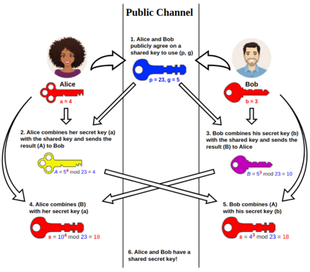

<style>
    strong{
        background-color:#faf43e;
        color: black;
        padding:0.1rem 0.2rem;
        border-radius:5px;
    }
</style>

<script type="text/javascript" src="http://cdn.mathjax.org/mathjax/latest/MathJax.js?config=TeX-AMS-MML_HTMLorMML"></script>
<script type="text/x-mathjax-config">
    MathJax.Hub.Config({ tex2jax: {inlineMath: [['$', '$']]}, messageStyle: "none" });
</script>

## Materiale
* [Introduzione alle PKI](https://www.ncsc.gov.uk/collection/in-house-public-key-infrastructure/introduction-to-public-key-infrastructure)
* [https://gnupg.org/](https://gnupg.org/)

# Crittografia - parte 2

Il problema della integrità, come facciamo garantire l'integrità? **Encryption non ci garantire l'integrità**, cioè come facciamo sapere che quando riceviamo un messaggio cifrato quello è l'originale?

Perché encryption non si risolve questo problema? **un attacco di tipo MITM potrebbe modificare** alcuni bit a caso, quindi, il contenuto non è l'originale.

## Hash functions

Per risolvere questo tipo problema si usano delle **funzioni One-way** chiamati **Hash Functions**, sono delle funzioni matematiche che prendono in input un testo/file di dimensione qualunque e restituiscono in output una stringa di **dimensione fissa** chiamato **digest**.


Proprietà:
* **one-way** : difficili da invertire,
* **collision resistant** : difficile trovare due input che danno lo stesso output.

è una funzione suriettiva, se output è una stringa da 128 bit allora abbiamo un codominio 2<sup> 128</sup> per causa di forza maggiore tanti elementi del dominio mappano sullo stesso elemento del dominio ma dato che è estremamente difficile (richiede qualche secolo di computazione) trovare una collisione possiamo considerare che siano praticamente collision free.

### Applicazioni
**Cambiando solo un bit dell'input si cambia completamente la stringa di output**. Questo significa che possiamo usare funzioni hash per **verificare l'integrità di un file/documento**.

```
Hello World -> SHA256 -> a591a6d40bf420404a011733cfb7b190d62c65bf0bcda32b57b277d9ad9f146e
Hello world -> SHA256 -> 64ec88ca00b268e5ba1a35678a1b5316d212f4f366b2477232534a8aeca37f3c
```
* Funzioni sono usati per **memorizzare le password**, perché anche se il system admin riesce a leggere l'hash non riesce a risalire al password effettivo. (`/etc/shadow`)


* Per verificare **l'integrità dei pacchetti/applicazioni** scaricati dall'internet.

* Un'altra applicazione è quella legata alla **firma digitale**, dato che la crittografia asimmetrica è estremamente lenta per documenti grandi, **la firma digitale cifra l'hash del documento**. Calcolare l'hash è molto veloce rispetto encryption.


#### Processo di verifica della firma digitale
* Passo 1 : prendo l'hash cifrato con la chiave privata, lo decifro con la chiave pubblica si ottiene l'hash non cifrato.
* Passo 2 : Calcolo l'hash del documento originale ricevuto,
* Passo 3 : Confronto le due hash.

## Hash function
* MD5: output 128 bits, è stato attaccato in 2004,
* SHA1 : output 160 bits, è possibile attaccarlo con una forza computazionale di 2<sup>80</sup>,
* SHA2 : output 224, 256, 384  e 512 bits, al momento non è stato attaccato.

## Key Hash Message Authentication Code - HMAC
**L'hash da solo non basta per garantire l'integrità, durante la trasmissione qualcuno potrebbe intercettare il messaggio, cambiarlo e calcolare hash di un messaggio alterato e inviarlo**.

Per **garantire l'integrità usando l'hash** dobbiamo aggiungere **Key Hash Message Authentication Code** - **HMAC**, quindi, tramite aggiunta di una chiave. La chiave non è per encryption ma serve per l'integrità.

Lo si fa, perché calcolare l'hash più rapido che fare un encryption.

La chiave viene messo in xor con un dei padding (opad/ipad) particolari, viene fatto un primo hash con la chiave a cui viene concatenato hash ottenuto con il messaggio.


Viene spedito il messaggio + HMAC, quando si riceve il messaggio rifa i calcoli e confronta HMAC con quello ricevuto.

Con questo meccanismo si risolve il problema della integrità.

## Man in the Middle Attack - MITM
Come facciamo avere la certezza che una chiave pubblica appartiene effettivamente ad una persona?


La soluzione che viene applicato è che quando un utente sottomette la sua chiave pubblica ad un altro, **l'utente insieme alla sua chiave pubblica deve legare un certificato di autenticità**. 

* Chi è che attesta la autenticità? usando la carta d'identità, è lo stato (ministero dell'interno). 
* Un altro approccio è **lo scambio della fiducia rispetto un altro utente della rete**. Pretty Good Privacy PGP adesso diventato **`GPG`**.  

### X509 and PKI
Lo standard X509 è basato su Public Key Infrastructures PKI, basato su certification authority. 

  * Certification authority - CA : **certifica che tale chiave pubblica appartiene al tale**, tutti certificati sono raccolti in una public infrastructure. **Il certificato digitale è la chiave pubblica firmata digitalmente** dal CA.

```console
# per trovare/scaricare il certificato
openssl s_client -showcerts -connect www.paypal.com:443 </dev/null
```

```txt
---
Certificate chain
 0 s:jurisdictionC = US, jurisdictionST = Delaware, businessCategory = Private Organization, serialNumber = 3014267, C = US, ST = California, L = San Jose, O = "PayPal, Inc.", CN = www.paypal.com
   i:C = US, O = DigiCert Inc, OU = www.digicert.com, CN = DigiCert SHA2 Extended Validation Server CA
   a:PKEY: rsaEncryption, 2048 (bit); sigalg: RSA-SHA256
   v:NotBefore: Oct 13 00:00:00 2023 GMT; NotAfter: Aug 20 23:59:59 2024 GMT

-----BEGIN CERTIFICATE-----
MIIM2TCCC8GgAwIBAgIQAlIbX4AQ/rcMwoWJhYUAMjANBgkqhkiG9w0BAQsFADB1
MQswCQYDVQQGEwJVUzEVMBMGA1UEChMMRGlnaUNlcnQgSW5jMRkwFwYDVQQLExB3
... (ommitted) ...
Bk8AExJ9J/HGHf/ChCQLwPmCR4c1NfQXR9CDuds=
-----END CERTIFICATE-----

```

```console
# per decodicare il certificato
openssl x509 -in paypal.pem -text -noout 
```

CA italiani, secondo la legge italiana, il certificato deve essere pubblicato sulla gazzetta ufficiale.

Chrome:

    Settings -> Show Advanced settings -> Manage Certificates

Firefox: 

    Edit -> Preferences -> Advanced -> Certificates -> View Certificates -> Certificate Manager -> Authorities

## Applications: Credit Card Chip

Le transazioni di bancarie con una carta di credito/debito vengono fatte tramite utilizzo delle chiavi pubbliche. 

Il chip ha con sè una coppia di chiavi, pubblica e privata. 

Come funziona il riconoscimento? **La carta è ritenuta valida se contiene una coppia di chiavi firmate da Certification Authority riconosciute Visa o Mastercard**. 

Quando si inserisce nel terminale, la **carta invia la il certificato della chiave pubblica**, il terminale contiene i certificati validi rilasciati da CA e verifica il certificato, adesso devo verificare che ci sia anche la chiave privata, **mando un numero casuale alla carta e chiedo di firmarlo digitalmente** (la chiave privata non esce mai dalla carta) e la carta invia la firma al terminale, infine, il terminale verifica la firma.


Come viene fatto una transazione? 
**Terminale acquisisce la chiave pubblica, i dati della transazione viene mandato alla carta, si digita il pin, sblocco i circuiti, viene fatto la firma dei dati della transazione, quindi, io firmo digitalmente l'acquisto e i dati vengono mandati al terminale, terminale verifica che la firma sia valida, infine i dati della transazione più la firma vengono mandati a Mastercard oppure a Visa. E non si può negare la transazione** a meno che ci sia una denuncia dello smarrimento della carta.


## Request For Comments - RFC
Sono **documenti tecnici pubblici che standardizzano la rete**. Vengono creati per esempio quando si crea un protocollo di rete, si aggregano un insieme di persone (come rappresentanti di cisco, microsoft, apple, ecc) si crea un gruppo di lavoro, alla fine si raggiunge un accordo e si realizza RFC finale.

## Protocollo Key Exchange di Diffie-Hellman
Un algoritmo che **permette di scambiarsi le chiavi pubblici su una rete non sicura**. Si basa sul problema matematico del **logaritmo discreto sui campi finiti**. 

$$ \log_{b}{x} = y \bmod n $$
$$ b^y = x \bmod n $$

Dove se n è un numero primo ammette una soluzione.

NOTE: Non esistono ad oggi algoritmi efficienti che risolvono il problema del logaritmo discreto, così come algoritmi che dato un numero consentono di calcolare la sua scomposizione in fattori primi.

Alice e Bob devono condividere un segreto, generano un numero casuale $R_{Alice}$ e $R_{Bob}$ che mantengono segreto, dopo di che Alice calcola $\alpha^{R_{Alice}} \bmod p$ e Bob calcola $\alpha^{R_{Bob}} \bmod p$. 

Alice invia a Bob $\alpha^{R_{Alice}} \bmod p$ e Bob manda ad Alice $\alpha^{R_{Bob}} \bmod p$.

A questo punto Alice eleva il numero ricevuto con il suo $R_{Alice}\rightarrow(\alpha^{R_{Bob}})^{R_{Alice}} \bmod p$,

Bob fa lo stesso $R_{Bob}\rightarrow(\alpha^{R_{Alice}})^{R_{Bob}} \bmod p$. In questo modo entrambi hanno lo stesso valore che è il segreto con cui cifra i messaggi.

Se qualcuno intercetta $R_{Alice}$ oppure $R_{Bob}$, per poter calcolare il numero segreto deve essere in grado di risolvere il logaritmo discreto in tempo utile. Quindi, MITM non può fare niente.




**Problema**: MITM, blocca $\alpha^{R_{Alice}} \bmod p$ inviato da Alice a Bob e invia il suo $\alpha^{R_{Evil}} \bmod p$ a Bob e viceversa ad Alice.

**Soluzione**: lo si risolve con **l'utilizzo di certificati digitali**.

## Strategia generale

Due entità devono comunicare in maniera confidenziale, faccio in modo che le due entità siano in grado di stabilire una chiave comune di encryption e poi si usa questa chiave per garantire **confidenzialità** del traffico. 

Per **integrità** è sufficiente utilizzare un meccanismo che per ogni messaggio che mando gli attacco una HMAC. Questo consente al destinatario di verificare l'integrità.

Per autenticità utilizzo la firma digitale.

### Problemi - Considerazioni
* Problemi di tipo politico sull'uso di protocolli crittografici: esiste un trattato di _Wassenaar_ firmata da un insieme paesi. Es. Non esportare armi nucleari/strategici. Secondo il tratto di Wassenaar gli algoritmi crittografici sono equivalenti alle armi nucleari. Quindi, un paese non può esportare senza un autorizzazione un algoritmo crittografia in un altro paese. Es. RSA non può essere esportata al di fuori degli USA.

>L'autore di PGP, Phil Zimmermann è stato arrestato per la violazione del trattato Wassenaar perché ha pubblicato il codice sorgente.

* Problema di performance e di scelta architetturale: crittografia simmetrica estremamente veloce ma gestione delle chiavi pesante. Crittografia asimmetrica estremamente inefficiente e richiede ... . 
  
* L'altro problema grosso è dal punto di visto informatico dove facciamo la crittografia, può essere fatta in diversi fasi:
  * A **livello applicazione**, cioè, il programma cifra i dati prima dell'output, della crittografia si occupa il programmatore.
  * A **livello sistema**, cioè, chi scrive il sistema che si occupa della crittografia, il sistemista decide per esempio se farlo a livello trasporto come TCP oppure a livello rete come IP. Richiede infrastruttura differenti in base al livello che sceglie. Il vantaggio è che il programmatore non deve preoccupare della crittografia ci pensa il sistema. 
  * Se lo faccio a **livello IP** è completamente trasparente. La faccio per tutta la connessione web.  
  * Se la faccio a **livello TCP** la faccio a livello di connessione, quindi posso decidere a quale connessione farlo, invece se lo faccio a livello IP non ho questa granularità, l'IP non può decidere su diverse sessioni. Il programmatore non è più svincolato come al livello sistema.

  
Se io cifro a livello IP e TCP il dato rimane in chiaro per livello soprastanti, solo se cifro a livello applicazione ho la garanzia della sicurezza. Per questo bisogna usare End-to-End Encryption in questo modo solo le due parti terminali della comunicazione sono in grado di accedere al contenuto in chiaro tutto quanto in mezzo non riesce leggere. Gmail cifra a livello trasporto. 

Se si cifra a livello application, sono cifrati dati dell'applicazione, a livello transport solo una parte viene oscurato, a livello IP si cifra quasi tutto. 