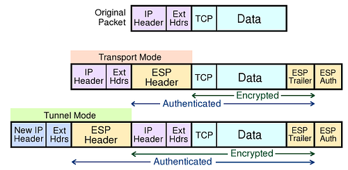
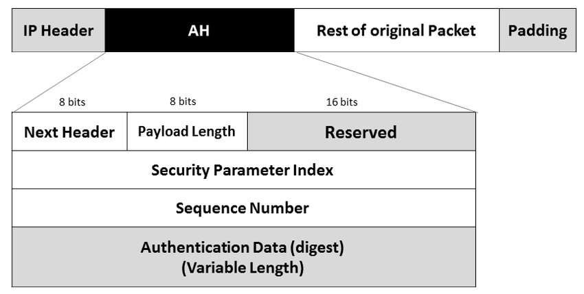
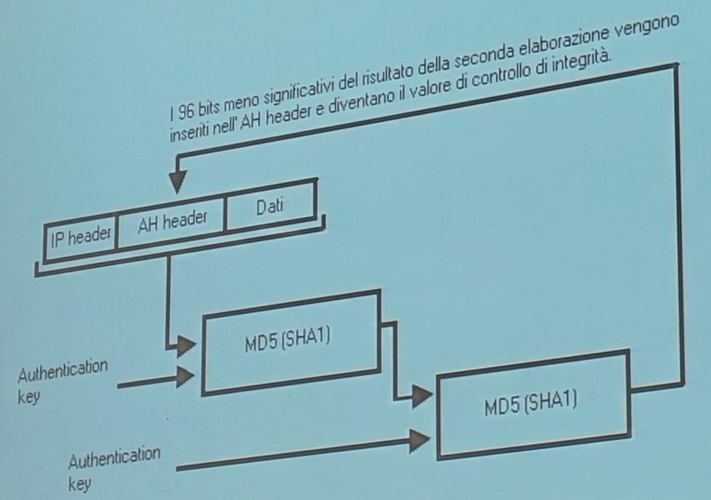
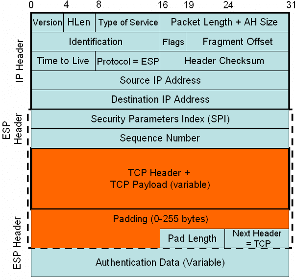
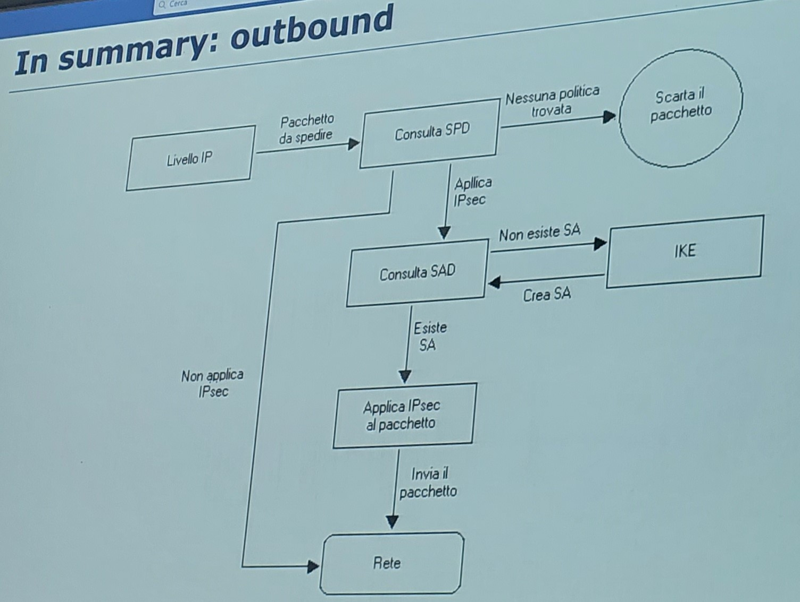
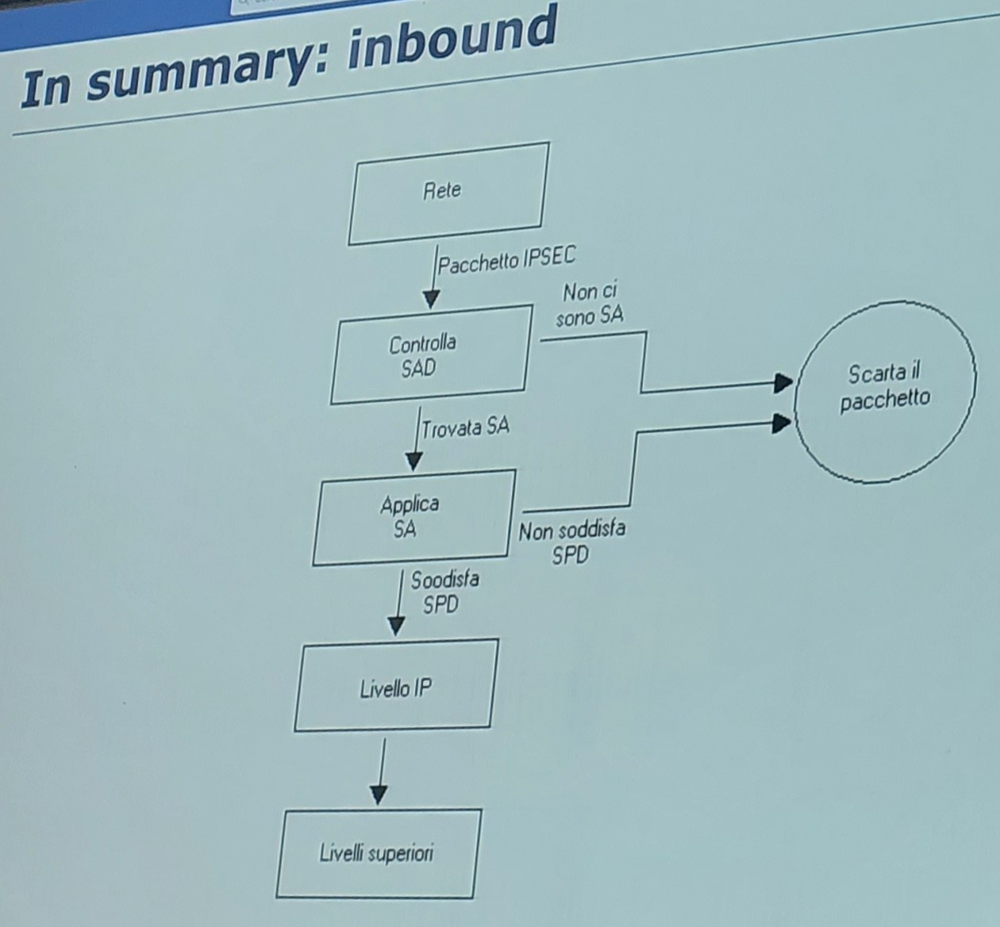
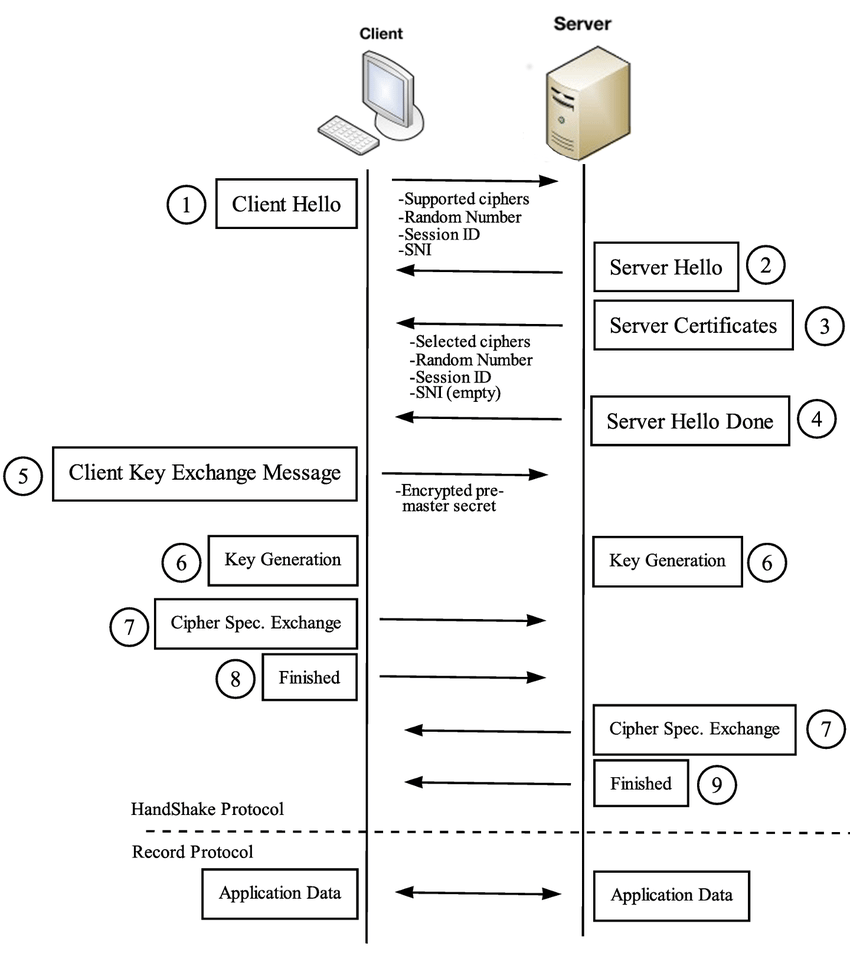
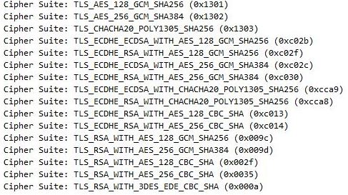

<style>
    strong{
        background-color:#faf43e;
        color: black;
        padding:0.1rem 0.2rem;
        border-radius:5px;
    }
</style>

# Applicazione della crittografia alla cybersecurity
Le principali applicazioni di crittografia sono legate ai protocolli di comunicazione. Ci sono altre applicazioni come crypto file systems che consente di cifrare i dati sul hard. 

## Network Security: IPSEC

Il protocollo principale che usa la crittografia a livello di rete è IPSEC, originariamente è stato un sotto modulo sviluppato per IPv6 poi è stato adottato anche dal protocollo IPv4.


L'obiettivo di IPSEC è quello di **cifrare e autenticare** il traffico a livello IP, è una risposta agli attacchi di intercettazione e agli attacchi di spoofing.

>Ultimo RFC 4301-4307 (december 2005) 

### Gli algoritmi usati all'interno dell'IPSEC sono (RFC 4835)
* AES CBC 128bit
* Triple DES CBC 168bit
* Message Authentication / integrity
  * SHA1/SHA2 HMAC
  * MD5 (deprecato)


### Servizi offerti da IPSEC

* Data origin authentication: autenticazione del mittente, previene ip spoofing,
* Confidenzialità,
* Integrità,
  * Sul singolo pacchetto,
  * Partial sequence integrity, previene packet replay (replay attack).
* Possibile nascondere l'indirizzo IP del mittente limited traffic flow confidentiality

La cosa importante è che questi servizi sono trasparenti alle applicazioni (a livelli sopra transport layer), cioè che tutti questi servizi vengono forniti a livello di sistema operativo, il programmatore che scrive applicazioni in una macchina che contiene ipsec non deve preoccuparsi del fatto che i suoi vengano intercettati sulla rete e dell'ip spoofing. Ovviamente tutto questo vale fino che il pacchetto arrivi alla macchina di destinazione, una volta decifrato il system admin può vedere il contenuto.

### IPSEC Protocols
IPSEC viene sviluppato con due tipi di protocolli:
* **Authentication Header** - AH: fornisce servizi di integrità, fa un controllo di integrità su tutto il pacchetto,
* **Encapsulated Security Payload** - ESP: fornisce servizi di confidenzialità. Può fare sia encryption che authentication, a differenza di AH, ESP fa il controllo di integrità sul payload ma non sul header.

In realtà, con l'utilizzo di IPSEC si sono resi conto che bastava ESP. AH è stato fatto downgraded da MUST a MAY, quindi, non è più obbligatorio.

IPSec aggiunge, un ipsec header, cioè che modifica il formato del pacchetto, quindi, può essere capito solo da un'altra macchina che ha ipsec.

### Tunnel Mode / Transport Mode

IPSEC può operare in due modalità:



* **Tunnel mode**: il pacchetto ipsec viene wrappato in un pacchetto IP, questo viene fatto per reggere la transizione da IPv4 a IPv6 e per far viaggiare il pacchetto su una rete che non supporta IPSEC. Es. far comunicare le macchine con ipsec con quelli senza ipsec. Tunnel mode è usato con VPN.
  
* **Transport mode**: usato per inviare pacchetti tra due macchine con ipsec.

### Authentication Header - AH 
L'header di AH contiene 
Si prende un pacchetto IP, a cui si aggiungono oltre ad altre informazioni si aggiunge Security Parameter Index **SPI** ed un Integrity Check Value **ICV** (Authentication Data).  

Il payload è dato da, se tunnel mode da IP + Data e se transport mode da TCP/UDP + Data.



#### Come funziona l'integrity check? 
Si prende un pacchetto IP, si prende AH header, si prendono i dati ed attraverso una chiave di integrità si fa doppio hash (SHA1) e il risultato viene inserito nell'AH. 



Integrity check value viene inizializzato a zero per calcolo del hash e poi aggiornato con il valore calcolato (HMAC).

Chi riceve il pacchetto, rifa i calcoli per controllare l'integrità.

### Encapsulated Security Payload - ESP
ESP garantisce confidenzialità e integrità del payload.



Il router capisce che stiamo lavorando dal numero di protocollo. IPSEC protocollo 50 per ESP e 51 per AH.

ESP può essere usato da solo come cifratura oppure cifratura + autenticazione. 
* Solo cifratura : Cifra il payload e IPv6 extension header ed in tunnel mode cifra tutto il pacchetto IP, 
* cifratura + autenticazione: aggiunge il controllo di integrità al payload.

AH autentica IP payload e alcune parti del header in transport mode ed in tunnel mode autentica tutto il pacchetto.

||transport mod|tunnel mod|
|-|-|-|
|AH | Authenticates IP payload and selected portions of IP header and IPv6 extension headers | Authenticates entire inner IP packet plus selected portions of outer IP header|
|ESP| Encrypts IP payload and any IPv6 extension header | Encrypts inner IP packet|
|ESP with authentication| Encrypts IP payload and any IPv6 extension header. Authenticates IP payload but no IP header| Encrypts inner IP packet. Authenticates inner IP packet but no outer IP header|

### Come viene implementato?

Idea: bisogna lavorare a livello di sistema modificando il codice di protocollo IP, cambiando il comportamento in base al tipo di pacchetto se deve fare trasformazioni crittografiche oppure no.

In pratica: si parte con una richiesta all'utente di definire un Security Policy Database, 

#### Security policy database
Dice cosa fare al traffico. Es. tutti il traffico dalla mia macchina ad un server particolare me lo deve cifrare.

Le SP specificano: che tipo di trasformazioni fare sul pacchetto, se andiamo in tunnel mode oppure in transport, traffico se sul quel traffico bisognare una trasformazione crittografica, trasformazione che vogliamo effettuare sul pacchetto, ecc.

Opzioni:
* `--sp-source` = source address
* `--sp-destination` = destination address
* `--source-port`
* `--destination-port`
* `--upper-layer-protocol` = TCP | UDP | ICMP6 | ANY
* `--flow-direction` = in | out
* `--action` = none | discard | ipsec
* `--sp-mode` = tunnel | transport
* `--sa-name` = security association name
* `--sp-name` = security policy name

Va definito per ogni tipologia traffico, cioè per ogni copia di ip source e destination.

Questi informazioni non sono sufficienti. Che trasformazione crittografica devo fare? Controllo d'integrità e/o encryption, quale algoritmo usare? es. SHA1, SHA2.

#### Security Association database
Dice come implementare le policy, cioè, dice per ogni coppia di host che cosa bisogna fare.

Perché sono divisi in due? perché in caso di vulnerabilità di un algoritmo crittografico basta cambiare il codice, altrimenti bisogna modificare anche la policy.

Opzioni:
* `--sa-source` = source address
* `--sa-destination` = destination address
* `--sa-mode` = tunnel | transport
* `--sa-spi` = security parameter index
* `--encryption-algorithm` = 3des-cbc | aes128-cbc | null
* `--encryption-key`
* `--integrity-algorithm` = hmac-sha1 | hmac-sha2-256
* `--integrity-key`
* `--sa-name` = security association name

### Internet Key Exchange Protocol - IKE
All'inizio la configurazione era manuale, quindi, bisognava mettersi d'accordo con le persone con si comunicava. Introducendo il protocollo IKE è stato automatizzato il processo di configurazione.
è un protocollo che viene attivato inconsapevolmente all'utente.

#### IKE Outbound
A livello IP arriva il pacchetto da spedire con IP Source/Destination con questi campi si accede alla ricerca del Security Policy Database (source, destination, port), se devo applicare ipsec consulto il corrispondente record sul Security Association Database, se non è definito IKE lo definisce contrattando con il destinatario. Nel momento in cui ho SA applico al pacchetto le trasformazioni richieste e invio nella rete.



#### IKE Inbound
Il pacchetto ipsec contiene il parametro Security Parametro Index SPI che viene usato in ricezione per accedere al Security Association Database, quando ricevo il pacchetto non so fare la trasformazione (decifrarlo), una volta trovato vado vedere se SA combacia con Security Policy e applico trasformazioni, altrimenti scarto il pacchetto.



#### Benefici di ipsec
* fornisce un buon livello di sicurezza a tutti livelli superiori a TCP,
* trasparente a TCP, a tutte le applicazioni, al programmatore e all'utente finale,
* facilmente estendibile a nuovi protocolli crittografici

#### Svantaggi Drawback
* Rallentamento del traffico perché la cifratura costa (anche se simmetrica é veloce) (ike usa Diffie-Hellman),
* messaggi broadcast non si possono fare perché serve un SA con ogni dispositivo della rete.

## Transport Level Security - TLS / SSL
IPsec nasce dopo TCP security, il primo protocollo ad affrontare il problema di sicurezza sulla rete è stato SSL poi diventato TLS. è un protocollo sviluppato da Netscape e standardizzato con RFC 2246. Ha come obiettivo quello di stabilire un canale sicuro tra due host a livello di trasporto.

Se IPsec è a livello IP, allora non dovrebbe leggere la porta che è all'interno del header TCP. In realtà, per non sovraccaricare IPsec è stato usato il concetto di porta anche in IPsec, es. posso cifrare solo il traffico HTTP. 

TLS nasce a livello TCP, quindi cifra la connessione da una porta a porta. è lo standard di riferimento per le connessioni HTTP.

La version attuale è TLS è 1.3 RFC 8446 (AUG 2018)

### Servizi del protocollo TLS

* Server authentication 
* Client authentication (opzionale)
* Data confidentiality, contro intercettazione
* Data integrity, contro le modifiche
* Non fornisce non-ripudio
* Generation / Distribution of session keys
* Security parameter negotiation
* Compressione e decompressione

Come funziona? SSL / TLS standard

Per l'autenticazione usa certificati x.509. Algoritmi usati per key exchange sono `RSA`, `DH`, `DSS`, `Fortezza`.

Encryption algorithms: 
RC4 (40-128), DES (40-128), 3DES, AES

Algoritmi Hashing usa: MD5 (deprecato), SHA1, SHA2

Layer TLS viene posto sopra il layer TCP.


### Sotto protocolli del TLS - Handshake protocol, Record protocol
* SSL **Handshake protocol**, è usato per stabilire le chiavi tra client e server. nella fase di handshake i due si mettono d'accordo sulle trasformazioni da fare es. algoritmi crittografici da usare e lo scambio di chiavi.
* SSL Change Cipher Spec protocol
* SSL Alert protocol 
* SSL **Record protocol**, opera sulle trasformazioni contrattate nella fase di handshake.

### Come funziona handshake protocol?
1. Client invia un `numero casuale` e un oggetto chiamato `cipher_suite` ed altre informazioni (come time) al server. 

2. Il server risponde a sua volta con un altro numero random, una cipher_suite (confermando o meno cipher suite del client in questo caso propone un suite più adatto al server), session id e la chiave pubblica del server.

3. Client prende la chiave pubblica del server e calcola la `premaster_secret`.



#### Cipher Suite
Cipher Suite sono due byte che rappresentano le modalità con cui client e server vogliono comunicare. 




#### Come si calcola il master secret

Una volta scelto algoritmi calcolano il master secret. 

Il premaster secret: Il client genera un numero casuale ed invia al server, quindi, il numero casuale è condiviso tra i due host.

```c
master_secret = SHA1(premaster_secret + SHA1('A' + premaster_secret + ClientHello.random + ServerHello.random)) ||
SHA1(premaster_secret + SHA1('BB' + premaster_secret + ClientHello.random + ServerHello.random)) ||
SHA1(premaster_secret + SHA1('CCC' + premaster_secret + ClientHello.random + ServerHello.random))
```
Da cui si ottiene un key block da 6 chiavi, 4 chiavi e 2 vettori di inizializzazione:
* client write mac
* server write mac  
* client write
* server write
* client write IV (initialization vector per cbc)
* Server write IV

Client cifra con una chiave diversa da server. Così come usano due chiavi diverse per MAC (message authentication code). Infine, il vettore di inizializzazione che serve per AES-CBC cipher block chaining.

Ci può essere un problema di MITM, nel senso che quando il server manda la chiave pubblica ci può essere un MITM che intercetta e ne manda un altra chiave al client.

Per risolvere MITM, si usano certificati, quindi, server manda oltre alla chiave pubblica anche il certificato firmato da CA.

Autenticazione attraverso il certificato è obbligatoria ma anche il server può opzionalmente richiedere al client il certificato.

Normalmente, per una questione di praticità (il certificato deve essere rinnovato, comprato, pubblicato sulla gazzetta ufficiale, ecc), non si fa mutua autenticazione ma solo autenticazione del server.

MIN 01:03
### Record protocol
una volta definiti le chiavi
il reco proto prende il packet tcp fa un compressione calcola il mac, fa la cifratura, aggiunge header e invia

tls flaws and breaches
vulnerabilit a livello tls
beast 2011
attacco heartbleedrubava  private keys

pricnipale 
non è rtasparente a livello applicazione

per cui tutte le app che vogliono cifrare a a livello trasport devono essere modificiati.


## end to end

gmail tls tcp ip

mail in chiaro passa a tls che lo cifra passa a tcp a ip

ip [tutto cifrato]

da ip passa tcp che a sua volta passa a tls che lo decifra

per non essere letto a bisogna farlo end to end

viene letto tra tls e gmail

cn end to end viene decifrato a dal applicazione

telegram usa mtproto
whatsapp e signal usa protcollo signal

problema diffie hellman

servirebbe un diffie hellman non interattive

mtproto prevede
due mod cloud chats e secret chats

in caso clloud sono memorizati in chiaro sul server invece secrete sn memorizaati cifrati

cloud chats mtproto 2.0

nelle screte chat dH viene fatto tra A e B 

problema è che il server potrebbe fare mitm

assume che il serve sia fidato.

BIASED

signal protocol

è bsato su diffie hellman
usa la curva elilitica curve25519

fase di registrazione 
in cui vengon generate e memorizzati in un database

ad ogni messaggio di whatapp viene generato una chiave differente

key ratchet

signal vs mtproto
ogni msg viene cifrato cun una chiave differente
mtproto cifra tutti msg cn una chiave

# lab

web of trust

openpgp

docker run -it ubuntu /bin/bash

generare una chiave
gpg --list-keys
gpg --full-generate-key
tipo di chiave
grandezza della chiave
nome, email, etc
password

keyserver.ubuntu.com

si prende l'hash

gpg --keyerver keyserver.ubuntu.com --recv-keys hashdellachiave

uid unknown la fiducia, 

gpg --edit-key "nome / hash della chiave"

entro in interfaccia gpg

trust qunto mi fido della firma

sign per firmare la chiave scaricato

save per uscire

trust permette di camiare la trust di quella chiave, 1,2,3,...,5
5 riservato per la mia chiave

a questo punto le chiavi firmati dalal chiave scaricata permette di fare trust sulle chiave trustate 

firmare un file (asimmetrico)
gpg --output file.txt.enc --encrypt --recipient "Nome" file.txt

gpg --output outfile.txt --decrypt file.txt.enc 

gpg -o file.txt.aes --symmetric --cipher-algo AES256 file.txt
gpg -o file.txt.aes -d file.txt # decryption

per firmare
gpg --output file.txt.sig --sign file.txt 

appende il file con la firma

gpg --output file.txt.sig --detach-sign file.txt # per staccarlo dal file

per verifcare una firma

gpg --verify file.txt.sig file.txt
dice info sulla firma

per esportare la chiave
gpg --export 

john the ripper

campo gecos contien info personali del utente

etc shadow 

tra $...$ ci mette il salt

single mode usa il campo gecos per decifrare il password nome utente, indirizzo, ecc.


