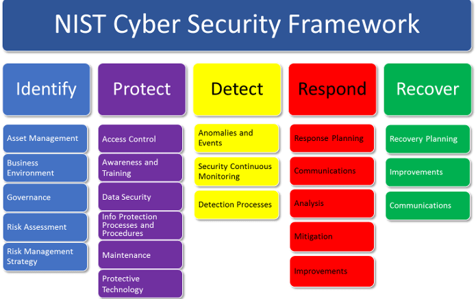
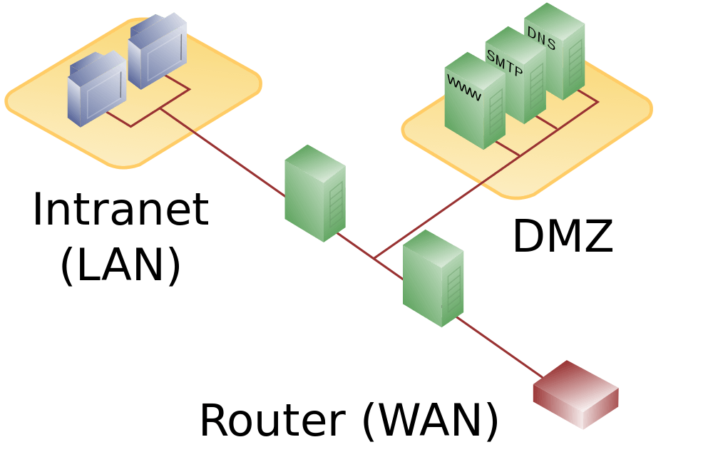
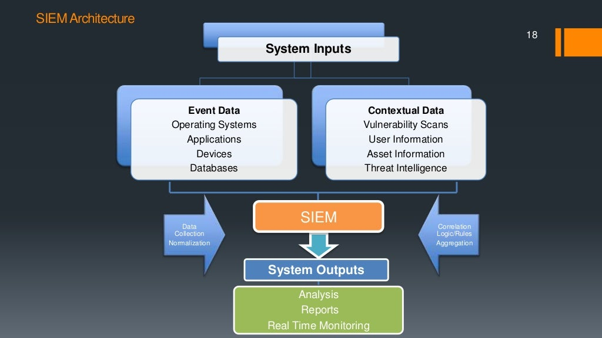

# Introduzione a "Defensive Cybersecurity"
Per rilevare prima possibile un attacco informatico sono state introdotte varie tecnologie, alcune sono di tipo preventivo ma maggior parte sono detection response, quindi, rilevano un attacco in corso e quindi provano a rispondere.

Il lavoro di chi fa sicurezza è quello di definire una strategia di difesa, che è fatto di tanti momenti e device diversi. Ogni scelta ha una sua finalità. 

Strategie di difesa:
1. Adottare la maggior sicurezza possibile, rendere più robusto possibile il sistema per un attaccante a riuscire ad effettuare un attacco con successo.
2. Ridurre impatti, Nel momento in cui l'attacco dovesse avvenire ridurre impatti.

## NIST Cyber Security Framework

Secondo NIST ci sono 5 momenti principali che definiscono una strategia:
1. Identify: asset management, business environment, governance, risk assessment, risk management strategy, 
2. Protect: access control, awareness and training, data security, info protection process and procedures, maintenance, protective technology,
3. Detect: anomalies and events, security continuous monitoring, detection processes
4. Respond: response planning, communications, analysis, mitigation, improvements,
5. Recover: recovery planing, improvements, communications.

Dove le attività di identificazione, protezione e Recovery (recupero)  sono fatte dal programma Cyber Resilience Programme **CRP** mentre Detect (rilevamento) e Respond (risposta) sono fatte dal Defensive Cyber Operations Programme **DCO**.

Se detection va male l'unica cosa da fare è recover!

cyber resilience programme

Basic Cybersecurity Tools che abbiamo visto:

* La crittografia, è un tool di prevenzione, si risolve il problema di infiltrazione dei dati anche se i dati vengono infiltrati non possono decifrarli in tempo utile. (Es. protocolli crittografici, IPsec, TLS)
* Antivirus,
* EDR, ASLR, Stackguard, DEP.

## Firewall
La prima tecnologia pensata per problemi legati al network security sono i Firewall. Sono dei device che tipicamente vengono installati all'ingresso di una rete.

Lo scopo del firewall è quello di analizzare il traffico di rete e in base alle caratteristiche e configurazione che gli sono state impostate decide quali pacchetti buttare e quali far passare.

Per essere efficace la rete deve avere un unico punto di uscita e un unico punto di entrata.

Wifi e GSM possono scavalcare il firewall.

Cosa fa il firewall?
Firewall riceve traffico e in funzione di policy impostate:
* logga tutto il traffico (la cosa più importante), 
* affronte di alcune situazioni manda delle notifiche (se riceve dei pacchetti sospetti),
* monitoraggio del traffico in tempo reale.

### Tipi di firewall
Cosa vado vedere dentro i pacchetti di rete? hanno un header e un payload, in particolare un pacchetto IP, hanno un header IP, un header TCP e un payload TCP. 

Tecniche di uso di firewall

#### Packet filter
Guarda solo il header IP, quindi, non guarda il payload IP. 
Es. si può scartare tutti pacchetti che arrivano da un server particolare.

Andando avanti si sono evoluti per ispezionare TCP header e TCP payload ma ovviamente più si addentra più diventa lento il firewall.

Il Packet filter moderni ispeziona source address, destination address, il tipo protocollo di trasporto (secondo livello), porte TCP e UDP e tipo di messaggio ICMP. Packet options come fragment size etc.

Può consentire al pacchetti di andare avanti, scartare il pacchetto, può modificare il pacchetto e logga.

Lavora pacchetto per pacchetto, ogni pacchetto viene sottoposto ad analisi.

#### Stateful inspection
Ispeziona le connessioni in entrata ed in uscita della rete.

Per velocizzare la connessione, per esempio, quando si ha una sessione trusted (una connessione ssh con un server fidato) non c'è bisogno di controllare tutti i pacchetti, quindi, si può saltare la parte di controllo dei pacchetti per velocizzare la connessione. 

Per questo sono stati introdotti Stateful inspection, è una modifica del packet filter che si ricorda le connessioni aperte, tiene una tabella con source e destination address e port, connection state etc, se un pacchetto fa parte di una connessione fidata fa passare senza filtraggio.

### Firewall rules
Un esempio di **una regola del firewall** per una connessione SSH, hanno generalmente due regole, una in entrata ed una in uscita:
* inbound: `src-port>1023, dst-port=22` traffico che entra da un porta maggiore di 1023 deve entrare nella porta 22,
* outbound: `src-port=22, dst-port>1023` traffico che esce dalla porta 22 deve andare su una porta maggiore di 1023,
* protocol=TCP

Le regole vengono interpretate in ordine in cui sono scritte.

Default rules: 
egress filtering outbound traffic from external address -> drop
ingress traffic from internal address -> drop

### Configurazione tipica di un firewall con Demilitarized Zone DMZ
* In cui host interni alla rete possono accedere DMZ e internet,
* Hosts esterni possono accedere solo DMZ e non intranet,
* DMZ hosts possono accedere solo internet.

Vantaggi: se un servizio della DMZ viene compromesso non influenza componenti interni dell'intranet. cioè se dmz viene attaccato non può fare da ponte per la intranet.

DMZ è la parte della rete più esposta, per ridurre le possibilità di attacco, in DMZ si mettono hosts particolari chiamati **bastion hosts**. 

**Bastion** hosts sono degli hosts **hardenized**, cioè rendere uno host difficilmente attaccabile, come si fa? si customizza il kernel del sistema operativo, quindi, contiene solo ed esclusivamente le componenti fondamentali per far funzionare l'host. **Hardenizzare** significa che vengono **tolti tutti servizi e tutte le parti di kernel e delle librerie che non servono allo svolgimento dello host**. Parte dal **principio che meno software ci sono all'interno dello host minore è la probabilità che venga attaccato**, più linee di codice abbiamo maggiore è la probabilità che ci sia un errore in quelle righe del codice. 

#### Proxy Firewall

* Proxy Firewall
  * Circuit level gateway
  * Application gateway

Sono dei firewall che dividono in due il traffico in due livelli, payload level e transport level. Sono chiamati di application level perché sono dei firewall che permette di analizzare il contenuto dei pacchetti. 

La forma più famosa di questi firewall sono chiamati **Web Application Firewall** WAF.

#### Circuit Level Proxy
Lavora a transport level analizzando il TCP header e non entra nel merito del payload. 

Host esterno chiede la connessione con un host interno, la richiesta arriva su una porta del proxy firewall. Proxy firewall prende il pacchetto e lo analizza, se rispetta certe regole lo fa passare, altrimenti butta via. 

Questo proxy lavora sul traffico HTTPS perché il payload è cifrato e non può controllare il payload.
  
#### Application Level Gateway
Se non si lavora con traffico cifrato si usa Application level gateway. Sono in grado di analizzare il payload in funzione del livello di applicazione. (Es. un firewall per SSH, un firewall per HTTP, etc.)

Questi permettono individuare per esempio un SQL injection, se sta facendo un buffer overflow (controlla se ci sia una stringa con `0x90` particolarmente lunga).

Permette di fare un analisi molto preciso del traffico e evitare forme di attacco sofisticati ma si paga in termini di prestazioni.

Ormai esistono WAF specializzati per HTTP.

### Air Gap
Air Gap è un firewall particolare in cui ce solo un server che registra tutto il traffico, quindi, il traffico non passa minimamente, il traffico viene depositato sul hard disk e poi un demone analizza il traffico. In questo caso non ce una connessione tra internet e intranet.

Non ce una connessione diretta tra lo host esterno e quello interno, dall'esterno scrive sul disco e l'host interno legge dal disco.

### Trasparenza rispetto le applicazioni

Più si sale di livello, più è necessario riconfigurare le applicazione, es. se si vuole abilitare il proxy su http, bisogna modificare il browser.

Quindi, packet filter e stateful inspection sono completamente trasparenti alle applicazioni, altrimenti, le applicazioni devono essere consapevoli del fatto che saranno proxate (che ce qualcuno in mezzo).

||performance| application transparency|
|-|-|-|
|Packet filter| best| yes
|Session filter||  yes|
|Circuite level gateway||  no (socks)|
|Application level |worst |no|

Il numero di firewall di una rete dipende dal security manager. In molte realtà aziendali la rete ricerca sviluppo è separato dal resto, cosi come la rete che paga stipendi.

### Next generation Firewall - NGFW
NGFW è un oggetto molto complesso che accorpa a tutto quello che abbiamo visto (antivirus, firewall, etc) e le funzioni di **intrusion prevention**. A differenza di un firewall è che un oggetto passivo questo è un oggetto attivo, attraverso l'aggiunta di intelligenza (AI+ML).

**Intrusion prevention** è la capacità di un device di **reagire autonomamente agli eventi**, cioè il firewall è istruito per fare automaticamente prevenzione degli attacchi per esempio se vedo dei pacchetti di NMAP a quel punto creo una regola che blocca tutto il traffico viene da quell'ip, da quel momento banno dalla mia rete, posso bloccare anche virus, posso analizzare il payload di un email e bloccare preventivamente.

### Intrusion Detection Systems - IDS
Sono dei sistemi pensati per fare detection, nati a supporto di firewall. Per esempio firewall non se ne accorge dell'attacco e l'attacco viene passato, a questo punto bisogna accorgersi che qualcuno sta attaccando. 

La regola d'oro delle strategie di sicurezza è sempre quello di assumere che le protezioni prima o poi crollano.

Sono un insieme di componenti hardware e software, il cui scopo è quelli di **rilevare un attacco in tempo reale accadimento di un intrusione**.

IDS analizzano una serie informazioni, in base alle informazioni raccolte decidono se alzare un alert oppure no.

IDS nella loro versione originale sono passivi, negli ultimi anni sono diventati anche attivi Intrusion prevention systems IPS, un IDS con intelligenza. Sono in grado di bloccare certe situazioni ritenute anomale.

Vari IDS:
* Host based IDS: analizzano le attività su singoli host (Pc o Server),
* Network based IDS: operano sul traffico di rete. Hanno dei sensori che vengono messi sulle reti, sono dei sniffer (componenti hardware) oppure pc con wireshark. Tutto il traffico generato dai sensori viene analizzato/elaborato in un server.

Entrambi Host e Network possono essere (la differenza di informazioni su cui lavorano):
* Signature based IDS: cerca una sequenze di byte maligni,
* Anomaly based IDS: basano sul concetto di un comportamento base, quindi, se ce qualcosa di anomalo viene rilevato.

Ci sono due modi con cui questi rilevano attacchi:
* **Misuse detection**: analizza il modo in cui viene utilizzato il sistema da cui capire se ce qualcosa che non va sul sistema. Sono utilizzati per rilevare degli attacchi in cui hanno delle sequenze di azioni caratteristiche (azioni ben definite).  Questo significa che bisogna conoscere a priori l'attacco. _Per Zero Day non funziona_.
  
  Es. prima accedono ad un file particolare e poi fanno una modifica ad un registro particolare e cosi via.

  Possono rilevare attacchi buffer overflow con sequenze di `0x90`.

* **Anomaly detection**: si fanno un'idea di un comportamento buono/base di un sistema, analizzando il comportamento, se ce qualcosa di anomalo alza l'allarme in questo modo si può rilevare attacchi. Quindi, si basano sull'analisi del sistema. Quindi, hanno una fase di training. _Sollevano allarmi ma non agiscono_. Questo è usato per Zero Day.

    Es. la frequenza e il luogo da uno si logga, quante volte viene cambiato la password, il carico di lavoro medio sul cpu, quali sono programmi eseguiti, quali sono i file che vengono usati, ecc. Quindi si fa una **profilazione degli utenti e poi si analizza i comportamenti**.

#### Host Intrusion detection systems - HIDS
Usano per fare detection:
* tutti file di log
* tutte le system calls
* command line 
* network data
* processes
* file access
* modification of system resources
* privilege escalation
* buffer overflow 
* access to email contact list
* directory traversal

#### Network based IDS - NIPS 
Analizano:
* network pattern matching
* stateful matching
* protocol anomaly
* traffic anomaly 
* statistical anomaly

#### IDS errors 
il problema grosso di questi sistemi è **la frequenza di errori riportati**. Stiamo parlando per sistemi di una certa dimensione un numero di allarmi che si aggira su qualche decina di migliaia al giorno. Per analizzare un allarme ci vogliono almeno 20 minuti.

Solitamente allarmi True Positive è sotto 1%. Quindi, hanno un percentuale di errore molto alta.

### Intrusion Prevention Systems - IPS
Rileva un tentativo di attacco e possono anche contrattaccare.

### Security Information Event Management - SIEM
Sono stati sviluppati dei sistemi intelligenti per ovviare i problemi di IDS/IPS (perché generano una enorme quantità di falsi positivi), SIEM sono dei prodotti che raccolgono i log e attraverso meccanismi di machine learning e intelligenza artificiale cercano di selezionare alert più vero simili.

Raccolgono i dati, normalizzano i log e generano un report finale. Sono grado di fare real time monitoring.

#### Security Operation Center - SOC 
SIEM sono il cuore di Security Operation Center SOC, sono centri di competenza, nascano come dei centri di sorveglianza.

La versione cyber è CSOC, sono dei centri di calcolo in cui esiste una SIEM che raccoglie dati dei device di reti. Tipicamente i service provider hanno un CSOC. Monitora e previene attacchi
network based, host based, individua eventuali vulnerabilità e cerca di evitare grossi danni informatici.

Nel SOC lavorano SOC analysts, sono quelli che ricevono gli alert dalla SIEM, quindi, SIEM riceve alert dalla IDS, gli analizza e decide quali tenere e quali scartare, quelli che tiene buoni li invia agli analisti. Gli analisti di primo livello se non riescono risolvere l'alert lo invia al livello successivo di SOC analysts senior e decidono se l'incidente è buono o meno. Se al secondo livello individua che alert è vero (quindi un attacco in corso) a questo punto per gestire l'incidente viene passato al livello 3.

#### Computer Security Incident Response Team CSIRT
La gestione dell'incidente viene passato ad un team specializzato nella gestione degli incidenti informatici Computer Security Incident Response Team CSIRT. Prima chiamati Computer Emergency Response Team CERT.

Primo CERT italiano 1994 creato all'Unimi, terzo CERT europeo, sono stati introdotti dopo l'attacco di Morris.

# Lab 

wazuh xdr e siem

xdr = contra attacca response

i dati prende dai log

tecnologie dietro wazuh sono ossec planc z, elastic 

