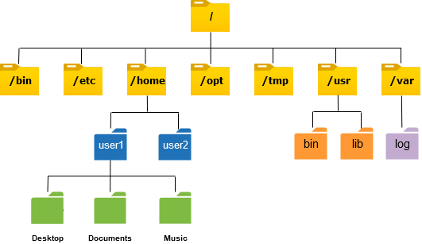

## Materiale di approfondimento
* [Unix file system](https://pages.cs.wisc.edu/~remzi/OSTEP/file-intro.pdf)

# File system
Il file system è un struttura dati che ci permette di gestire dei file, trovare, condividere.

## il file sistem è composto da tre componenti principali:
-   **drive** luogo fisico dove archiviamo i dati es. hard disk, 
-   **directories** dei file particolari che permette di raggruppare diversi file ed altri cartelle, inoltre, indicano il percorso dove vengono salvati i dati. 
-   **file** è una sequenza di bit che rappresenta i dati vogliamo salvare.

File system è strutturato come un albero, ancorato ad un directory principale detto `root`. 

## Compiti del file system

    find . -name "*.txt" -exec pwd \; 
    search for files that ends with ".txt" in this directory
    -exec allows to run cmd at that path

`which ps` dice dove si trova il bin del commando `ps`

`more` visualize file as chunks of size of screen

`head` | `tail` per vedere head (le prime righe) or tail (le ultime righe) del file

`tail -f` segue i cambiamenti del file

`wc` word count 

## Links 
in linux un file nel file system è un link ad un i-node.

**Hard link** ci permette di rappresentare un file con un altro nome, creiamo un altro link allo stesso i-node. Quindi, se facciamo un modifica al file la modifica sarà riflettuta anche da altra parte. Si può creare un Hard link solo entro il File system (non tra due dischi diversi).

    ln hardlinkName path/to/
    
**Soft link** oppure symbolic link sono simili a shortcut di windows. è un link diretto al file originale. Possono essere create soft link anche tra file system diversi.

    ln -s softlinkName path/to/

