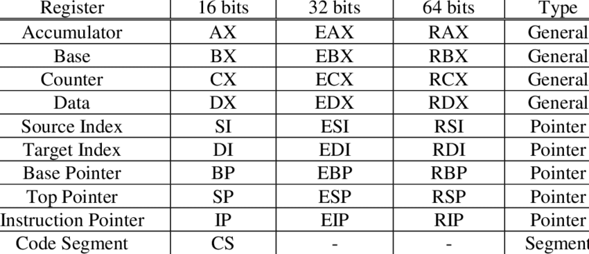
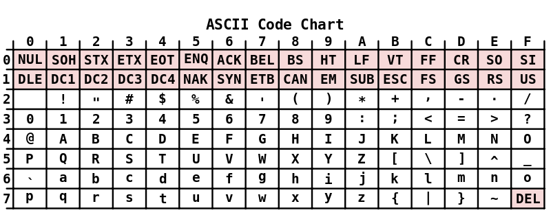

<style>
    strong{
        background-color:#faf43e;
        color: black;
        padding:0.1rem 0.2rem;
        border-radius:5px;
    }
</style>

# Playing with assembly

All'interno di un programma assembler ci sono tre tipi di contenuti:
* Istruzioni,
* Le direttive: sono precedute da un punto `.` // es. (.data .text)sono delle istruzioni per l'assemblatore/compilatore,
* I commenti sono seguiti da un cancelletto `#`.
  
```asm
# LABEL OPCODE OPERANDS 

LOOP: 
    add rax, 3
    jmp LOOP
```

Un programma assembly può essere suddiviso in tre sezioni: 
* `section .data` : sezione per dichiarare dati inizializzati oppure costanti, 
* `section .bss`: per dichiarare variabili, 
* `section .text`: sezione di codice.
  * `global _start`: dice al kernel dove inizia l'esecuzione del programma.

~~~s
section .text
    global _start
_start:
~~~

I dati in un programma assembler possono essere memorizzati in **registri** (memorizzati in una memoria direttamente accessibile dal processore) o in **variabili** (memorizzati in memoria). Registri hanno il _tempo di accesso più veloce in assoluto_.

Il procesore può manipolare **esclusivamente i dati all'interno i registri**. Quindi, per modificare un variabile, l'unico modo è portare il contenuto della variabile dentro un registro -> modificare il contenuto del registro -> e scriverlo/spostarlo in un variabile. Quindi, non è possibile modificare il contenuto di un variabile in memoria.

## Registri
Ci sono 16 registri da 64bit, i primi 8 sono: RAX, ..., RDX, RBP, RSI, RDI, e RSP; i rimanenti 8 hanno una nomenclatura R8 - R15.

### Subregisters
Nell'ambito della architettura Intel per il **back compatibility**, i registri sono fatti in modo tale che **è possibile accedere a sottoporzioni del registro** proprio per garantire il codice scritto negli anni precedenti.

RAX registro da 64bit, EAX lo stesso registro ma i 32 bit meno significativi, AX i 16 bit meno significativi di RAX, AL per 8 bit meno significati di RAX (RIGHT), AH per 8 bit più significativi di ultimi 16 bit di RAX (LEFT).

Nei nuovi registri (R8-R15) si può la stessa cosa, R8 qword, R8D lower dword (ultimi 32bit), R8W lowest word (ultimi 16bit), R8B lowest byte (ultimi 8bit) (equivale a R8L e non ce R8H). 




## Dati
Inoltre, in assembly esistono solo dati di tpo **numeri** e **caratteri**.
* **Numeri** sn rappresentati usando la rappresentazione binaria.
* Per rappresentazione dei dati in formato **carattere** si fa riferimento all'**unicode** in particolare **UTF-8**. (ogni carattere occupa un byte).



    100 in decimale = 0110 0100 in binario = 0x64 in HEX
    100 in formato carattere = 0x31 0x30 0x30 in HEX

### Riservare spazio per dati oppure per inizializzare con dati/costanti
~~~s
.data # data section
buffer:     resb    64  # reserve 64 byte, resb = reserve byte
wordvar:    resw    1   # reserve 1 word (2 byte), resw = reserve word (16bit)
realarray:  resq    10  # array of ten reals, resq = reserve qword (32bit)

db  0x55                # byte 0x55 (85 se un numero, "U" se un char, è il programmatore che decide se usarlo come numero oppure come char), db = data byte
db  0x55,0x56,0x57      # three bytes in succession
db  'a',0x55            # character constant are Ok
db  'hello',12,10,'$'   # string constants (riserva dei byte per hello e poi per il resto)
dw  0x1234              # 0x34 0x12, dw = data word
dw  'a'                 # 0x61 0x00 (it's just a number)
dw  'ab'                # 0x61 0x62 (character constant)
dd  0x12345678          # 0x78 0x56 0x34 0x12
~~~

~~~s
.text # the actual code
resb rese byte
resw un word
resq arrya of ten reals
databyte db 0x55 
db 'hello',
~~~

## Modalità di indirizzamento dei dati all'interno della memoria
Le modalita con cui si accede ai dati si chiama addressing mode, esistono tre modalità principali:

* accedere ai dati dai **regstri**,
* accedere ai dati dal **valore immediato**,
* accedere ai dati dalla **memoria**:
  * accesso **diretto** usa i registri in modalità diretta,
  * accesso **indiretto**.

### Register addressing
Lavora con i dati presenti nel registro. 

(Il risultato viene messo sempre nel **primo operando**)

    mov rdx, rcx # sposta il contenuto di RCX dentro il registro RDX

// mov dword ptr rax,0x80 CHIEDERE conferma

### Indirizzamento immediato
~~~s
mov dword ptr rax,12 # dat interpretato come decimale, se 0x12 interprata come HEX
mov dword ptr rax,0x80 # sposta per 32bit il valore 0x80 dentro il registro rax (cioè utilizza ultimi 32 bit del registro RAX non modificando quello che ce nei primi bit)
~~~

è usato per caricare valori direttamente nei registri.
Inoltre, è richiesto al programmatore di specificare quando è ambiguo usando `BYTE/WORD/DWORD PTR`: se deve caricare 2 in un registro da 64bit deve specificare se caricare 2 preceduto da zeri oppure scriverlo negli ultimi 8 bit (byte) per esempio. 

PTR può essere opzionale in alcuni assembler.

`mov dword ptr rax,12`: scrive 12 utilizzando double word (32bit) quindi metterà dei leading zeros per creare 32bit e non cabmierà i bit restanti del registro.

### Indirizzamento indiretto - Puntatori 
Tramite puntatori che stanno tipicamente nei registri.

    mov rcx, [rax]

Sposto in `rcx` il contenuto della locazione di memoria di `rax` (usa il puntatore dentro `rax` per andare cercare il contenuto che sta in quell'indirizzo di memoria).

#### Base Pointer Addressing

    mov rax, [rcx + number]
    # esmpio di indirizzamento indiretto
    [number]
    [reg]
    [reg + number]    
    [reg + reg * scale] # scale is 1,2,4 and 8 only

Se conosco a priori l'indirzzo di memoria posso usare questo
mov rcx, 0x20000 # the value 2000 s loaded in rcx.

~~~c
int a [20]
...
int i, nums = 0;

for(i = 0; i < 20; i++>){
    sum += a[i];
}
~~~
~~~s
    xor     rax # xor con se stessa, serve per azzerare il contenuto a del registro
    xor     rbx
    lea     rcx,a # carico l'indirizzo del variabile "a" LOAD EFFECTIVE ADDRESS
sumloop:
    mov     [rcx + rax * 4], rdx # indirizzamento indiretto, all'inizio carico in rcx  il contenuto di rdx, e poi la prossima volta mi sposto di 4 byte.
    add     rbx,rdx # sommo
    inc     rax # incrementa di uno
    cmpl    rax,19
    jle     sumloop 
~~~

    rax # contiene i del for
    rbx # contiene la somma sum
    rcx # indirizzo dell'array a

Load effective address `lea rcx, buffer` carica l'indirrizzo di un variabile `buffer` nel registro.


### Differenza tra indirizzamento diretto ed indiretto
* direct addressing
    * veloce ma non flessibile (meno intuitivo),
    * indirizzo di memoria è direttamente specificato nell'istruzione.
* indirect addressing
  * è più flessibile di indirizzamento diretto ma lento (più intuitivo),
  * usa registri (dove cercare l'indirizzo) o valori (sommando oppure facendo prodotto) come puntatore, quindi, richiede ulteriori calcoli (lento).


## Little Endian
~~~s
mov rax,0xc001ca75 # sets rax to "0x c0 01 ca 75"
mov rcx, 0x10000
mov [rcx], rax # store the data as LITTLE ENDIAN "0x 75 ca 01 c0" at address 0x10000
mov bh, [rcx] # moves 0x75 to bh (sono i bit più sigificativi del registro bx) prende i primi 8bit che trova a quell'indirizzo.
~~~

> Per l'azienda Data Point nel 1972 Intel ha progettato il processore 8008 che usava **Little Endian**, perchè veniva più facile i riporti delle operazioni aritmentiche, quindi, la progettazione dell'ALU è stato fatto con Little Endian.

## Istruzioni Aritmetiche

~~~s
add dest,source # il risultato va nel primo operando dest = dest + source
sub dest,source
inc dest #incrementa
dec dest #decrementa
neg dest # complemento a 2, fa NOT e somma 2.
cmp source1,source2 # s2-s1
~~~

### Moltiplicazione
`mul` dati senza segno oppure `imul` per dati con segno. Può avere due operandi o uno, se non è specificato è dentro `rax`, il risultato della moltiplicazione viene messo in `rdx`:`eax` (si può perdere il contenuto originario del `rdx` e `eax`).

uguale per divisione> `div` unsigned or `idiv` signed.

and
or ...
shift ...

## Control Flow
Il flusso di controllo (if/for/while) di un programma assembly viene controllato usando le istruzioni compare e jump:

    cmp rax,0
    je end_loop

`je` Jump Equals is flow control instruction jump which says to jump to the label `end_loop`
`cmp` compare two values, and stores the result of the comparison in the status register `RFLAGS`.

je (jump equal), jg (jump greater), jge (jump greater or equal), jl (jump less), jle (jump less or), ...

## System call
Assembly usa syscall per fare operazioni complicate. Si tratta di memorizzare il numero del syscall, all'interno del registro `RAX` dopo di che si predispongono gli argomenti eventtuali negi registri `RDI, RSI, RDX, R10, R8, R9`.

### Esempio Input da tastiera
Per leggere da tastiera syscall numero 0 in RAX e in RSI l'indirizzo di un buffer dove mettere i dati letti e in RDX il numero di caratteri che si vuole leggere.

[x86-64.org](www.x86-64.org/documentation/abi.pdf) **Link OFFLINE**

[Syscall - Table - 1](https://x64.syscall.sh/)
[Syscall - Table - 2](https://blog.rchapman.org/posts/Linux_System_Call_Table_for_x86_64/)

~~~s
# n = read(o,buf,100);

mov rdi, 0
mov rsi, rsp
mov rdx, 100
mov rax, 0

syscall
~~~
~~~s
# write(1,buf,n);

mov rdi, 1
mov rsi, rsp
mov rdx, rax
mov rax, 1

sycall
~~~

## Hello World in assembly
~~~s
.intel_syntax noprefix
.global _start

.section        .text

_start:  
        mov rax, 1          # syscall write
        mov rdi, 1
        lea rsi, message
        mov rdx, 13         
        syscall             

        mov rax, 60         # syscall exit
        xor rdi, rdi
        syscall


.section        .data
message: .asciz "Hello, World" 
~~~

    # per compilare assembly con gcc
    gcc -nostdlib -static -o helloworld 


